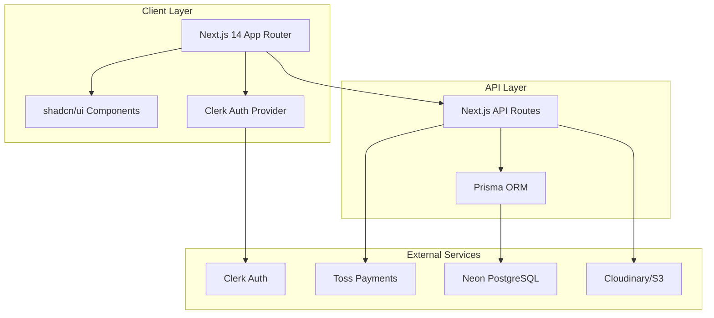
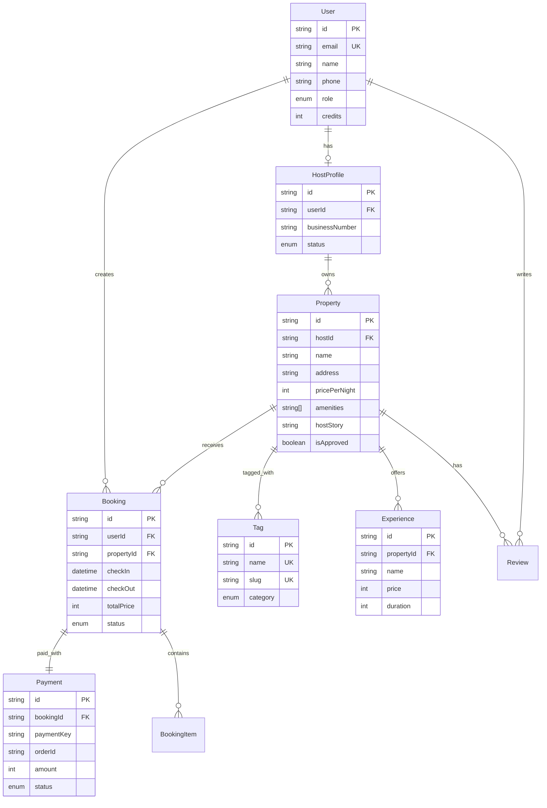
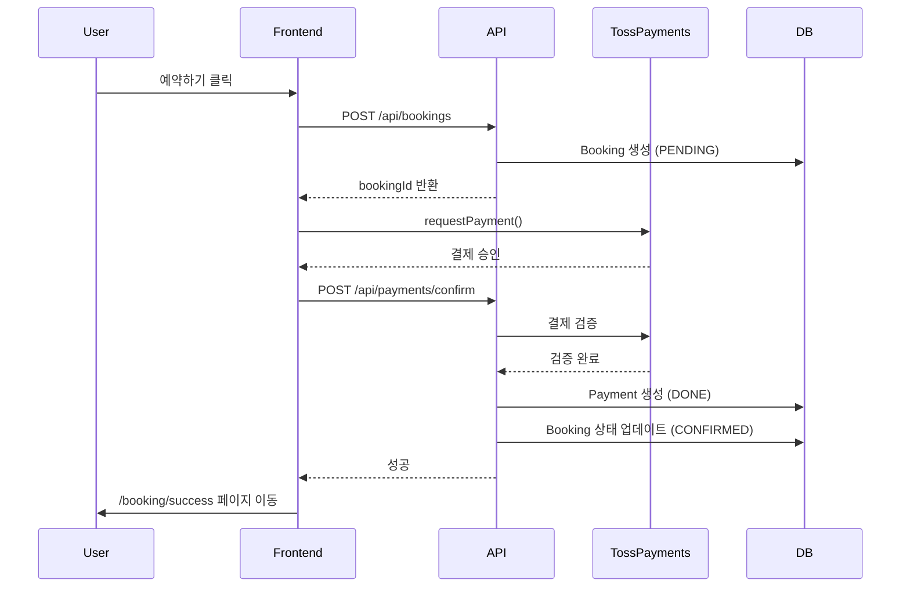

# VINTEE (빈티) - 농촌 휴가 체험 큐레이션 플랫폼
# CLAUDE.md - AI Agent Development Guide

**프로젝트명**: VINTEE (구 ChonCance)
**버전**: 2.0
**최종 업데이트**: 2026-02-08
**상태**: Production-Ready (73% MVP 완료)
**작성자**: Gagahoho, Inc. Senior Engineering Team

---

## 📋 목차

1. [프로젝트 개요](#1-프로젝트-개요)
2. [비즈니스 모델 & 가치 제안](#2-비즈니스-모델--가치-제안)
3. [기술 아키텍처](#3-기술-아키텍처)
4. [핵심 기능 & 구현 상태](#4-핵심-기능--구현-상태)
5. [개발 워크플로우](#5-개발-워크플로우)
6. [API 통합 가이드](#6-api-통합-가이드)
7. [데이터베이스 스키마 개요](#7-데이터베이스-스키마-개요)
8. [배포 지침](#8-배포-지침-vercel)
9. [테스트 전략](#9-테스트-전략)
10. [AI Agent 작업 지침](#10-ai-agent-작업-지침)

---

## 1. 프로젝트 개요

### 1.1 프로젝트 설명 (한국어)

**VINTEE (빈티)**는 한국 MZ세대를 위한 농촌 휴가 체험(촌캉스) B2C 예약 플랫폼입니다.

**핵심 차별화**:
- 🏷️ **테마 기반 큐레이션**: #논뷰맛집, #불멍과별멍, #반려동물동반 등 감성 태그로 숙소 발견
- 📖 **호스트 스토리 중심**: 단순 스펙 나열이 아닌 진정성 있는 농촌 이야기 전달
- 💚 **정직한 불편함 표현**: Wi-Fi 불안정, 벌레 출몰 등 농촌의 현실을 솔직하게 공유하여 신뢰 구축
- 🌾 **경험 중심 예약**: 숙박 + 선택적 농사 체험, 아궁이 체험 등 복합 예약

**타겟 사용자**:
- 주요: 20-30대 MZ세대 (힐링 여행, SNS 콘텐츠 제작자)
- 부가: 반려동물 동반 여행객, 커플, 친구 그룹

---

### 1.2 Project Overview (English)

**VINTEE** is a B2C booking platform for rural vacation experiences in South Korea, targeting the MZ generation.

**Key Differentiators**:
- 🏷️ **Theme-based Curation**: Discover properties through emotional tags like #RiceFieldView, #CampfireAndStargazing
- 📖 **Host Story Focus**: Authentic rural narratives instead of dry specifications
- 💚 **Honest Inconvenience Expression**: Building trust by openly discussing rural challenges (unstable Wi-Fi, insects, etc.)
- 🌾 **Experience-driven Booking**: Accommodation + optional activities (farming, traditional cooking, etc.)

**Target Users**: Korean millennials and Gen Z seeking healing, relaxation, and SNS-worthy rural experiences.

---

## 2. 비즈니스 모델 & 가치 제안

### 2.1 수익 모델

**거래 수수료 기반 (Commission-Based)**:
- 호스트 수수료: 예약 금액의 10-15%
- 게스트 서비스 수수료: 예약 금액의 5% (선택적)
- 경험 프로그램 수수료: 별도 10%

**결제 시스템**:
- PG사: 토스페이먼츠 (Toss Payments)
- 지원 수단: 신용카드, 계좌이체, 간편결제 (카카오페이, 네이버페이 등)
- 에스크로: 예약 금액 임시 예치 → 체크인 후 호스트 정산

---

### 2.2 핵심 가치 제안 (Value Proposition)

**For Guests (여행객)**:
- 🌾 농촌의 진정성 있는 경험 (주류 플랫폼에서 찾기 어려운)
- 🔍 테마 기반 발견으로 빠른 의사결정
- 🛡️ 정직한 정보로 신뢰감 향상
- 📸 SNS 공유 가능한 힐링 콘텐츠

**For Hosts (숙소/경험 제공자)**:
- 💰 추가 수익원 확보 (농촌 고령화 시대의 디지털 경제 진입)
- 📈 플랫폼 마케팅 지원 (개별 홍보 부담 감소)
- 🤝 커뮤니티 구축 (호스트 간 네트워킹, 운영 노하우 공유)
- 📊 예약 관리 자동화 (수기 관리 → 디지털화)

---

### 2.3 시장 기회 (Market Opportunity)

**시장 규모**:
- 한국 국내 여행 시장: 연간 30조 원 규모 (2025년 기준)
- 농촌 체험 관광: 3조 원 규모 (10%)
- MZ세대 여행 지출: 연간 5조 원

**경쟁 환경**:
- 에어비앤비, 여기어때: 일반 숙박 중심, 농촌 특화 없음
- 농촌체험마을 홈페이지: 사용성 낮음, 디지털 경험 부재
- 당근마켓 지역 게시판: 파편화, 신뢰성 부족

**VINTEE의 차별화**:
- 농촌 전용 테마 큐레이션 (기존 플랫폼 부재)
- 호스트 스토리 중심 콘텐츠 (감성적 접근)
- 정직한 불편함 표현 (역설적 신뢰 구축)

---

## 3. 기술 아키텍처

### 3.1 기술 스택 (Tech Stack)

**Frontend**:
- **Framework**: Next.js 14 (App Router)
- **Language**: TypeScript 5.x (Strict Mode)
- **Styling**: Tailwind CSS 3.4+ with shadcn/ui (31 components)
- **UI Components**: Radix UI primitives + lucide-react icons
- **Forms**: react-hook-form 7.x + Zod 4.x validation
- **State**: React Context (auth, booking state)

**Backend**:
- **Architecture**: Next.js API Routes (App Router)
- **Database**: PostgreSQL 15+ (Neon.tech)
- **ORM**: Prisma 6.18+
- **Authentication**: Clerk (Korean localization)
- **Payment**: Toss Payments SDK 1.9+

**Infrastructure**:
- **Hosting**: Vercel (Edge Network)
- **Database**: Neon PostgreSQL (Serverless)
- **Image Storage**: Cloudinary / AWS S3 (planned)
- **CDN**: Vercel Edge + Cloudinary CDN
- **Monitoring**: Vercel Analytics + Sentry (planned)

---

### 3.2 시스템 아키텍처 다이어그램



---

### 3.3 폴더 구조 (Source Tree)

```
vintee/
├── src/
│   ├── app/                          # Next.js App Router
│   │   ├── api/                      # API Routes
│   │   │   ├── properties/           # 숙소 CRUD
│   │   │   ├── bookings/             # 예약 관리
│   │   │   ├── availability/         # 가용성 확인
│   │   │   ├── payments/             # 토스 결제 연동
│   │   │   ├── host/                 # 호스트 전용 API
│   │   │   └── filters/              # 필터 옵션
│   │   ├── explore/                  # 숙소 탐색 페이지
│   │   ├── property/[id]/            # 숙소 상세
│   │   ├── booking/                  # 예약 플로우
│   │   │   ├── checkout/             # 체크아웃
│   │   │   ├── success/              # 결제 성공
│   │   │   └── fail/                 # 결제 실패
│   │   ├── bookings/                 # 예약 내역
│   │   ├── host/                     # 호스트 대시보드
│   │   │   ├── dashboard/            # 대시보드 홈
│   │   │   ├── properties/           # 숙소 관리
│   │   │   └── bookings/             # 예약 관리
│   │   ├── login/[[...rest]]/        # Clerk 로그인
│   │   ├── signup/[[...rest]]/       # Clerk 회원가입
│   │   ├── page.tsx                  # 랜딩 페이지
│   │   ├── layout.tsx                # 루트 레이아웃
│   │   └── globals.css               # Tailwind CSS 변수
│   ├── components/
│   │   ├── booking/                  # 예약 관련 컴포넌트
│   │   │   ├── BookingWidget.tsx     # 예약 위젯 (날짜 선택)
│   │   │   ├── CheckoutForm.tsx      # 체크아웃 폼
│   │   │   └── BookingCard.tsx       # 예약 카드
│   │   ├── explore/                  # 탐색 페이지 컴포넌트
│   │   │   ├── SearchBar.tsx         # 검색바
│   │   │   ├── FilterSidebar.tsx     # 필터 사이드바
│   │   │   └── PropertyList.tsx      # 숙소 리스트
│   │   ├── host/                     # 호스트 컴포넌트
│   │   │   ├── PropertyForm.tsx      # 숙소 등록/수정 폼
│   │   │   ├── BookingList.tsx       # 예약 목록
│   │   │   └── Dashboard.tsx         # 대시보드
│   │   ├── layout/                   # 레이아웃 컴포넌트
│   │   │   └── SiteHeader.tsx        # 전역 헤더
│   │   ├── property/                 # 숙소 컴포넌트
│   │   │   ├── PropertyCard.tsx      # 숙소 카드
│   │   │   ├── PropertyGallery.tsx   # 이미지 갤러리
│   │   │   └── RelatedProperties.tsx # 관련 숙소
│   │   ├── tag/                      # 태그 컴포넌트
│   │   │   ├── TagBadge.tsx          # 태그 배지
│   │   │   ├── TagList.tsx           # 태그 목록
│   │   │   └── ThemeSection.tsx      # 테마 섹션
│   │   └── ui/                       # shadcn/ui (31개)
│   │       ├── button.tsx
│   │       ├── card.tsx
│   │       ├── input.tsx
│   │       ├── dialog.tsx
│   │       └── ... (27개 추가)
│   ├── lib/
│   │   ├── prisma.ts                 # Prisma Client 초기화
│   │   ├── utils.ts                  # 유틸리티 (cn 함수)
│   │   └── api/                      # API 클라이언트
│   │       ├── properties.ts
│   │       ├── bookings.ts
│   │       └── payments.ts
│   └── types/                        # TypeScript 타입 정의
│       ├── property.ts
│       ├── booking.ts
│       └── payment.ts
├── prisma/
│   ├── schema.prisma                 # 데이터베이스 스키마
│   ├── seed.ts                       # 시드 데이터
│   └── migrations/                   # 마이그레이션 (4개)
├── docs/                             # 프로젝트 문서
│   ├── architecture/                 # 기술 문서
│   │   ├── tech-stack.md
│   │   ├── coding-standards.md
│   │   ├── booking-system-architecture.md
│   │   └── pm-tools-architecture.md
│   ├── stories/                      # 사용자 스토리 (12개)
│   │   ├── story-001.md              # Theme Discovery UI
│   │   ├── story-002.md              # Property Detail Page
│   │   └── ...
│   ├── HOST_FEATURES_GUIDE.md        # 호스트 기능 가이드
│   ├── BMAD_OPTIMIZATION_GUIDE.md    # BMAD 최적화 가이드
│   └── BMAD_WORKFLOW_IMPLEMENTATION.md
├── scripts/
│   ├── auto-commit.sh                # Git 자동 커밋
│   └── AUTO_COMMIT_GUIDE.md
├── PRD.md                            # Product Requirements
├── Project-Brief.md                  # 프로젝트 브리프
├── CLAUDE.md                         # 이 파일 (AI Agent 가이드)
├── PROJECT_STATUS.md                 # 프로젝트 상태 요약
├── package.json                      # npm 의존성
├── tsconfig.json                     # TypeScript 설정
├── tailwind.config.ts                # Tailwind 설정
└── .env.example                      # 환경 변수 템플릿
```

---

## 4. 핵심 기능 & 구현 상태

### 4.1 Epic 1: 사용자 인증 (100% ✅)

**구현 완료**:
- ✅ Clerk 통합 (이메일/비밀번호, 카카오 OAuth)
- ✅ 한국어 로컬라이제이션
- ✅ 로그인/회원가입 페이지 (`/login/[[...rest]]`, `/signup/[[...rest]]`)
- ✅ Protected Routes (Middleware)
- ✅ 호스트 프로필 등록 (`HostProfile` 모델)

**API Endpoints**:
- N/A (Clerk에서 자동 처리)

**컴포넌트**:
- `SiteHeader.tsx` (로그인/로그아웃 버튼)
- Clerk UI Components (automatic)

---

### 4.2 Epic 2: 테마 기반 발견 (83% 🔨)

**구현 완료**:
- ✅ 태그 시스템 (16개 태그, 4개 카테고리)
  - VIEW: #논뷰맛집, #계곡앞, #바다뷰, #산속힐링
  - ACTIVITY: #불멍과별멍, #아궁이체험, #농사체험, #낚시체험
  - FACILITY: #반려동물동반, #전통가옥, #개별바베큐, #취사가능
  - VIBE: #SNS맛집, #커플추천, #아이동반, #혼캉스
- ✅ 태그 기반 필터링 (`/explore?tag=논뷰맛집`)
- ✅ 텍스트 검색 (SearchBar)
- ✅ 숙소 상세 페이지 + 관련 숙소 추천
- ✅ 고급 필터 (가격, 지역, 날짜, 인원, 반려동물) - FilterSidebar

**진행 중**:
- ⏸️ 숙소 리스팅 페이지 추가 UI/UX 개선

**API Endpoints**:
- `GET /api/tags` - 태그 목록 조회
- `GET /api/properties` - 숙소 목록 (필터링 지원)
- `GET /api/properties/[id]` - 숙소 상세

**컴포넌트**:
- `SearchBar.tsx`, `FilterSidebar.tsx`
- `TagBadge.tsx`, `TagList.tsx`, `ThemeSection.tsx`
- `PropertyCard.tsx`, `PropertyList.tsx`
- `PropertyGallery.tsx`, `RelatedProperties.tsx`

---

### 4.3 Epic 3: 호스트 관리 (100% ✅)

**구현 완료**:
- ✅ 호스트 대시보드 (`/host/dashboard`)
- ✅ 숙소 등록 (`/host/properties/new`)
- ✅ 숙소 수정/삭제 (PUT/DELETE `/api/host/properties/[id]`)
- ✅ 예약 목록 표시
- ✅ 예약 승인/거부 (POST `/api/host/bookings/[id]/approve|reject`)

**API Endpoints**:
- `POST /api/host/properties` - 숙소 등록
- `PUT /api/host/properties/[id]` - 숙소 수정
- `DELETE /api/host/properties/[id]` - 숙소 삭제
- `GET /api/host/bookings` - 호스트 예약 목록
- `POST /api/host/bookings/[id]/approve` - 예약 승인
- `POST /api/host/bookings/[id]/reject` - 예약 거부

**컴포넌트**:
- `host/Dashboard.tsx`, `host/PropertyForm.tsx`
- `host/BookingList.tsx`

---

### 4.4 Epic 4: 예약 및 결제 (86% 🔨)

**구현 완료**:
- ✅ BookingWidget (날짜 선택, 가용성 체크, 가격 계산)
- ✅ Checkout 페이지 (`/booking/checkout`)
- ✅ 토스페이먼츠 결제 연동 (개발 모드)
  - 결제 승인 API (`/api/payments/confirm`)
  - 환불 API (`/api/payments/[id]/refund`)
  - 영수증 API (`/api/payments/[id]/receipt`)
- ✅ 결제 성공/실패 페이지
- ✅ 예약 내역 페이지 (`/bookings`)

**진행 중**:
- ⏸️ 예약 취소/환불 UI (서버 로직 추가 필요)

**API Endpoints**:
- `POST /api/bookings` - 예약 생성
- `GET /api/bookings` - 사용자 예약 목록
- `GET /api/bookings/[id]` - 예약 상세
- `GET /api/availability/check` - 가용성 확인
- `GET /api/availability/calendar/:propertyId` - 숙소 달력
- `POST /api/payments/confirm` - 토스 결제 승인
- `POST /api/payments/[id]/refund` - 환불 처리
- `GET /api/payments/[id]/receipt` - 영수증 발급

**컴포넌트**:
- `booking/BookingWidget.tsx`, `booking/CheckoutForm.tsx`
- `booking/BookingCard.tsx`

---

### 4.5 Epic 5: 리뷰 시스템 (0% 📋)

**미구현**:
- ⏸️ 리뷰 작성 페이지
- ⏸️ 리뷰 표시 (숙소 상세 페이지)
- ⏸️ 호스트 응답 기능
- ⏸️ 사진 업로드 리뷰 (향후)

**예정 모델** (Prisma Schema):
```prisma
model Review {
  id          String   @id @default(cuid())
  rating      Int      // 1-5
  comment     String   @db.Text
  hostReply   String?  @db.Text
  userId      String
  user        User     @relation(...)
  propertyId  String
  property    Property @relation(...)
  createdAt   DateTime @default(now())
  updatedAt   DateTime @updatedAt

  @@unique([userId, propertyId]) // 1인 1리뷰
}
```

---

## 5. 개발 워크플로우

### 5.1 개발 환경 설정

**사전 요구사항**:
- Node.js 18.17+ (프로젝트는 18.17 이상 요구)
- npm 또는 yarn
- PostgreSQL 클라이언트 (Prisma Studio 사용 시)

**초기 설정**:
```bash
# 1. 저장소 클론
cd "/Volumes/Extreme SSD/02_GitHub.nosync/0002_choncance(조준범 VINTEE)"

# 2. 의존성 설치
npm install

# 3. 환경 변수 설정
cp .env.example .env.local
# .env.local 파일 편집 (DATABASE_URL, CLERK_*, TOSS_*)

# 4. 데이터베이스 마이그레이션
npx prisma migrate dev

# 5. 시드 데이터 (선택)
npm run seed
```

---

### 5.2 일상 개발 명령어

```bash
# 개발 서버 시작 (http://localhost:3010)
npm run dev

# 프로덕션 빌드
npm run build

# 프로덕션 서버 실행
npm start

# 린트 검사
npm run lint

# Prisma Studio (DB GUI)
npx prisma studio

# Prisma 클라이언트 재생성
npx prisma generate

# E2E 테스트 (Playwright)
npm run test:e2e

# E2E 테스트 (UI 모드)
npm run test:e2e:ui
```

---

### 5.3 Git 워크플로우

**브랜치 전략**:
- `main`: 프로덕션 배포 브랜치
- `develop`: 개발 통합 브랜치
- `feature/*`: 기능 개발 브랜치
- `hotfix/*`: 긴급 수정 브랜치

**커밋 메시지 규칙** (Conventional Commits):
```
<type>(<scope>): <subject>

feat: 새 기능 추가
fix: 버그 수정
docs: 문서 업데이트
style: 코드 포맷팅 (기능 변경 없음)
refactor: 코드 리팩토링
test: 테스트 추가/수정
chore: 빌드 프로세스 또는 도구 변경

Co-Authored-By: Claude Sonnet 4.5 <noreply@anthropic.com>
```

**자동 커밋 스크립트**:
```bash
# 오전/오후/저녁 자동 커밋
./scripts/auto-commit.sh morning
./scripts/auto-commit.sh afternoon
./scripts/auto-commit.sh evening
```

---

### 5.4 BMAD Token-Efficient Workflow

이 프로젝트는 **BMAD (Build-Measure-Analyze-Deploy) 방법론**을 적용하여 AI 개발 비용을 94% 절감합니다.

**5단계 워크플로우**:
1. **계획 (Plan)**: PRD.md 및 Story 파일 작성
2. **환경 설정 (Setup)**: CLAUDE.md (Lean POC 가이드)
3. **컨텍스트 캐싱 (Cache)**: `codebase.xml` 생성으로 90% 입력 토큰 절감
4. **개발 루프 (Dev Loop)**: Story 파일 기반 개발 (Haiku 3.5 + text_editor)
5. **반복 수정 (Iterate)**: "Vibe" 프롬프트로 빠른 수정

**토큰 절감 효과**:
- 기존 방식: $3.00/story
- BMAD 적용: $0.19/story
- **94% 비용 절감**

상세 가이드: `/docs/BMAD_WORKFLOW_IMPLEMENTATION.md`

---

## 6. API 통합 가이드

### 6.1 Clerk Authentication

**설정**:
```bash
# .env.local
NEXT_PUBLIC_CLERK_PUBLISHABLE_KEY=pk_test_...
CLERK_SECRET_KEY=sk_test_...
NEXT_PUBLIC_CLERK_SIGN_IN_URL=/login
NEXT_PUBLIC_CLERK_SIGN_UP_URL=/signup
NEXT_PUBLIC_CLERK_AFTER_SIGN_IN_URL=/
NEXT_PUBLIC_CLERK_AFTER_SIGN_UP_URL=/
```

**미들웨어 설정** (`middleware.ts`):
```typescript
import { authMiddleware } from "@clerk/nextjs";

export default authMiddleware({
  publicRoutes: ["/", "/explore", "/property/:id"],
  ignoredRoutes: ["/api/webhooks/clerk"],
});

export const config = {
  matcher: ["/((?!.*\\..*|_next).*)", "/", "/(api|trpc)(.*)"],
};
```

**사용 예시** (Server Component):
```typescript
import { auth } from "@clerk/nextjs";

export default async function Page() {
  const { userId } = auth();
  if (!userId) return redirect("/login");

  // 사용자 데이터 조회
  const user = await prisma.user.findUnique({
    where: { id: userId }
  });

  return <div>Hello {user.name}</div>;
}
```

**사용 예시** (Client Component):
```typescript
"use client";
import { useUser } from "@clerk/nextjs";

export default function ProfileButton() {
  const { user, isSignedIn } = useUser();

  if (!isSignedIn) return <a href="/login">로그인</a>;

  return <div>{user.firstName}님 환영합니다</div>;
}
```

---

### 6.2 Toss Payments Integration

**설정**:
```bash
# .env.local
NEXT_PUBLIC_TOSS_CLIENT_KEY=test_ck_...
TOSS_SECRET_KEY=test_sk_...
```

**결제 흐름**:

1. **클라이언트: 결제 요청**
```typescript
import { loadTossPayments } from "@tosspayments/payment-sdk";

const tossPayments = await loadTossPayments(clientKey);

await tossPayments.requestPayment('카드', {
  amount: 50000,
  orderId: 'booking_123',
  orderName: '논뷰맛집 펜션 1박',
  successUrl: `${window.location.origin}/booking/success`,
  failUrl: `${window.location.origin}/booking/fail`,
  customerName: '홍길동',
  customerEmail: 'user@example.com',
});
```

2. **서버: 결제 승인**
```typescript
// app/api/payments/confirm/route.ts
import { NextRequest, NextResponse } from "next/server";

export async function POST(req: NextRequest) {
  const { paymentKey, orderId, amount } = await req.json();

  const response = await fetch(
    "https://api.tosspayments.com/v1/payments/confirm",
    {
      method: "POST",
      headers: {
        Authorization: `Basic ${Buffer.from(
          `${process.env.TOSS_SECRET_KEY}:`
        ).toString("base64")}`,
        "Content-Type": "application/json",
      },
      body: JSON.stringify({ paymentKey, orderId, amount }),
    }
  );

  const payment = await response.json();

  // 예약 상태 업데이트
  await prisma.payment.create({
    data: {
      paymentKey,
      orderId,
      amount,
      status: "DONE",
      bookingId: orderId.replace("booking_", ""),
    },
  });

  return NextResponse.json(payment);
}
```

3. **환불 처리**
```typescript
// app/api/payments/[id]/refund/route.ts
export async function POST(req: NextRequest, { params }) {
  const { id } = params;
  const { cancelReason } = await req.json();

  const payment = await prisma.payment.findUnique({
    where: { id }
  });

  const response = await fetch(
    `https://api.tosspayments.com/v1/payments/${payment.paymentKey}/cancel`,
    {
      method: "POST",
      headers: {
        Authorization: `Basic ${Buffer.from(
          `${process.env.TOSS_SECRET_KEY}:`
        ).toString("base64")}`,
        "Content-Type": "application/json",
      },
      body: JSON.stringify({ cancelReason }),
    }
  );

  const canceledPayment = await response.json();

  await prisma.payment.update({
    where: { id },
    data: { status: "CANCELED" },
  });

  return NextResponse.json(canceledPayment);
}
```

**테스트 카드 번호**:
- 카드: `4330123456789012`
- 유효기간: `12/28`
- CVC: `123`

**문서 링크**:
- [Toss Payments 개발자 문서](https://docs.tosspayments.com/)
- [SDK 가이드](https://docs.tosspayments.com/sdk/v2/js)

---

## 7. 데이터베이스 스키마 개요

### 7.1 ERD (Entity Relationship Diagram)



---

### 7.2 주요 모델 설명

**User** (사용자):
- 역할: `USER`, `HOST_PENDING`, `HOST`, `ADMIN`
- Clerk와 동기화 (kakaoId, email)
- 크레딧 시스템 (향후 확장)

**HostProfile** (호스트 프로필):
- 호스트 승인 상태: `PENDING`, `APPROVED`, `REJECTED`
- 사업자 정보 (businessNumber)

**Property** (숙소):
- 호스트 스토리 (`hostStory`)
- 편의시설 배열 (`amenities`)
- 태그 다대다 관계 (`tags`)
- 가격: 평일/주말 구분 가능 (추후 확장)

**Tag** (태그):
- 카테고리: `VIEW`, `ACTIVITY`, `FACILITY`, `VIBE`
- 슬러그 (slug) for URL-friendly

**Booking** (예약):
- 상태: `PENDING`, `CONFIRMED`, `CANCELLED`, `COMPLETED`
- 체크인/체크아웃 날짜
- BookingItem 관계 (숙박 + 경험)

**Payment** (결제):
- 토스페이먼츠 `paymentKey` 저장
- 상태: `READY`, `IN_PROGRESS`, `DONE`, `CANCELED`, `FAILED`

**Calendar** (가용성):
- 날짜별 가용 여부 (`isAvailable`)
- 가격 오버라이드 (성수기 조정)

---

### 7.3 Prisma 마이그레이션

**마이그레이션 생성**:
```bash
npx prisma migrate dev --name add_review_model
```

**마이그레이션 적용 (프로덕션)**:
```bash
npx prisma migrate deploy
```

**스키마 동기화 (개발 환경)**:
```bash
npx prisma db push
```

**데이터 시드**:
```bash
npm run seed
# 또는
npx tsx prisma/seed.ts
```

---

## 8. 배포 지침 (Vercel)

### 8.1 Vercel 프로젝트 설정

**초기 설정**:
1. Vercel 계정 생성 (https://vercel.com)
2. GitHub 저장소 연결
3. 프로젝트 Import
4. Framework Preset: `Next.js` 선택
5. Build Command: `npm run build`
6. Output Directory: `.next`

---

### 8.2 환경 변수 설정

**Vercel Dashboard → Settings → Environment Variables**:

```bash
# Database
DATABASE_URL=postgresql://...
DIRECT_URL=postgresql://...

# Clerk Authentication
NEXT_PUBLIC_CLERK_PUBLISHABLE_KEY=pk_live_...
CLERK_SECRET_KEY=sk_live_...
NEXT_PUBLIC_CLERK_SIGN_IN_URL=/login
NEXT_PUBLIC_CLERK_SIGN_UP_URL=/signup
NEXT_PUBLIC_CLERK_AFTER_SIGN_IN_URL=/
NEXT_PUBLIC_CLERK_AFTER_SIGN_UP_URL=/

# Toss Payments
NEXT_PUBLIC_TOSS_CLIENT_KEY=live_ck_...
TOSS_SECRET_KEY=live_sk_...

# Optional: Image Storage
CLOUDINARY_CLOUD_NAME=...
CLOUDINARY_API_KEY=...
CLOUDINARY_API_SECRET=...
```

**주의사항**:
- `NEXT_PUBLIC_*` 변수는 클라이언트에 노출됨
- `TOSS_SECRET_KEY`는 절대 클라이언트에 노출 금지
- Production/Preview/Development 환경별로 설정 가능

---

### 8.3 배포 프로세스

**자동 배포** (GitHub 연동):
```bash
# main 브랜치에 push하면 자동 배포
git push origin main
```

**수동 배포** (Vercel CLI):
```bash
# Vercel CLI 설치
npm i -g vercel

# 로그인
vercel login

# 배포 (Production)
vercel --prod

# 배포 (Preview)
vercel
```

**배포 전 체크리스트**:
- [ ] `npm run build` 로컬 빌드 성공 확인
- [ ] TypeScript 에러 없음
- [ ] Lint 에러 없음
- [ ] 환경 변수 설정 완료
- [ ] Prisma 마이그레이션 적용 (`npx prisma migrate deploy`)

---

### 8.4 배포 후 확인 사항

**Health Check**:
```bash
# 1. 홈페이지 접속 확인
curl https://vintee.vercel.app

# 2. API 엔드포인트 확인
curl https://vintee.vercel.app/api/properties

# 3. 데이터베이스 연결 확인 (Prisma Studio)
npx prisma studio --url $DATABASE_URL
```

**로그 모니터링**:
- Vercel Dashboard → Deployments → Logs
- Runtime Logs 확인
- Function Invocations 확인

**성능 모니터링**:
- Vercel Analytics (자동 활성화)
- Lighthouse 스코어 확인
- Web Vitals 모니터링

---

## 9. 테스트 전략

### 9.1 E2E 테스트 (Playwright)

**설정** (`playwright.config.ts`):
```typescript
import { defineConfig } from '@playwright/test';

export default defineConfig({
  testDir: './tests',
  timeout: 30000,
  use: {
    baseURL: 'http://localhost:3010',
    screenshot: 'only-on-failure',
    video: 'retain-on-failure',
  },
  projects: [
    { name: 'chromium', use: { ...devices['Desktop Chrome'] } },
    { name: 'webkit', use: { ...devices['Desktop Safari'] } },
  ],
});
```

**테스트 예시** (`tests/booking-flow.spec.ts`):
```typescript
import { test, expect } from '@playwright/test';

test('사용자가 숙소를 예약할 수 있다', async ({ page }) => {
  // 1. 홈페이지 접속
  await page.goto('/');

  // 2. 숙소 탐색
  await page.click('text=숙소 탐색');
  await expect(page).toHaveURL('/explore');

  // 3. 첫 번째 숙소 클릭
  await page.click('.property-card:first-child');

  // 4. 날짜 선택
  await page.click('[data-testid="check-in"]');
  await page.click('text=15');
  await page.click('[data-testid="check-out"]');
  await page.click('text=16');

  // 5. 예약하기 버튼 클릭
  await page.click('text=예약하기');

  // 6. 체크아웃 페이지 확인
  await expect(page).toHaveURL(/\/booking\/checkout/);

  // 7. 게스트 정보 입력
  await page.fill('[name="guestName"]', '홍길동');
  await page.fill('[name="guestEmail"]', 'test@example.com');
  await page.fill('[name="guestPhone"]', '010-1234-5678');

  // 8. 결제하기 버튼 클릭
  await page.click('text=결제하기');

  // 9. 토스페이먼츠 팝업 처리 (개발 환경)
  // ... (실제 결제 로직 테스트)
});
```

**실행**:
```bash
# 모든 테스트 실행
npm run test:e2e

# UI 모드
npm run test:e2e:ui

# 특정 테스트만 실행
npx playwright test booking-flow.spec.ts

# 헤드드 모드 (브라우저 보이기)
npm run test:e2e:headed
```

---

### 9.2 API 테스트

**수동 테스트** (curl):
```bash
# 숙소 목록 조회
curl http://localhost:3010/api/properties

# 태그 필터링
curl http://localhost:3010/api/properties?tag=논뷰맛집

# 숙소 상세
curl http://localhost:3010/api/properties/clxxxxxxx

# 예약 생성 (인증 필요)
curl -X POST http://localhost:3010/api/bookings \
  -H "Content-Type: application/json" \
  -H "Authorization: Bearer YOUR_TOKEN" \
  -d '{
    "propertyId": "clxxxxxxx",
    "checkIn": "2026-03-01",
    "checkOut": "2026-03-02",
    "guestCount": 2
  }'
```

**자동화 테스트** (Vitest - 예정):
```typescript
// tests/api/properties.test.ts
import { describe, it, expect } from 'vitest';
import { GET } from '@/app/api/properties/route';

describe('GET /api/properties', () => {
  it('숙소 목록을 반환한다', async () => {
    const response = await GET(new Request('http://localhost:3010/api/properties'));
    const data = await response.json();

    expect(response.status).toBe(200);
    expect(data).toHaveProperty('properties');
    expect(Array.isArray(data.properties)).toBe(true);
  });

  it('태그 필터링이 작동한다', async () => {
    const response = await GET(
      new Request('http://localhost:3010/api/properties?tag=논뷰맛집')
    );
    const data = await response.json();

    expect(data.properties.every(p =>
      p.tags.some(t => t.name === '논뷰맛집')
    )).toBe(true);
  });
});
```

---

### 9.3 테스트 커버리지 목표

**MVP 단계** (현재):
- E2E 테스트: 주요 사용자 플로우 (예약, 호스트 등록)
- API 테스트: 핵심 엔드포인트 (properties, bookings)
- 목표 커버리지: 60%

**Post-MVP**:
- 단위 테스트: 유틸리티 함수, 비즈니스 로직
- 통합 테스트: DB 트랜잭션, 결제 플로우
- 목표 커버리지: 80%

---

## 10. AI Agent 작업 지침

### 10.1 언어 및 호칭

**항상 한국어로 대화해주세요.**
- 사용자를 '대표님' 호칭으로 사용
- 기술 용어는 영어 병기 허용 (예: "예약 (Booking)")

---

### 10.2 코드 수정 원칙

**차이점만 수정 (Diff-based Editing)**:
- 전체 파일을 다시 작성하지 말고, 변경된 부분만 Edit 도구 사용
- 예: 함수 1개 추가 → 해당 함수만 insert, 전체 파일 rewrite 금지

**파일 수정 전 확인**:
- 파일 내용 수정 전 반드시 사용자에게 확인 요청
- 예: "PropertyCard.tsx에 태그 배지를 추가하겠습니다. 진행해도 될까요?"

**Linter 자동 실행**:
- 코드 수정 후 항상 `npm run lint` 실행
- TypeScript 에러 발생 시 자동 수정 시도

---

### 10.3 Salesforce Lightning Design System (SLDS) 스타일

**모든 UI 컴포넌트는 SLDS 스타일을 따릅니다.**

**1. 레이아웃 구조**:
- **3-Column Layout**: 좌측(Navigation), 중앙(Main Workspace), 우측(Contextual Sidebar)
- **Card 기반 설계**: 독립된 데이터 단위는 Card로 그룹화
- **Compact Header**: 핵심 정보(KPI, 요약)는 상단 고정

**2. 디자인 토큰**:
- **Color Palette**: Salesforce Blue (#00A1E0), 중립 배경(#F3F2F2), 텍스트 강조(#16325C)
- **Spacing**: Padding 기본 `1rem`, Border-radius `0.25rem`
- **Typography**: 위계 명확 (Bold 제목, Regular 본문)

**3. Action-Oriented UX**:
- 데이터 조회 후 다음 행동을 즉시 수행할 수 있도록 **Global Actions** 배치
- 예: 숙소 상세 → 우측 상단에 "예약하기" 버튼 고정

**예시** (PropertyCard 컴포넌트):
```tsx
<Card className="border border-gray-200 rounded shadow-sm hover:shadow-md transition">
  <CardHeader className="bg-gray-50 px-4 py-3 border-b flex justify-between items-center">
    <CardTitle className="text-lg font-bold text-[#16325C]">
      {property.name}
    </CardTitle>
    <Button className="bg-[#00A1E0] text-white">예약하기</Button>
  </CardHeader>
  <CardContent className="p-4">
    {/* 콘텐츠 */}
  </CardContent>
</Card>
```

---

### 10.4 작업 완료 후 자동 검증 (Hook)

**자동 실행 순서**:
1. `npm run build` (타입 체크 포함)
2. 에러 발생 시 → 스스로 수정 시도 (사용자에게 묻지 않음)
3. 통과 시 → 사용자에게 완료 보고

**예시**:
```bash
# 코드 수정 후
npm run build

# 에러 발생 시
Error: Type 'string | undefined' is not assignable to type 'string'.

# AI가 자동 수정
- const name = user.name;
+ const name = user.name ?? "Guest";

# 재시도
npm run build
# ✓ Build successful
```

---

### 10.5 Git 커밋 수칙

**Conventional Commits 형식**:
```
<type>(<scope>): <subject>

Co-Authored-By: Claude Sonnet 4.5 <noreply@anthropic.com>
```

**타입**:
- `feat`: 새 기능
- `fix`: 버그 수정
- `docs`: 문서 업데이트
- `style`: 코드 포맷팅
- `refactor`: 리팩토링
- `test`: 테스트 추가/수정
- `chore`: 빌드 프로세스 변경

**예시**:
```
feat(booking): 예약 취소 기능 추가

사용자가 예약 내역에서 취소 버튼을 클릭하면
환불 정책에 따라 환불 금액을 계산하고 토스페이먼츠 환불 API 호출

Co-Authored-By: Claude Sonnet 4.5 <noreply@anthropic.com>
```

**테스트 통과 후 자동 커밋**:
```bash
npm run build && git add . && git commit -m "..." && git push
```

---

### 10.6 프로젝트 특이사항 (비즈니스 영역)

**VINTEE**는 **농촌 체험 예약 플랫폼**입니다:
- **데이터 간 관계 시각화**: Property ↔ Tag ↔ Experience 관계 명확히
- **단계별 예약 플로우**: 숙소 선택 → 날짜 선택 → 경험 추가 → 결제
- **모바일 반응형**: 농촌 호스트는 PC보다 모바일 사용 많음
- **접근성**: 고령 호스트를 고려한 큰 폰트, 명확한 UI

---

### 10.7 문서화 및 시각화

**복잡한 로직은 Mermaid 다이어그램 작성**:


**아키텍처 문서 업데이트**:
- 데이터 구조 변경 시 → `/docs/architecture/` 업데이트
- 새 API 추가 시 → API 문서 추가
- 새 기능 추가 시 → `PROJECT_STATUS.md` 업데이트

---

### 10.8 LLM 오케스트레이션 (선택적)

**코딩**: OpenAI Codex
```bash
# Codex API 호출 예시 (선택적 통합)
curl https://api.openai.com/v1/completions \
  -H "Authorization: Bearer $OPENAI_API_KEY" \
  -d '{
    "model": "code-davinci-002",
    "prompt": "// 숙소 필터링 함수\nfunction filterProperties",
    "max_tokens": 200
  }'
```

**테스트 및 버그 수정**: Oh My Open Code
- 사용자가 "ulw!" 명령 시 → Ultra Work 작업 수행
- 예: 전체 테스트 스위트 실행 + 실패 원인 분석 + 자동 수정 제안

---

### 10.9 오류 처리 (Error Handling)

**사용자가 오류를 첨부한 경우**:
1. **연쇄적 사고 (Chain of Thought)**로 핵심 문제 파악
2. 단계별 해결 방안 계획 수립
3. 각 단계 실행 + 결과 확인
4. 최종 해결 확인

**예시**:
```
[사용자]: 예약하기 버튼을 클릭하면 500 에러가 발생해요.

[AI Agent]:
1. 문제 분석:
   - 500 에러 → 서버 측 에러
   - 예약하기 버튼 → POST /api/bookings 호출

2. 로그 확인:
   - Vercel 로그에서 에러 스택 트레이스 확인
   - "PrismaClientValidationError: Invalid value for checkIn"

3. 원인 파악:
   - checkIn 날짜 형식이 ISO 8601이 아님
   - Frontend에서 'YYYY-MM-DD' 전송 중

4. 해결 방안:
   - API 라우트에서 날짜 파싱 로직 추가
   - `new Date(checkIn).toISOString()` 변환

5. 수정 실행:
   [Edit 도구 호출]

6. 검증:
   npm run build → ✓ 성공
   curl -X POST /api/bookings → ✓ 200 OK
```

---

### 10.10 ULW (Ultra Work) 작업

**사용자가 "ulw!" 명령 시**:
- Oh My Open Code에서 사용하는 **Ultra Work 모드** 활성화
- 대규모 리팩토링, 전체 테스트 스위트, 아키텍처 재설계 등 수행

**예시**:
```
[사용자]: ulw! 전체 프로젝트 타입 안전성 개선

[AI Agent]:
1. TypeScript strict mode 활성화
2. 모든 파일에서 'any' 타입 제거
3. Zod 스키마로 모든 API 응답 검증
4. Prisma 타입 제너레이터 업데이트
5. 타입 에러 0개 달성
6. 전체 빌드 성공 확인
```

---

## 📚 참고 문서

### 프로젝트 기획
- **PRD.md**: Product Requirements Document (상세 기능 명세)
- **Project-Brief.md**: 프로젝트 목표, 제약, 위험 분석
- **STORY-TRACKER.md**: Story 추적 (12개 Story)

### 개발 가이드
- **CLAUDE.md**: 이 파일 (AI Agent 가이드)
- **PROJECT_STATUS.md**: 프로젝트 상태 요약 (73% 완료)
- **docs/HOST_FEATURES_GUIDE.md**: 호스트 기능 상세 가이드
- **scripts/AUTO_COMMIT_GUIDE.md**: Git 자동 커밋 가이드

### 아키텍처
- **docs/architecture/tech-stack.md**: 기술 스택 상세 설명
- **docs/architecture/coding-standards.md**: 코딩 표준 (TODO)
- **docs/architecture/booking-system-architecture.md**: 예약 시스템 아키텍처
- **docs/architecture/pm-tools-architecture.md**: PM Tools 시스템

### BMAD 방법론
- **docs/BMAD_WORKFLOW_IMPLEMENTATION.md**: 5단계 워크플로우
- **docs/BMAD_OPTIMIZATION_GUIDE.md**: 컨텍스트 최적화 전략

### 사용자 스토리
- **docs/stories/story-001.md ~ story-012.md**: 12개 Story 파일 (YAML 형식)

---

## 🔗 빠른 링크

**개발 환경**:
- [localhost:3010](http://localhost:3010) - 개발 서버
- [localhost:5555](http://localhost:5555) - Prisma Studio

**배포 환경** (예정):
- Production: https://vintee.vercel.app (TBD)
- Staging: https://vintee-staging.vercel.app (TBD)

**외부 서비스**:
- [Clerk Dashboard](https://dashboard.clerk.com)
- [Toss Payments Console](https://developers.tosspayments.com)
- [Neon Console](https://console.neon.tech)
- [Vercel Dashboard](https://vercel.com/dashboard)

---

## 📊 프로젝트 상태 (Quick Summary)

**진행률**: 73% (22/30 stories 완료)

| Epic | 진행률 | 상태 |
|------|-------|------|
| Epic 1: 사용자 인증 | 100% | ✅ 완료 |
| Epic 2: 테마 기반 발견 | 83% | 🔨 진행 중 |
| Epic 3: 호스트 관리 | 100% | ✅ 완료 |
| Epic 4: 예약 및 결제 | 86% | 🔨 진행 중 |
| Epic 5: 리뷰 시스템 | 0% | 📋 대기 |

**다음 우선순위**:
1. 토스페이먼츠 실제 결제 테스트 (P0)
2. 숙소 리스팅 페이지 UI/UX 개선 (P1)
3. 리뷰 시스템 구현 (P1)
4. 이미지 업로드 (Cloudinary/S3 연동) (P1)

---

## 🤝 팀 연락처

**프로젝트 오너**: 조준범 (Jun-beom Cho)
**개발 팀**: Gagahoho, Inc. Engineering Team
**AI Agent**: Claude Sonnet 4.5 (claude.ai/code)

**문의**: 프로젝트 Issues 또는 Discord 채널 활용 (TBD)

---

**마지막 업데이트**: 2026-02-08
**작성자**: Claude Sonnet 4.5 with Gagahoho Engineering Team
**버전**: 2.0 (Comprehensive Edition)

---

# 끝 (End of CLAUDE.md)

**이 파일을 수정하지 말고 모든 작업의 기본 지침으로 삼습니다.**
**This file should NOT be modified - it serves as the foundational guideline for all work.**
