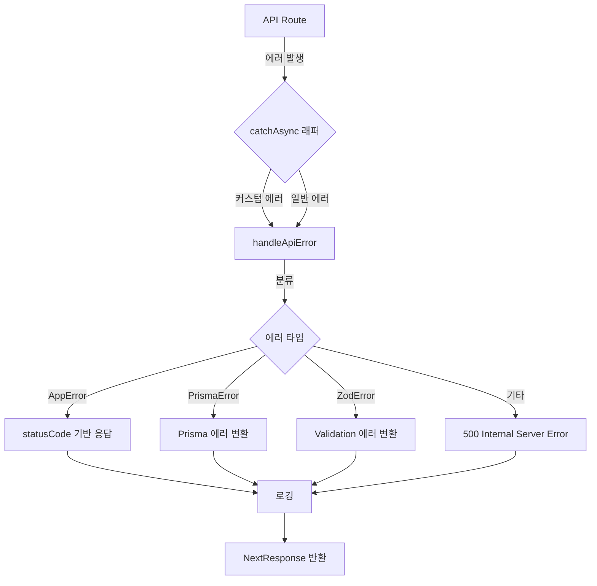

# VINTEE 에러 핸들링 가이드

## 📋 목차

1. [개요](#개요)
2. [에러 처리 아키텍처](#에러-처리-아키텍처)
3. [커스텀 에러 클래스](#커스텀-에러-클래스)
4. [API 에러 핸들링](#api-에러-핸들링)
5. [에러 로깅](#에러-로깅)
6. [에러 페이지](#에러-페이지)
7. [테스트 방법](#테스트-방법)
8. [Best Practices](#best-practices)

---

## 개요

VINTEE 프로젝트는 통일된 에러 처리 시스템을 통해 다음을 달성합니다:

- ✅ **일관된 에러 응답 형식** - 모든 API에서 동일한 에러 응답 구조 사용
- ✅ **타입 안전성** - TypeScript로 작성된 커스텀 에러 클래스
- ✅ **자동 에러 로깅** - 모든 에러를 자동으로 로깅하여 디버깅 용이
- ✅ **사용자 친화적 에러 메시지** - 한국어 에러 메시지로 UX 개선
- ✅ **개발자 친화적 디버깅** - 개발 환경에서는 상세한 스택 트레이스 제공

---

## 에러 처리 아키텍처



### 디렉토리 구조

```
src/
├── lib/
│   ├── errors/
│   │   └── index.ts           # 커스텀 에러 클래스 정의
│   ├── api/
│   │   └── error-handler.ts   # 전역 에러 핸들러
│   └── logger.ts              # 로깅 유틸리티
├── app/
│   ├── error.tsx              # 전역 에러 페이지
│   ├── not-found.tsx          # 404 페이지
│   ├── global-error.tsx       # 루트 레벨 에러 페이지
│   └── api/
│       ├── properties/route.ts  # 에러 처리 적용된 API 예시
│       └── bookings/route.ts    # 에러 처리 적용된 API 예시
```

---

## 커스텀 에러 클래스

### 에러 클래스 계층 구조

```typescript
Error (기본)
  └── AppError (커스텀 기본 에러)
      ├── UnauthorizedError (401)
      ├── ForbiddenError (403)
      ├── NotFoundError (404)
      ├── BadRequestError (400)
      ├── ValidationError (422)
      ├── ConflictError (409)
      ├── PaymentError (402)
      ├── BookingError (409)
      ├── DatabaseError (500)
      ├── ExternalAPIError (502)
      ├── RateLimitError (429)
      ├── InternalServerError (500)
      ├── TimeoutError (504)
      └── ServiceUnavailableError (503)
```

### 사용 예시

```typescript
import {
  BadRequestError,
  NotFoundError,
  UnauthorizedError,
  ValidationError
} from "@/lib/errors";

// 잘못된 요청
throw new BadRequestError("유효하지 않은 파라미터입니다", "INVALID_PARAM");

// 리소스 없음
throw new NotFoundError("숙소를 찾을 수 없습니다", "PROPERTY_NOT_FOUND");

// 인증 필요
throw new UnauthorizedError("로그인이 필요합니다");

// 유효성 검사 실패
throw new ValidationError("입력 데이터가 유효하지 않습니다", "VALIDATION_FAILED", {
  fields: {
    email: "이메일 형식이 올바르지 않습니다"
  }
});
```

---

## API 에러 핸들링

### catchAsync 래퍼 사용

모든 API Route는 `catchAsync` 래퍼로 감싸서 자동 에러 처리를 적용합니다.

**기본 패턴:**

```typescript
import { NextRequest } from "next/server";
import { catchAsync, successResponse } from "@/lib/api/error-handler";
import { BadRequestError } from "@/lib/errors";
import { logger } from "@/lib/logger";

export const GET = catchAsync(async (request: NextRequest) => {
  logger.info("API 요청 시작");

  // 비즈니스 로직
  const data = await fetchData();

  // 에러가 발생하면 자동으로 catchAsync가 처리
  if (!data) {
    throw new NotFoundError("데이터를 찾을 수 없습니다");
  }

  logger.info("API 요청 성공");

  // 성공 응답 (통일된 형식)
  return successResponse(data, "조회 성공");
});
```

### 에러 응답 형식

**성공 응답:**

```json
{
  "success": true,
  "message": "조회 성공",
  "data": {
    // 실제 데이터
  }
}
```

**에러 응답:**

```json
{
  "success": false,
  "error": {
    "message": "숙소를 찾을 수 없습니다",
    "code": "PROPERTY_NOT_FOUND",
    "statusCode": 404,
    "details": {},
    "stack": "... (개발 환경에서만)"
  }
}
```

### 실제 적용 예시

**Before (기존 코드):**

```typescript
export async function GET(request: NextRequest) {
  try {
    const data = await prisma.property.findMany();
    return NextResponse.json({ properties: data });
  } catch (error) {
    console.error("Error:", error);
    return NextResponse.json(
      { error: "숙소 조회에 실패했습니다" },
      { status: 500 }
    );
  }
}
```

**After (에러 핸들링 적용):**

```typescript
export const GET = catchAsync(async (request: NextRequest) => {
  logger.info("숙소 목록 조회 요청");

  try {
    const data = await prisma.property.findMany();

    logger.info("숙소 목록 조회 성공", { count: data.length });

    return successResponse({ properties: data }, "숙소 목록 조회 성공");
  } catch (error) {
    logger.error("숙소 조회 중 데이터베이스 오류", error);
    throw new DatabaseError("숙소 조회 중 오류가 발생했습니다");
  }
});
```

---

## 에러 로깅

### Logger 사용법

```typescript
import { logger } from "@/lib/logger";

// 디버그 (개발 환경에서만)
logger.debug("디버그 메시지", { userId: "123" });

// 정보
logger.info("API 요청 성공", { endpoint: "/api/properties" });

// 경고
logger.warn("응답 시간 지연", { duration: 3000 });

// 에러
logger.error("데이터베이스 연결 실패", error, { database: "postgres" });
```

### 로그 형식

```
[2026-02-10T10:30:45.123Z] [INFO] API 요청 성공 | {"endpoint":"/api/properties"}
[2026-02-10T10:30:50.456Z] [ERROR] 데이터베이스 연결 실패 | {"errorName":"DatabaseError","errorMessage":"Connection timeout"}
```

### 외부 로깅 서비스 연동 (향후)

프로덕션 환경에서는 다음 서비스와 연동 예정:

- **Sentry**: 에러 추적 및 알림
- **LogRocket**: 세션 리플레이 및 사용자 행동 분석
- **DataDog**: 로그 집계 및 모니터링

---

## 에러 페이지

### error.tsx (전역 에러 페이지)

애플리케이션에서 처리되지 않은 에러를 포착하는 클라이언트 컴포넌트입니다.

**기능:**
- 사용자 친화적 에러 메시지 표시
- "다시 시도" 버튼으로 복구 시도
- "홈으로 이동" 버튼으로 안전한 페이지 이동
- 개발 환경에서 상세 에러 정보 표시

**경로:** `/src/app/error.tsx`

### not-found.tsx (404 페이지)

존재하지 않는 경로에 접근 시 표시되는 페이지입니다.

**기능:**
- 404 상태를 명확히 표시
- 추천 링크 제공 (숙소 탐색, 내 예약 등)
- 고객센터 링크 제공

**경로:** `/src/app/not-found.tsx`

### global-error.tsx (루트 레벨 에러 페이지)

error.tsx에서도 잡히지 않은 최상위 에러를 처리합니다.

**경로:** `/src/app/global-error.tsx`

---

## 테스트 방법

### 1. 테스트 API 사용

에러 핸들링 시스템을 테스트하기 위한 전용 API가 제공됩니다.

```bash
# 성공 케이스
curl http://localhost:3010/api/test-errors

# Bad Request 에러
curl http://localhost:3010/api/test-errors?type=bad_request

# Unauthorized 에러
curl http://localhost:3010/api/test-errors?type=unauthorized

# Not Found 에러
curl http://localhost:3010/api/test-errors?type=not_found

# Validation 에러
curl http://localhost:3010/api/test-errors?type=validation

# Database 에러
curl http://localhost:3010/api/test-errors?type=database

# Internal Server Error
curl http://localhost:3010/api/test-errors?type=internal

# 예상치 못한 에러
curl http://localhost:3010/api/test-errors?type=unexpected
```

### 2. 실제 API 테스트

```bash
# 잘못된 가격 필터 (400 에러)
curl "http://localhost:3010/api/properties?min_price=abc"

# 존재하지 않는 숙소 (404 에러)
curl "http://localhost:3010/api/properties/invalid-id"

# 인증 없이 예약 생성 (401 에러)
curl -X POST http://localhost:3010/api/bookings \
  -H "Content-Type: application/json" \
  -d '{"propertyId":"123","checkIn":"2026-03-01","checkOut":"2026-03-02"}'
```

### 3. 에러 페이지 테스트

```bash
# 존재하지 않는 페이지 접속
http://localhost:3010/nonexistent-page

# 에러를 발생시키는 페이지 생성 (개발용)
```

### 4. 로그 확인

개발 서버 콘솔에서 로그를 확인합니다:

```
[2026-02-10T10:30:45.123Z] [INFO] 숙소 목록 조회 요청
[2026-02-10T10:30:45.456Z] [ERROR] 숙소 조회 중 데이터베이스 오류 발생
```

---

## Best Practices

### 1. 적절한 에러 타입 사용

```typescript
// ❌ 나쁜 예
throw new Error("유효하지 않은 이메일");

// ✅ 좋은 예
throw new ValidationError(
  "이메일 형식이 유효하지 않습니다",
  "INVALID_EMAIL_FORMAT"
);
```

### 2. 상세한 에러 정보 제공

```typescript
// ❌ 나쁜 예
throw new NotFoundError("찾을 수 없습니다");

// ✅ 좋은 예
throw new NotFoundError(
  "요청한 숙소를 찾을 수 없습니다",
  "PROPERTY_NOT_FOUND",
  { propertyId: id }
);
```

### 3. 민감한 정보 노출 방지

```typescript
// ❌ 나쁜 예 - 데이터베이스 연결 정보 노출
throw new DatabaseError(`Database connection failed: ${connectionString}`);

// ✅ 좋은 예
throw new DatabaseError("데이터베이스 연결에 실패했습니다");
```

### 4. 로깅 활용

```typescript
// ❌ 나쁜 예
console.log("Error:", error);

// ✅ 좋은 예
logger.error("예약 생성 중 오류 발생", error, {
  userId,
  propertyId,
  checkIn,
  checkOut
});
```

### 5. catchAsync 일관되게 사용

```typescript
// ❌ 나쁜 예 - try-catch 수동 관리
export async function GET(request: NextRequest) {
  try {
    // ...
  } catch (error) {
    return NextResponse.json({ error: "Error" }, { status: 500 });
  }
}

// ✅ 좋은 예 - catchAsync 사용
export const GET = catchAsync(async (request: NextRequest) => {
  // 에러는 자동으로 처리됨
  const data = await fetchData();
  return successResponse(data);
});
```

### 6. 사용자 친화적 메시지

```typescript
// ❌ 나쁜 예
throw new DatabaseError("PrismaClientKnownRequestError: P2025");

// ✅ 좋은 예
throw new NotFoundError(
  "요청하신 숙소가 삭제되었거나 존재하지 않습니다",
  "PROPERTY_DELETED_OR_NOT_FOUND"
);
```

---

## 에러 코드 규칙

### 네이밍 컨벤션

- **대문자 + 언더스코어**: `PROPERTY_NOT_FOUND`
- **명확한 의미**: `INVALID_EMAIL_FORMAT` (○) vs `EMAIL_ERROR` (✗)
- **일관성**: 같은 도메인은 같은 접두사 사용
  - `PROPERTY_NOT_FOUND`, `PROPERTY_NOT_APPROVED`
  - `BOOKING_CONFLICT`, `BOOKING_EXPIRED`

### 카테고리별 에러 코드

**인증/권한:**
- `UNAUTHORIZED` - 인증 필요
- `FORBIDDEN` - 권한 부족
- `TOKEN_EXPIRED` - 토큰 만료

**유효성 검사:**
- `VALIDATION_ERROR` - 일반 유효성 검사 실패
- `INVALID_EMAIL_FORMAT` - 이메일 형식 오류
- `INVALID_DATE_RANGE` - 날짜 범위 오류

**리소스:**
- `NOT_FOUND` - 일반 리소스 없음
- `PROPERTY_NOT_FOUND` - 숙소 없음
- `BOOKING_NOT_FOUND` - 예약 없음

**비즈니스 로직:**
- `BOOKING_CONFLICT` - 예약 충돌
- `PROPERTY_NOT_APPROVED` - 숙소 미승인
- `PAYMENT_FAILED` - 결제 실패

**시스템:**
- `DATABASE_ERROR` - 데이터베이스 오류
- `EXTERNAL_API_ERROR` - 외부 API 오류
- `INTERNAL_SERVER_ERROR` - 서버 내부 오류

---

## 마이그레이션 가이드

기존 API를 에러 핸들링 시스템으로 마이그레이션하는 단계:

### 1단계: Import 추가

```typescript
import { catchAsync, successResponse } from "@/lib/api/error-handler";
import { BadRequestError, NotFoundError } from "@/lib/errors";
import { logger } from "@/lib/logger";
```

### 2단계: 함수 시그니처 변경

```typescript
// Before
export async function GET(request: NextRequest) { ... }

// After
export const GET = catchAsync(async (request: NextRequest) => { ... });
```

### 3단계: 로깅 추가

```typescript
logger.info("API 요청 시작", { endpoint: request.url });
```

### 4단계: 에러 throw로 변경

```typescript
// Before
if (!data) {
  return NextResponse.json({ error: "Not found" }, { status: 404 });
}

// After
if (!data) {
  throw new NotFoundError("데이터를 찾을 수 없습니다");
}
```

### 5단계: 성공 응답 형식 통일

```typescript
// Before
return NextResponse.json({ data });

// After
return successResponse(data, "조회 성공");
```

---

## FAQ

### Q1. 기존 try-catch 블록은 어떻게 처리하나요?

catchAsync 내부에서 예외가 발생하면 자동으로 처리되므로, 최상위 try-catch는 제거할 수 있습니다. 다만, 특정 로직에서 에러를 변환해야 하는 경우 내부 try-catch를 유지할 수 있습니다.

```typescript
export const GET = catchAsync(async (request: NextRequest) => {
  try {
    // Prisma 쿼리
    const data = await prisma.property.findMany();
  } catch (error) {
    logger.error("DB 조회 실패", error);
    throw new DatabaseError("숙소 조회 중 오류가 발생했습니다");
  }

  return successResponse(data);
});
```

### Q2. Prisma 에러는 자동으로 처리되나요?

네! `handleApiError` 함수에서 Prisma 에러(`PrismaClientKnownRequestError`)를 자동으로 감지하고 적절한 HTTP 상태 코드와 메시지로 변환합니다.

### Q3. 개발/프로덕션 환경에서 다르게 동작하나요?

네! `process.env.NODE_ENV`에 따라:

- **개발 환경**: 상세한 스택 트레이스, 에러 상세 정보 포함
- **프로덕션 환경**: 사용자 친화적 메시지만 표시, 민감 정보 숨김

### Q4. Sentry 연동은 어떻게 하나요?

`src/lib/api/error-handler.ts`의 `logError` 함수에서 주석 처리된 코드를 활성화하면 됩니다:

```typescript
if (process.env.NODE_ENV === 'production' && !isOperational) {
  Sentry.captureException(error);
}
```

---

## 참고 자료

- [Next.js Error Handling](https://nextjs.org/docs/app/building-your-application/routing/error-handling)
- [HTTP Status Codes](https://developer.mozilla.org/ko/docs/Web/HTTP/Status)
- [Prisma Error Reference](https://www.prisma.io/docs/reference/api-reference/error-reference)

---

**마지막 업데이트**: 2026-02-10
**작성자**: Gagahoho, Inc. Engineering Team
**버전**: 1.0
