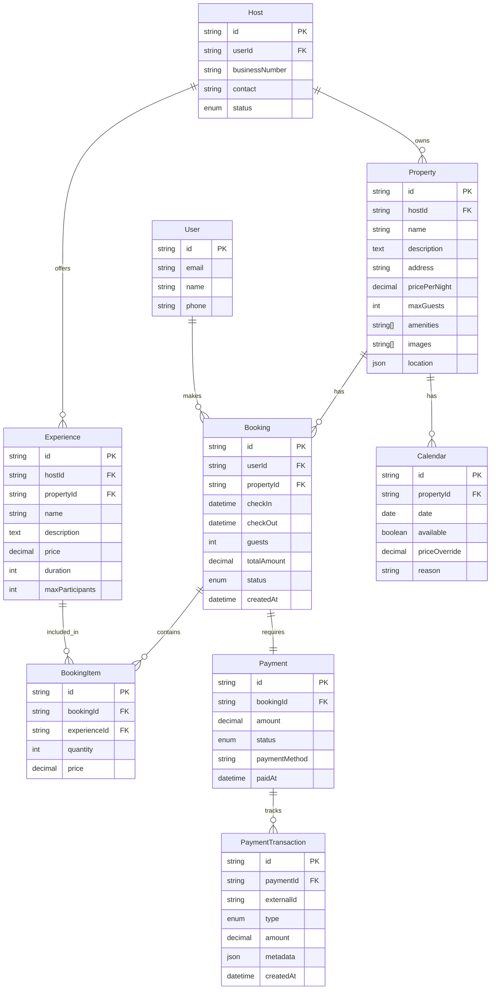
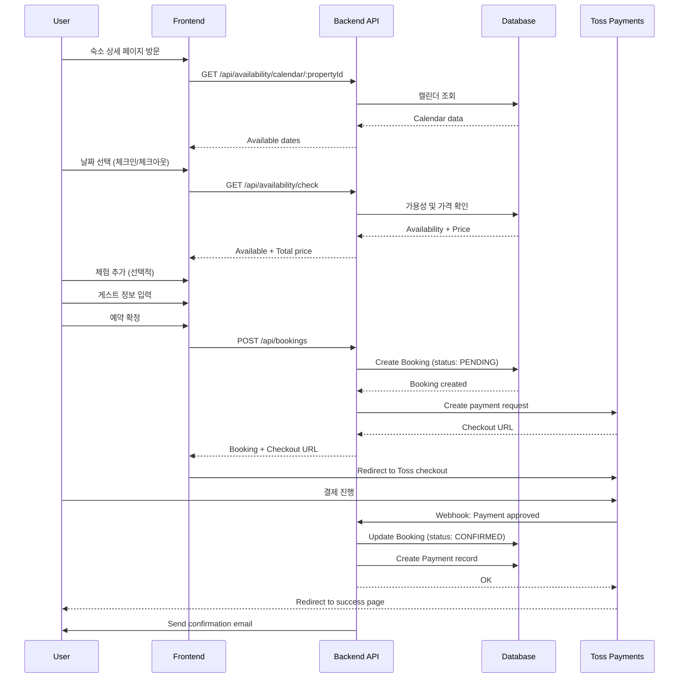
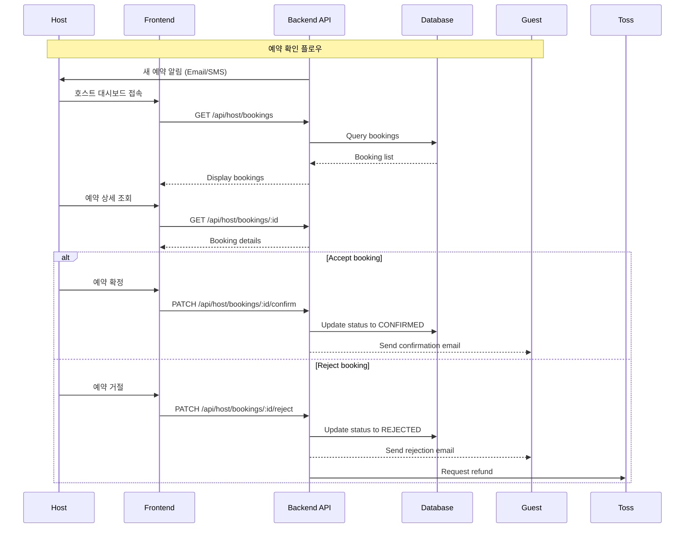

# 예약 시스템 아키텍처 문서

## 개요

ChonCance 플랫폼의 핵심 기능인 예약 시스템(Booking System)의 풀스택 아키텍처 설계.

**목적**: 사용자가 숙소(Property)와 선택적 체험(Experience)을 예약하고 관리할 수 있는 시스템

**목표**:
- 간단하고 직관적인 예약 프로세스
- 실시간 예약 가능 여부 확인
- 결제 통합
- 호스트 예약 관리
- 예약 상태 추적

## 시스템 아키텍처

### 전체 구조

```
┌─────────────────────────────────────────────────────────────┐
│                    Frontend (Next.js 14)                     │
│  - Property Detail with Booking Widget                       │
│  - Booking Checkout Flow                                     │
│  - My Bookings Dashboard                                     │
│  - Host Booking Management                                   │
├─────────────────────────────────────────────────────────────┤
│                     API Layer (REST)                         │
│  /api/bookings       - 예약 CRUD                             │
│  /api/availability   - 가용성 확인                           │
│  /api/payments       - 결제 처리                             │
│  /api/host/bookings  - 호스트 예약 관리                      │
├─────────────────────────────────────────────────────────────┤
│                  Business Logic Layer                        │
│  - Booking Service (예약 로직)                               │
│  - Availability Service (날짜 확인)                          │
│  - Payment Service (결제 통합)                               │
│  - Notification Service (알림)                               │
├─────────────────────────────────────────────────────────────┤
│               External Services                              │
│  - Toss Payments (한국 결제)                                 │
│  - Email Service (예약 확인 메일)                            │
│  - SMS Service (선택적)                                      │
├─────────────────────────────────────────────────────────────┤
│                   Data Layer                                 │
│  PostgreSQL (Neon)                                           │
│  - Property, Experience                                      │
│  - Booking, BookingItem                                      │
│  - Payment, PaymentTransaction                               │
│  - Calendar (가용성 관리)                                    │
└─────────────────────────────────────────────────────────────┘
```

## 데이터 모델

### ERD



### 핵심 엔티티 설명

#### 1. Property (숙소)
```typescript
interface Property {
  id: string;
  hostId: string;
  name: string;
  description: string;
  address: string;
  location: {
    lat: number;
    lng: number;
  };
  pricePerNight: number;
  maxGuests: number;
  amenities: string[];  // ["wifi", "parking", "kitchen", ...]
  images: string[];     // Image URLs
  rules: string;
  checkInTime: string;  // "15:00"
  checkOutTime: string; // "11:00"
  minNights: number;    // 최소 숙박일
  maxNights: number;    // 최대 숙박일
  status: "active" | "inactive" | "pending";
  createdAt: Date;
  updatedAt: Date;
}
```

#### 2. Experience (체험)
```typescript
interface Experience {
  id: string;
  hostId: string;
  propertyId: string;   // 연관된 숙소
  name: string;
  description: string;
  price: number;
  duration: number;     // 분 단위
  maxParticipants: number;
  images: string[];
  availableDays: number[]; // [0,1,2,3,4,5,6] (일~토)
  availableTimes: string[]; // ["10:00", "14:00"]
  status: "active" | "inactive";
}
```

#### 3. Booking (예약)
```typescript
interface Booking {
  id: string;
  userId: string;
  propertyId: string;
  checkIn: Date;
  checkOut: Date;
  guests: number;

  // 가격 정보
  nightlyRate: number;      // 1박 요금
  numberOfNights: number;   // 숙박일수
  accommodationTotal: number; // 숙박 총액
  experiencesTotal: number;  // 체험 총액
  serviceFee: number;        // 서비스 수수료
  totalAmount: number;       // 최종 금액

  // 예약 상태
  status: BookingStatus;

  // 연락 정보
  guestName: string;
  guestPhone: string;
  guestEmail: string;

  // 특별 요청
  specialRequests?: string;

  // 메타데이터
  createdAt: Date;
  updatedAt: Date;
  confirmedAt?: Date;
  cancelledAt?: Date;
  cancellationReason?: string;
}

enum BookingStatus {
  PENDING = "pending",           // 결제 대기
  CONFIRMED = "confirmed",       // 예약 확정
  CANCELLED = "cancelled",       // 취소됨
  COMPLETED = "completed",       // 완료됨
  REJECTED = "rejected",         // 호스트 거절
  NO_SHOW = "no_show"           // 노쇼
}
```

#### 4. BookingItem (예약에 포함된 체험)
```typescript
interface BookingItem {
  id: string;
  bookingId: string;
  experienceId: string;
  date: Date;           // 체험 날짜
  time: string;         // 체험 시간
  quantity: number;     // 참가 인원
  price: number;        // 단가
  totalPrice: number;   // 총 가격
}
```

#### 5. Calendar (가용성 캘린더)
```typescript
interface Calendar {
  id: string;
  propertyId: string;
  date: Date;
  available: boolean;           // 예약 가능 여부
  priceOverride?: number;       // 가격 오버라이드 (성수기 등)
  reason?: string;              // 불가 사유
  minNights?: number;           // 해당 날짜의 최소 숙박일
}
```

#### 6. Payment (결제)
```typescript
interface Payment {
  id: string;
  bookingId: string;
  amount: number;
  currency: string;          // "KRW"
  status: PaymentStatus;
  paymentMethod: string;     // "card", "transfer", "kakao_pay"

  // Toss Payments 정보
  paymentKey?: string;       // Toss paymentKey
  orderId: string;           // 주문 ID
  orderName: string;         // 주문명

  // 타임스탬프
  requestedAt: Date;
  approvedAt?: Date;
  cancelledAt?: Date;

  // 환불 정보
  refundAmount?: number;
  refundReason?: string;
}

enum PaymentStatus {
  READY = "ready",           // 결제 준비
  IN_PROGRESS = "in_progress", // 결제 진행 중
  DONE = "done",             // 결제 완료
  CANCELLED = "cancelled",   // 결제 취소
  FAILED = "failed"          // 결제 실패
}
```

## API 설계

### 1. 가용성 확인 API

#### GET /api/availability/check
숙소의 특정 날짜 범위 가용성 확인

**Query Parameters:**
```typescript
{
  propertyId: string;
  checkIn: string;  // ISO 8601 date
  checkOut: string;
  guests?: number;
}
```

**Response:**
```typescript
{
  available: boolean;
  price: {
    nightlyRate: number;
    numberOfNights: number;
    accommodationTotal: number;
    serviceFee: number;
    total: number;
  };
  unavailableDates?: string[];  // ISO dates
  alternativeDates?: {
    checkIn: string;
    checkOut: string;
    price: number;
  }[];
}
```

#### GET /api/availability/calendar/:propertyId
특정 숙소의 월별 캘린더 조회

**Query Parameters:**
```typescript
{
  year: number;
  month: number;  // 1-12
}
```

**Response:**
```typescript
{
  propertyId: string;
  calendar: {
    [date: string]: {  // "2025-10-27"
      available: boolean;
      price: number;
      minNights?: number;
    };
  };
}
```

### 2. 예약 API

#### POST /api/bookings
새 예약 생성

**Request:**
```typescript
{
  propertyId: string;
  checkIn: string;
  checkOut: string;
  guests: number;
  guestInfo: {
    name: string;
    phone: string;
    email: string;
  };
  experiences?: {
    experienceId: string;
    date: string;
    time: string;
    quantity: number;
  }[];
  specialRequests?: string;
}
```

**Response:**
```typescript
{
  booking: Booking;
  payment: {
    orderId: string;
    orderName: string;
    amount: number;
    checkoutUrl: string;  // Toss Payments checkout URL
  };
}
```

#### GET /api/bookings
사용자의 예약 목록 조회

**Query Parameters:**
```typescript
{
  status?: BookingStatus;
  page?: number;
  limit?: number;
}
```

**Response:**
```typescript
{
  bookings: Booking[];
  pagination: {
    page: number;
    limit: number;
    total: number;
    totalPages: number;
  };
}
```

#### GET /api/bookings/:id
특정 예약 상세 조회

**Response:**
```typescript
{
  booking: Booking & {
    property: Property;
    items: (BookingItem & { experience: Experience })[];
    payment: Payment;
  };
}
```

#### PATCH /api/bookings/:id/cancel
예약 취소

**Request:**
```typescript
{
  reason: string;
}
```

**Response:**
```typescript
{
  booking: Booking;
  refund: {
    amount: number;
    processingDays: number;
    policy: string;
  };
}
```

### 3. 호스트 예약 관리 API

#### GET /api/host/bookings
호스트의 예약 목록 조회

**Query Parameters:**
```typescript
{
  propertyId?: string;
  status?: BookingStatus;
  startDate?: string;
  endDate?: string;
  page?: number;
  limit?: number;
}
```

#### PATCH /api/host/bookings/:id/confirm
예약 확정

#### PATCH /api/host/bookings/:id/reject
예약 거절

**Request:**
```typescript
{
  reason: string;
}
```

### 4. 결제 API

#### POST /api/payments/confirm
Toss Payments 결제 승인

**Request:**
```typescript
{
  paymentKey: string;
  orderId: string;
  amount: number;
}
```

#### GET /api/payments/:bookingId
예약의 결제 정보 조회

#### POST /api/payments/:bookingId/refund
결제 환불 요청

**Request:**
```typescript
{
  cancelReason: string;
}
```

## 예약 플로우

### 사용자 예약 플로우



### 호스트 예약 관리 플로우



## UI/UX 설계

### 주요 화면

#### 1. 숙소 상세 페이지 - 예약 위젯

```
┌─────────────────────────────────────┐
│  ₩50,000 / 박                        │
├─────────────────────────────────────┤
│  체크인    │  체크아웃                │
│  2025-11-01│  2025-11-03             │
├─────────────────────────────────────┤
│  게스트                               │
│  성인 2명 ▼                           │
├─────────────────────────────────────┤
│  ₩50,000 × 2박      ₩100,000         │
│  서비스 수수료         ₩5,000          │
│  ─────────────────────────────       │
│  총 합계            ₩105,000          │
├─────────────────────────────────────┤
│         [  예약하기  ]                │
└─────────────────────────────────────┘
```

#### 2. 예약 체크아웃 페이지

**Steps:**
1. **날짜 및 게스트 확인**
   - 체크인/체크아웃 날짜
   - 게스트 수

2. **체험 선택 (선택적)**
   - 이용 가능한 체험 목록
   - 날짜/시간 선택
   - 참가 인원

3. **게스트 정보**
   - 이름, 전화번호, 이메일
   - 특별 요청사항

4. **결제**
   - 가격 상세 내역
   - 결제 방법 선택
   - 취소 정책 동의
   - Toss Payments 결제

#### 3. 내 예약 대시보드

**Tabs:**
- **예정된 예약**: 확정된 미래 예약
- **과거 예약**: 완료된 예약
- **취소된 예약**: 취소/거절된 예약

**각 예약 카드:**
```
┌──────────────────────────────────────┐
│ [숙소 이미지]                          │
│                                       │
│ 숙소 이름                              │
│ 2025-11-01 ~ 2025-11-03 (2박)        │
│ 게스트 2명                             │
│                                       │
│ 총 금액: ₩105,000                      │
│ 상태: ✅ 확정됨                         │
│                                       │
│ [상세보기]  [취소하기]                  │
└──────────────────────────────────────┘
```

#### 4. 호스트 예약 관리 대시보드

**필터:**
- 숙소별
- 상태별 (대기/확정/완료/취소)
- 날짜 범위

**예약 목록 (테이블 형식):**
| 예약 ID | 게스트 | 숙소 | 체크인 | 체크아웃 | 금액 | 상태 | 액션 |
|---------|--------|------|--------|----------|------|------|------|
| #B001   | 홍길동 | 한옥스테이 | 2025-11-01 | 2025-11-03 | ₩105,000 | 대기 중 | [확정] [거절] |

## 비즈니스 로직

### 1. 가용성 확인 로직

```typescript
async function checkAvailability(
  propertyId: string,
  checkIn: Date,
  checkOut: Date
): Promise<{ available: boolean; reason?: string }> {
  // 1. 날짜 유효성 검증
  if (checkIn >= checkOut) {
    return { available: false, reason: "잘못된 날짜 범위" };
  }

  if (checkIn < new Date()) {
    return { available: false, reason: "과거 날짜는 예약할 수 없습니다" };
  }

  // 2. Property 조회
  const property = await prisma.property.findUnique({
    where: { id: propertyId },
  });

  if (!property || property.status !== "active") {
    return { available: false, reason: "숙소를 이용할 수 없습니다" };
  }

  // 3. 최소/최대 숙박일 확인
  const nights = differenceInDays(checkOut, checkIn);
  if (nights < property.minNights) {
    return {
      available: false,
      reason: `최소 ${property.minNights}박 이상 예약해야 합니다`
    };
  }

  if (nights > property.maxNights) {
    return {
      available: false,
      reason: `최대 ${property.maxNights}박까지만 예약 가능합니다`
    };
  }

  // 4. 기존 예약 확인
  const existingBookings = await prisma.booking.findMany({
    where: {
      propertyId,
      status: { in: ["confirmed", "pending"] },
      OR: [
        {
          checkIn: { lt: checkOut },
          checkOut: { gt: checkIn },
        },
      ],
    },
  });

  if (existingBookings.length > 0) {
    return { available: false, reason: "이미 예약된 날짜입니다" };
  }

  // 5. 캘린더 블록 확인
  const blockedDates = await prisma.calendar.findMany({
    where: {
      propertyId,
      date: {
        gte: checkIn,
        lt: checkOut,
      },
      available: false,
    },
  });

  if (blockedDates.length > 0) {
    return {
      available: false,
      reason: "선택한 날짜 중 이용 불가한 날짜가 있습니다"
    };
  }

  return { available: true };
}
```

### 2. 가격 계산 로직

```typescript
async function calculateBookingPrice(
  propertyId: string,
  checkIn: Date,
  checkOut: Date,
  experienceItems?: ExperienceItem[]
): Promise<PriceBreakdown> {
  // 1. Property 기본 가격
  const property = await prisma.property.findUnique({
    where: { id: propertyId },
  });

  const numberOfNights = differenceInDays(checkOut, checkIn);

  // 2. 날짜별 가격 (캘린더 오버라이드 확인)
  const calendarDates = await prisma.calendar.findMany({
    where: {
      propertyId,
      date: {
        gte: checkIn,
        lt: checkOut,
      },
    },
  });

  let accommodationTotal = 0;
  const currentDate = new Date(checkIn);

  while (currentDate < checkOut) {
    const calendar = calendarDates.find(
      c => isSameDay(c.date, currentDate)
    );

    const nightlyRate = calendar?.priceOverride || property.pricePerNight;
    accommodationTotal += nightlyRate;

    currentDate.setDate(currentDate.getDate() + 1);
  }

  // 3. 체험 가격
  let experiencesTotal = 0;
  if (experienceItems) {
    for (const item of experienceItems) {
      const experience = await prisma.experience.findUnique({
        where: { id: item.experienceId },
      });
      experiencesTotal += experience.price * item.quantity;
    }
  }

  // 4. 서비스 수수료 (10%)
  const serviceFee = Math.round((accommodationTotal + experiencesTotal) * 0.1);

  // 5. 총액
  const totalAmount = accommodationTotal + experiencesTotal + serviceFee;

  return {
    nightlyRate: property.pricePerNight,
    numberOfNights,
    accommodationTotal,
    experiencesTotal,
    serviceFee,
    totalAmount,
  };
}
```

### 3. 예약 생성 로직

```typescript
async function createBooking(data: CreateBookingInput): Promise<Booking> {
  return await prisma.$transaction(async (tx) => {
    // 1. 가용성 재확인 (동시성 제어)
    const availability = await checkAvailability(
      data.propertyId,
      data.checkIn,
      data.checkOut
    );

    if (!availability.available) {
      throw new Error(availability.reason);
    }

    // 2. 가격 계산
    const price = await calculateBookingPrice(
      data.propertyId,
      data.checkIn,
      data.checkOut,
      data.experiences
    );

    // 3. 예약 생성
    const booking = await tx.booking.create({
      data: {
        userId: data.userId,
        propertyId: data.propertyId,
        checkIn: data.checkIn,
        checkOut: data.checkOut,
        guests: data.guests,
        ...price,
        status: "pending",
        guestName: data.guestInfo.name,
        guestPhone: data.guestInfo.phone,
        guestEmail: data.guestInfo.email,
        specialRequests: data.specialRequests,
      },
    });

    // 4. 체험 아이템 생성
    if (data.experiences) {
      await tx.bookingItem.createMany({
        data: data.experiences.map(exp => ({
          bookingId: booking.id,
          experienceId: exp.experienceId,
          date: exp.date,
          time: exp.time,
          quantity: exp.quantity,
          price: exp.price,
          totalPrice: exp.price * exp.quantity,
        })),
      });
    }

    // 5. 결제 레코드 생성
    const orderId = generateOrderId(booking.id);
    await tx.payment.create({
      data: {
        bookingId: booking.id,
        amount: booking.totalAmount,
        currency: "KRW",
        status: "ready",
        orderId,
        orderName: `${property.name} 예약`,
        requestedAt: new Date(),
      },
    });

    return booking;
  });
}
```

### 4. 취소 정책 로직

```typescript
interface CancellationPolicy {
  refundRate: number;  // 0.0 ~ 1.0
  description: string;
}

function getCancellationPolicy(
  booking: Booking,
  cancellationDate: Date
): CancellationPolicy {
  const daysUntilCheckIn = differenceInDays(
    booking.checkIn,
    cancellationDate
  );

  // 체크인 7일 전: 전액 환불
  if (daysUntilCheckIn >= 7) {
    return {
      refundRate: 1.0,
      description: "전액 환불",
    };
  }

  // 체크인 3~6일 전: 50% 환불
  if (daysUntilCheckIn >= 3) {
    return {
      refundRate: 0.5,
      description: "50% 환불",
    };
  }

  // 체크인 2일 전 이내: 환불 불가
  return {
    refundRate: 0,
    description: "환불 불가",
  };
}

async function cancelBooking(
  bookingId: string,
  reason: string
): Promise<{ booking: Booking; refund: RefundInfo }> {
  return await prisma.$transaction(async (tx) => {
    const booking = await tx.booking.findUnique({
      where: { id: bookingId },
      include: { payment: true },
    });

    if (booking.status !== "confirmed") {
      throw new Error("확정된 예약만 취소할 수 있습니다");
    }

    // 취소 정책 확인
    const policy = getCancellationPolicy(booking, new Date());
    const refundAmount = Math.round(booking.totalAmount * policy.refundRate);

    // 예약 상태 업데이트
    const updatedBooking = await tx.booking.update({
      where: { id: bookingId },
      data: {
        status: "cancelled",
        cancelledAt: new Date(),
        cancellationReason: reason,
      },
    });

    // 환불 처리
    if (refundAmount > 0 && booking.payment) {
      await requestTossPaymentRefund(
        booking.payment.paymentKey,
        refundAmount,
        reason
      );

      await tx.payment.update({
        where: { id: booking.payment.id },
        data: {
          status: "cancelled",
          cancelledAt: new Date(),
          refundAmount,
          refundReason: reason,
        },
      });
    }

    return {
      booking: updatedBooking,
      refund: {
        amount: refundAmount,
        processingDays: 3-5,
        policy: policy.description,
      },
    };
  });
}
```

## 결제 통합 (Toss Payments)

### 결제 플로우

```typescript
// 1. 결제 요청 생성
async function createPaymentRequest(booking: Booking): Promise<string> {
  const clientKey = process.env.TOSS_CLIENT_KEY;
  const orderId = booking.payment.orderId;

  // Toss Payments checkout URL 생성
  const checkoutUrl = `https://pay.toss.im/web/checkout?` +
    `clientKey=${clientKey}&` +
    `orderId=${orderId}&` +
    `orderName=${encodeURIComponent(booking.payment.orderName)}&` +
    `amount=${booking.totalAmount}&` +
    `successUrl=${encodeURIComponent(`${APP_URL}/booking/success`)}&` +
    `failUrl=${encodeURIComponent(`${APP_URL}/booking/fail`)}`;

  return checkoutUrl;
}

// 2. 결제 승인
async function confirmPayment(
  paymentKey: string,
  orderId: string,
  amount: number
): Promise<PaymentConfirmation> {
  const secretKey = process.env.TOSS_SECRET_KEY;

  const response = await fetch("https://api.tosspayments.com/v1/payments/confirm", {
    method: "POST",
    headers: {
      "Authorization": `Basic ${Buffer.from(secretKey + ":").toString("base64")}`,
      "Content-Type": "application/json",
    },
    body: JSON.stringify({
      paymentKey,
      orderId,
      amount,
    }),
  });

  if (!response.ok) {
    throw new Error("결제 승인 실패");
  }

  const confirmation = await response.json();

  // 예약 상태 업데이트
  await prisma.$transaction([
    prisma.booking.update({
      where: { id: orderId },
      data: {
        status: "confirmed",
        confirmedAt: new Date(),
      },
    }),
    prisma.payment.update({
      where: { orderId },
      data: {
        paymentKey,
        status: "done",
        approvedAt: new Date(),
      },
    }),
  ]);

  // 확인 이메일 발송
  await sendBookingConfirmationEmail(orderId);

  return confirmation;
}

// 3. 환불
async function requestTossPaymentRefund(
  paymentKey: string,
  amount: number,
  reason: string
): Promise<void> {
  const secretKey = process.env.TOSS_SECRET_KEY;

  const response = await fetch(
    `https://api.tosspayments.com/v1/payments/${paymentKey}/cancel`,
    {
      method: "POST",
      headers: {
        "Authorization": `Basic ${Buffer.from(secretKey + ":").toString("base64")}`,
        "Content-Type": "application/json",
      },
      body: JSON.stringify({
        cancelAmount: amount,
        cancelReason: reason,
      }),
    }
  );

  if (!response.ok) {
    throw new Error("환불 요청 실패");
  }
}
```

## 알림 시스템

### 이메일 알림

**사용자 알림:**
1. **예약 확인 이메일** (결제 완료 후)
   - 예약 상세 정보
   - 체크인/체크아웃 시간
   - 호스트 연락처
   - 숙소 위치 및 찾아가는 방법

2. **예약 취소 확인 이메일**
   - 취소 사유
   - 환불 금액 및 예상 일정

3. **체크인 리마인더** (체크인 3일 전)
   - 준비 사항
   - 체크인 절차

**호스트 알림:**
1. **새 예약 알림**
   - 게스트 정보
   - 예약 상세
   - 확정/거절 링크

2. **체크인 리마인더** (체크인 1일 전)

### 이메일 템플릿 예시

```typescript
// templates/booking-confirmation.tsx
export function BookingConfirmationEmail({ booking }: Props) {
  return (
    <Html>
      <Head />
      <Body>
        <h1>예약이 확정되었습니다!</h1>

        <Section>
          <h2>예약 정보</h2>
          <p>예약 번호: {booking.id}</p>
          <p>숙소: {booking.property.name}</p>
          <p>체크인: {format(booking.checkIn, "yyyy년 MM월 dd일 HH:mm")}</p>
          <p>체크아웃: {format(booking.checkOut, "yyyy년 MM월 dd일 HH:mm")}</p>
          <p>게스트: {booking.guests}명</p>
        </Section>

        <Section>
          <h2>결제 정보</h2>
          <p>총 금액: ₩{booking.totalAmount.toLocaleString()}</p>
        </Section>

        <Section>
          <h2>호스트 정보</h2>
          <p>이름: {booking.property.host.name}</p>
          <p>연락처: {booking.property.host.phone}</p>
        </Section>

        <Section>
          <h2>찾아가는 방법</h2>
          <p>{booking.property.address}</p>
          <Button href={`https://maps.google.com/?q=${booking.property.location.lat},${booking.property.location.lng}`}>
            지도 보기
          </Button>
        </Section>

        <Section>
          <Button href={`${APP_URL}/bookings/${booking.id}`}>
            예약 상세 보기
          </Button>
        </Section>
      </Body>
    </Html>
  );
}
```

## 성능 최적화

### 1. 데이터베이스 인덱스

```sql
-- 예약 조회 최적화
CREATE INDEX idx_booking_user_status ON Booking(userId, status);
CREATE INDEX idx_booking_property_dates ON Booking(propertyId, checkIn, checkOut);
CREATE INDEX idx_booking_dates ON Booking(checkIn, checkOut);

-- 캘린더 조회 최적화
CREATE INDEX idx_calendar_property_date ON Calendar(propertyId, date);

-- 결제 조회 최적화
CREATE INDEX idx_payment_booking ON Payment(bookingId);
CREATE INDEX idx_payment_order ON Payment(orderId);
```

### 2. 캐싱 전략

```typescript
// Redis 캐싱
import { Redis } from "@upstash/redis";

const redis = new Redis({
  url: process.env.UPSTASH_REDIS_URL,
  token: process.env.UPSTASH_REDIS_TOKEN,
});

// 캘린더 캐싱 (1시간)
async function getCachedCalendar(
  propertyId: string,
  year: number,
  month: number
) {
  const cacheKey = `calendar:${propertyId}:${year}-${month}`;

  const cached = await redis.get(cacheKey);
  if (cached) return cached;

  const calendar = await fetchCalendar(propertyId, year, month);
  await redis.set(cacheKey, calendar, { ex: 3600 }); // 1 hour

  return calendar;
}

// 예약 시 캐시 무효화
async function invalidateCalendarCache(propertyId: string) {
  const keys = await redis.keys(`calendar:${propertyId}:*`);
  if (keys.length > 0) {
    await redis.del(...keys);
  }
}
```

### 3. 동시성 제어

```typescript
// Optimistic locking with version field
const booking = await prisma.booking.updateMany({
  where: {
    id: bookingId,
    version: currentVersion,  // Only update if version matches
  },
  data: {
    status: "confirmed",
    version: { increment: 1 },
  },
});

if (booking.count === 0) {
  throw new Error("예약이 이미 변경되었습니다. 다시 시도해주세요.");
}
```

## 보안 고려사항

### 1. 결제 보안

- **PCI DSS 준수**: Toss Payments가 카드 정보 처리
- **금액 검증**: 서버 사이드에서 금액 재계산 및 검증
- **HTTPS 필수**: 모든 결제 관련 통신은 HTTPS
- **Webhook 검증**: Toss에서 오는 webhook signature 검증

```typescript
function verifyTossWebhook(signature: string, body: string): boolean {
  const secret = process.env.TOSS_WEBHOOK_SECRET;
  const hash = crypto
    .createHmac("sha256", secret)
    .update(body)
    .digest("base64");

  return hash === signature;
}
```

### 2. 예약 보안

- **Rate Limiting**: 예약 생성 API에 rate limit 적용
- **CSRF Protection**: Next.js 기본 제공
- **데이터 검증**: Zod로 입력 데이터 검증

```typescript
const createBookingSchema = z.object({
  propertyId: z.string().cuid(),
  checkIn: z.string().datetime(),
  checkOut: z.string().datetime(),
  guests: z.number().int().min(1).max(20),
  guestInfo: z.object({
    name: z.string().min(2).max(50),
    phone: z.string().regex(/^010-?\d{4}-?\d{4}$/),
    email: z.string().email(),
  }),
  // ...
});
```

### 3. 권한 제어

```typescript
// 사용자는 자신의 예약만 접근
async function getBooking(bookingId: string, userId: string) {
  const booking = await prisma.booking.findFirst({
    where: {
      id: bookingId,
      userId: userId,  // 본인 확인
    },
  });

  if (!booking) {
    throw new UnauthorizedError("접근 권한이 없습니다");
  }

  return booking;
}

// 호스트는 자신의 숙소 예약만 접근
async function getHostBooking(bookingId: string, hostId: string) {
  const booking = await prisma.booking.findFirst({
    where: {
      id: bookingId,
      property: {
        hostId: hostId,  // 호스트 확인
      },
    },
  });

  if (!booking) {
    throw new UnauthorizedError("접근 권한이 없습니다");
  }

  return booking;
}
```

## 테스트 전략

### 1. 단위 테스트

```typescript
// __tests__/services/booking.test.ts
describe("BookingService", () => {
  describe("checkAvailability", () => {
    it("should return available for valid dates", async () => {
      const result = await checkAvailability(
        "property-123",
        new Date("2025-11-01"),
        new Date("2025-11-03")
      );

      expect(result.available).toBe(true);
    });

    it("should return unavailable for past dates", async () => {
      const result = await checkAvailability(
        "property-123",
        new Date("2024-01-01"),
        new Date("2024-01-03")
      );

      expect(result.available).toBe(false);
      expect(result.reason).toContain("과거 날짜");
    });

    it("should return unavailable for conflicting bookings", async () => {
      // Mock existing booking
      prisma.booking.findMany.mockResolvedValue([
        { checkIn: new Date("2025-11-02"), checkOut: new Date("2025-11-04") },
      ]);

      const result = await checkAvailability(
        "property-123",
        new Date("2025-11-01"),
        new Date("2025-11-03")
      );

      expect(result.available).toBe(false);
    });
  });

  describe("calculateBookingPrice", () => {
    it("should calculate correct price", async () => {
      const price = await calculateBookingPrice(
        "property-123",
        new Date("2025-11-01"),
        new Date("2025-11-03"),
        []
      );

      expect(price.numberOfNights).toBe(2);
      expect(price.accommodationTotal).toBe(100000); // 50000 * 2
      expect(price.serviceFee).toBe(10000); // 10%
      expect(price.totalAmount).toBe(110000);
    });
  });
});
```

### 2. 통합 테스트

```typescript
// __tests__/api/bookings.test.ts
describe("POST /api/bookings", () => {
  it("should create a booking successfully", async () => {
    const response = await request(app)
      .post("/api/bookings")
      .set("Authorization", `Bearer ${userToken}`)
      .send({
        propertyId: "property-123",
        checkIn: "2025-11-01",
        checkOut: "2025-11-03",
        guests: 2,
        guestInfo: {
          name: "홍길동",
          phone: "010-1234-5678",
          email: "test@example.com",
        },
      });

    expect(response.status).toBe(201);
    expect(response.body.booking).toBeDefined();
    expect(response.body.payment.checkoutUrl).toBeDefined();
  });

  it("should fail for unavailable dates", async () => {
    // Create existing booking
    await createBooking({
      propertyId: "property-123",
      checkIn: new Date("2025-11-01"),
      checkOut: new Date("2025-11-03"),
      // ...
    });

    const response = await request(app)
      .post("/api/bookings")
      .set("Authorization", `Bearer ${userToken}`)
      .send({
        propertyId: "property-123",
        checkIn: "2025-11-02",
        checkOut: "2025-11-04",
        guests: 2,
        guestInfo: { /* ... */ },
      });

    expect(response.status).toBe(400);
    expect(response.body.error).toContain("예약된 날짜");
  });
});
```

### 3. E2E 테스트 (Playwright)

```typescript
// e2e/booking-flow.spec.ts
test("complete booking flow", async ({ page }) => {
  // 1. Navigate to property detail
  await page.goto("/property/property-123");

  // 2. Select dates
  await page.click('[data-testid="check-in-input"]');
  await page.click('[data-date="2025-11-01"]');
  await page.click('[data-date="2025-11-03"]');

  // 3. Select guests
  await page.selectOption('[data-testid="guests-select"]', "2");

  // 4. Click book button
  await page.click('[data-testid="book-button"]');

  // 5. Fill guest info
  await page.fill('[data-testid="guest-name"]', "홍길동");
  await page.fill('[data-testid="guest-phone"]', "010-1234-5678");
  await page.fill('[data-testid="guest-email"]', "test@example.com");

  // 6. Proceed to payment
  await page.click('[data-testid="proceed-to-payment"]');

  // 7. Mock Toss Payments success
  await page.route("**/api/payments/confirm", (route) => {
    route.fulfill({
      status: 200,
      body: JSON.stringify({ success: true }),
    });
  });

  // 8. Verify booking created
  await expect(page.locator('[data-testid="booking-success"]')).toBeVisible();
  await expect(page.locator('[data-testid="booking-id"]')).toContainText("B");
});
```

## 배포 및 모니터링

### 환경 변수

```env
# Database
DATABASE_URL=postgresql://...

# Toss Payments
TOSS_CLIENT_KEY=test_ck_...
TOSS_SECRET_KEY=test_sk_...
TOSS_WEBHOOK_SECRET=...

# Redis (캐싱)
UPSTASH_REDIS_URL=...
UPSTASH_REDIS_TOKEN=...

# Email
SENDGRID_API_KEY=...
FROM_EMAIL=noreply@choncance.com

# App
NEXT_PUBLIC_APP_URL=https://choncance.com
```

### 모니터링

```typescript
// lib/monitoring.ts
import * as Sentry from "@sentry/nextjs";

export function trackBookingCreated(booking: Booking) {
  Sentry.addBreadcrumb({
    category: "booking",
    message: "Booking created",
    level: "info",
    data: {
      bookingId: booking.id,
      propertyId: booking.propertyId,
      amount: booking.totalAmount,
    },
  });
}

export function trackPaymentFailed(error: Error, booking: Booking) {
  Sentry.captureException(error, {
    tags: {
      type: "payment_failure",
      bookingId: booking.id,
    },
    extra: {
      booking,
    },
  });
}
```

## 향후 개선 사항

### Phase 1 (MVP 완성)
- ✅ 기본 예약 CRUD
- ✅ 결제 통합
- ✅ 이메일 알림
- ⏳ 캘린더 UI 개선
- ⏳ 호스트 대시보드 완성

### Phase 2 (사용성 개선)
- 📅 즉시 예약 vs 승인 필요 옵션
- 🔔 실시간 알림 (WebSocket)
- 📱 모바일 최적화
- 🌍 다국어 지원

### Phase 3 (고급 기능)
- 💬 호스트-게스트 메시징
- ⭐ 리뷰 시스템 통합
- 🎁 쿠폰 및 프로모션
- 📊 예약 분석 대시보드

### Phase 4 (스케일링)
- 🔄 재고 관리 (다수의 동일 숙소)
- 🏢 채널 매니저 통합 (Airbnb, Booking.com)
- 🤖 동적 가격 책정 (AI)
- 📈 수요 예측

---

**문서 버전**: 1.0
**작성일**: 2025-10-27
**작성자**: Winston (Architect Agent)
**우선순위**: HIGH (MVP Core Feature)
