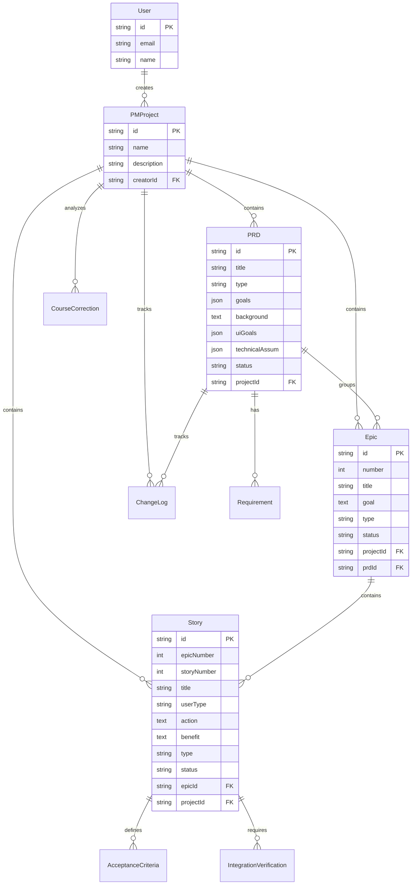

# PM Tools 아키텍처 문서

## 개요

PM Tools는 ChonCance 플랫폼에 통합된 제품 관리 도구 모듈로, BMAD 프레임워크의 PM 워크플로우를 실제 웹 애플리케이션 기능으로 구현한 것입니다.

**목적**: 제품 관리자가 PRD, Epic, User Story를 체계적으로 작성, 관리, 추적할 수 있도록 지원

**완성일**: 2025-10-27

## 시스템 아키텍처

### 전체 구조

```
┌─────────────────────────────────────────────────────────────┐
│                        Client Layer                          │
│  (Next.js 14 App Router + React + shadcn/ui)                │
├─────────────────────────────────────────────────────────────┤
│                     PM Dashboard UI                          │
│  - Projects List                                             │
│  - PRD Creation Wizard                                       │
│  - Epic/Story Management                                     │
│  - Export Functions                                          │
├─────────────────────────────────────────────────────────────┤
│                     API Layer (REST)                         │
│  /api/pm/projects    - 프로젝트 CRUD                         │
│  /api/pm/prds        - PRD 관리                              │
│  /api/pm/epics       - Epic 관리                             │
│  /api/pm/stories     - Story 관리                            │
│  /api/pm/course-correction - 방향 수정                       │
│  /api/pm/export/*    - 문서 내보내기                         │
├─────────────────────────────────────────────────────────────┤
│              Business Logic Layer                            │
│  - Clerk Authentication (사용자별 프로젝트 격리)             │
│  - Prisma ORM (타입 안전 데이터 접근)                        │
│  - Markdown Export Generator                                 │
├─────────────────────────────────────────────────────────────┤
│                   Data Layer                                 │
│  PostgreSQL (Neon)                                           │
│  - PMProject, PRD, Epic, Story                               │
│  - Requirement, AcceptanceCriteria                           │
│  - ChangeLog, CourseCorrection                               │
└─────────────────────────────────────────────────────────────┘
```

## 데이터 모델

### 핵심 엔티티



### 데이터 모델 설계 결정

1. **PMProject 분리**: User의 일반 프로젝트와 PM 프로젝트를 분리하여 관심사 분리
2. **JSON 필드 사용**: `goals`, `uiGoals`, `technicalAssum`은 구조가 유동적이므로 JSON으로 저장
3. **Cascade 삭제**: 프로젝트 삭제 시 관련 PRD, Epic, Story도 자동 삭제
4. **선택적 관계**: Epic은 PRD에 속할 수도, 독립적으로 존재할 수도 있음

## API 설계

### REST API 엔드포인트

#### Projects

```
GET    /api/pm/projects          # 프로젝트 목록 조회
POST   /api/pm/projects          # 새 프로젝트 생성
GET    /api/pm/projects/:id      # 프로젝트 상세 조회
PATCH  /api/pm/projects/:id      # 프로젝트 수정
DELETE /api/pm/projects/:id      # 프로젝트 삭제
```

#### PRDs

```
POST   /api/pm/prds              # PRD 생성
GET    /api/pm/prds/:id          # PRD 조회
PATCH  /api/pm/prds/:id          # PRD 수정
DELETE /api/pm/prds/:id          # PRD 삭제
```

#### Epics

```
POST   /api/pm/epics             # Epic 생성
GET    /api/pm/epics/:id         # Epic 조회
PATCH  /api/pm/epics/:id         # Epic 수정
DELETE /api/pm/epics/:id         # Epic 삭제
```

#### Stories

```
POST   /api/pm/stories           # Story 생성
GET    /api/pm/stories/:id       # Story 조회
PATCH  /api/pm/stories/:id       # Story 수정
DELETE /api/pm/stories/:id       # Story 삭제
```

#### Export

```
GET    /api/pm/export/prd/:id    # PRD를 Markdown으로 내보내기
GET    /api/pm/export/epic/:id   # Epic을 Markdown으로 내보내기
GET    /api/pm/export/story/:id  # Story를 Markdown으로 내보내기
```

#### Course Correction

```
POST   /api/pm/course-correction       # 방향 수정 분석 생성
GET    /api/pm/course-correction/:id   # 방향 수정 분석 조회
PATCH  /api/pm/course-correction/:id   # 방향 수정 분석 수정
```

### 인증 및 권한

- **인증**: Clerk를 통한 사용자 인증
- **권한 모델**:
  - 사용자는 자신이 생성한 PMProject만 접근 가능
  - PMProject의 모든 하위 리소스(PRD, Epic, Story)는 프로젝트 생성자만 접근
  - API 레벨에서 `creatorId` 체크를 통한 접근 제어

```typescript
// 권한 체크 예시
const project = await prisma.pMProject.findUnique({
  where: {
    id: projectId,
    creatorId: userId,  // Clerk userId
  },
});

if (!project) {
  return NextResponse.json({ error: "권한이 없습니다" }, { status: 403 });
}
```

## UI/UX 아키텍처

### 페이지 구조

```
/pm-dashboard
├── /                              # 대시보드 홈
│   └── Projects 목록 + 통계
├── /projects/[id]                 # 프로젝트 상세
│   ├── PRDs 탭
│   ├── Epics 탭
│   └── Stories 탭
├── /create-prd                    # PRD 생성 마법사
├── /create-epic                   # Epic 생성 폼 (미완성)
├── /create-story                  # Story 생성 폼 (미완성)
├── /prds/[id]                     # PRD 상세/편집 (미완성)
├── /epics/[id]                    # Epic 상세/편집 (미완성)
└── /stories/[id]                  # Story 상세/편집 (미완성)
```

### 컴포넌트 설계

```
components/
└── pm-dashboard/
    ├── ProjectCard.tsx            # 프로젝트 카드 컴포넌트
    ├── PRDCard.tsx                # PRD 카드
    ├── EpicCard.tsx               # Epic 카드
    ├── StoryCard.tsx              # Story 카드
    ├── CreateProjectDialog.tsx    # 프로젝트 생성 다이얼로그
    └── ExportButton.tsx           # 내보내기 버튼
```

### 상태 관리

- **로컬 상태**: React useState for 폼 입력
- **서버 상태**: 직접 fetch API 호출 (향후 React Query 고려)
- **인증 상태**: Clerk의 useAuth hook

## 기술 스택

### Frontend
- **Framework**: Next.js 14 (App Router)
- **UI Library**: React 18
- **Styling**: Tailwind CSS
- **Component Library**: shadcn/ui
- **Icons**: lucide-react
- **TypeScript**: 5.x

### Backend
- **API**: Next.js API Routes (REST)
- **ORM**: Prisma 6.x
- **Database**: PostgreSQL (Neon)
- **Authentication**: Clerk

### 인프라
- **Hosting**: Vercel (예정)
- **Database Hosting**: Neon (PostgreSQL)
- **File Storage**: 없음 (JSON 및 Text로 DB 저장)

## 구현 상태

### ✅ 완료된 기능

1. **데이터베이스 스키마**
   - ✅ 8개 모델 정의 (PMProject, PRD, Epic, Story, Requirement, AcceptanceCriteria, IntegrationVerification, ChangeLog, CourseCorrection)
   - ✅ Prisma 마이그레이션 적용

2. **API 엔드포인트**
   - ✅ Projects CRUD
   - ✅ PRDs CRUD
   - ✅ Epics CRUD
   - ✅ Stories CRUD
   - ✅ Course Correction 생성/조회/수정
   - ✅ Export (PRD, Epic, Story → Markdown)

3. **UI 페이지**
   - ✅ PM Dashboard 메인 페이지
   - ✅ 프로젝트 상세 페이지 (Tabs로 PRD/Epic/Story 구분)
   - ✅ PRD 생성 폼

### ⏳ 미완성 기능

1. **UI 페이지**
   - ⏳ Epic 생성/편집 페이지
   - ⏳ Story 생성/편집 페이지
   - ⏳ Course Correction 도구 UI
   - ⏳ PRD/Epic/Story 상세 페이지 (조회만 가능)

2. **고급 기능**
   - ⏳ PRD Sharding (PRD를 여러 Epic 파일로 분할)
   - ⏳ 실시간 협업 (여러 PM이 동시 편집)
   - ⏳ 버전 히스토리 및 롤백
   - ⏳ 템플릿 라이브러리

## 성능 고려사항

### 현재 구현

1. **데이터베이스 쿼리**
   - Prisma의 `include`를 사용한 관계 로딩
   - 프로젝트 상세 조회 시 모든 관련 데이터를 한 번에 로드
   - N+1 문제 없음

2. **API 응답**
   - JSON 직렬화
   - 페이지네이션 미구현 (작은 데이터셋 가정)

### 향후 최적화

1. **페이지네이션**
   - 프로젝트 목록: 페이지당 20개
   - PRD/Epic/Story 목록: 페이지당 50개

2. **캐싱**
   - React Query로 클라이언트 사이드 캐싱
   - Next.js의 fetch cache 활용

3. **지연 로딩**
   - 프로젝트 상세 페이지에서 탭 클릭 시 데이터 로드

## 보안 고려사항

### 구현된 보안

1. **인증**: Clerk를 통한 사용자 인증
2. **권한 부여**:
   - API 레벨에서 `creatorId` 확인
   - 사용자는 자신의 프로젝트만 접근
3. **입력 검증**:
   - TypeScript 타입 체크
   - Prisma 스키마 제약

### 추가 보안 권장사항

1. **Rate Limiting**: API 호출 제한 (Vercel Edge Middleware)
2. **CSRF Protection**: Next.js 기본 제공
3. **XSS Protection**: React의 자동 이스케이프
4. **SQL Injection Protection**: Prisma의 parameterized queries

## 확장성 고려사항

### 현재 제한사항

- 단일 사용자당 프로젝트 수: 무제한 (실제로는 수백 개 이하 권장)
- 프로젝트당 PRD 수: 무제한
- PRD당 Epic 수: 무제한
- Epic당 Story 수: 무제한

### 확장 전략

1. **수평 확장**
   - Vercel의 자동 스케일링
   - Neon PostgreSQL의 자동 스케일링

2. **수직 확장**
   - 데이터베이스 인덱스 추가
   - 복잡한 쿼리 최적화

## 마이그레이션 및 배포

### 데이터베이스 마이그레이션

```bash
# 마이그레이션 생성
npx prisma migrate dev --name migration_name

# 프로덕션 마이그레이션
npx prisma migrate deploy
```

### 배포 프로세스

```bash
# 1. 빌드
npm run build

# 2. Vercel 배포
vercel deploy --prod

# 3. 마이그레이션 실행 (자동)
# Vercel의 build command에서 prisma generate 실행
```

## 향후 로드맵

### Phase 1: 완성 (1-2주)
- ✅ Epic/Story 생성 UI 완성
- ✅ PRD/Epic/Story 상세 페이지 구현
- ✅ Course Correction 도구 UI

### Phase 2: 개선 (2-4주)
- 📋 PRD Wizard 개선 (단계별 가이드)
- 📋 템플릿 시스템 (Greenfield/Brownfield 템플릿)
- 📋 검색 기능
- 📋 필터링 및 정렬

### Phase 3: 협업 (4-8주)
- 👥 팀 기능 (여러 PM 협업)
- 👥 댓글 및 피드백
- 👥 승인 워크플로우
- 👥 알림 시스템

### Phase 4: 통합 (8-12주)
- 🔗 Jira/Linear 통합
- 🔗 Slack 알림
- 🔗 GitHub Issues 동기화
- 🔗 Figma 연동

## 기술 부채 및 개선사항

### 알려진 제한사항

1. **에러 처리**: 기본적인 try-catch만 구현, 세부 에러 메시지 부족
2. **로딩 상태**: 간단한 "로딩 중..." 텍스트만 표시
3. **폼 검증**: 클라이언트 사이드 검증만 있음, 서버 사이드 검증 부족
4. **테스트**: 단위 테스트 및 통합 테스트 없음

### 개선 계획

1. **에러 처리 개선**
   ```typescript
   // 현재
   catch (error) {
     console.error("오류:", error);
     alert("실패했습니다.");
   }

   // 개선 후
   catch (error) {
     if (error instanceof PrismaClientKnownRequestError) {
       // 특정 Prisma 오류 처리
     }
     toast.error(`오류: ${getErrorMessage(error)}`);
     logError(error);
   }
   ```

2. **로딩 및 에러 상태 개선**
   - React Suspense 활용
   - Skeleton 컴포넌트
   - Error Boundary

3. **폼 검증 강화**
   - Zod 스키마로 클라이언트/서버 공유 검증
   - react-hook-form 활용

4. **테스트 추가**
   - Vitest for 단위 테스트
   - Playwright for E2E 테스트

## 참고 자료

- [BMAD 프레임워크](/.bmad-core/)
- [Prisma 문서](https://www.prisma.io/docs)
- [Next.js 14 문서](https://nextjs.org/docs)
- [Clerk 인증](https://clerk.com/docs)
- [shadcn/ui](https://ui.shadcn.com/)

---

**문서 버전**: 1.0
**작성일**: 2025-10-27
**작성자**: Winston (Architect Agent)
