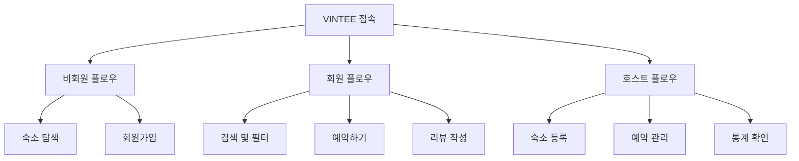
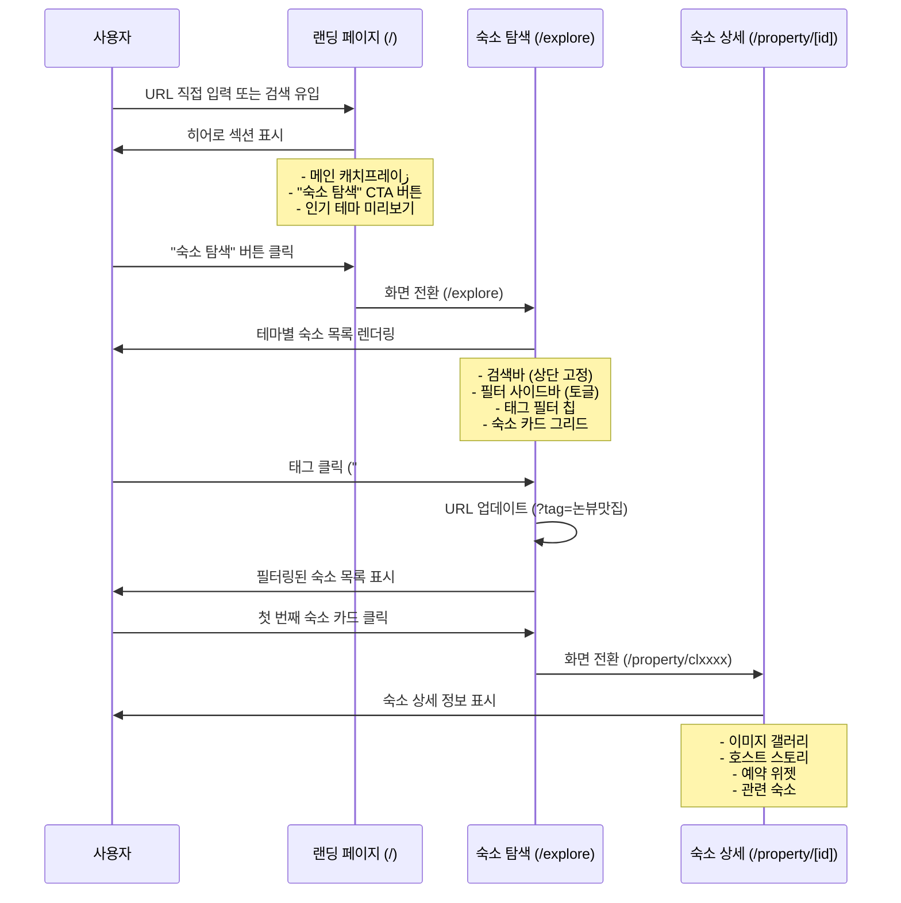
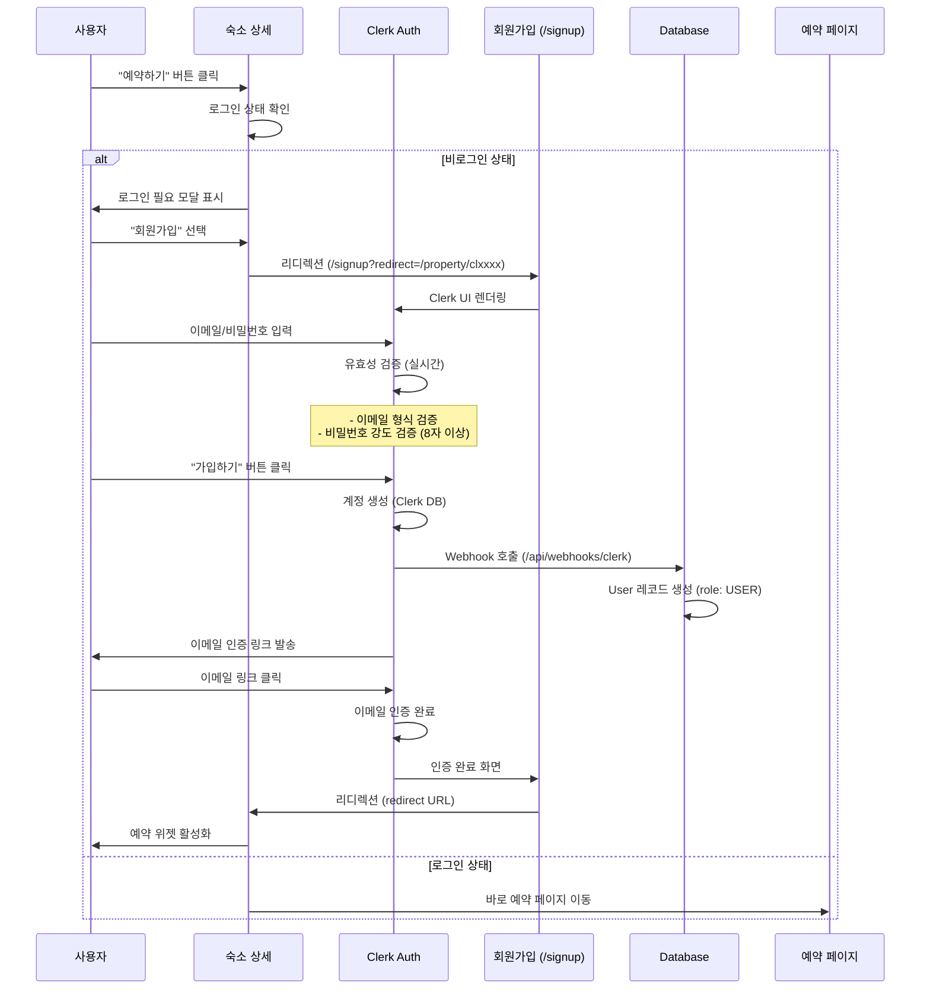
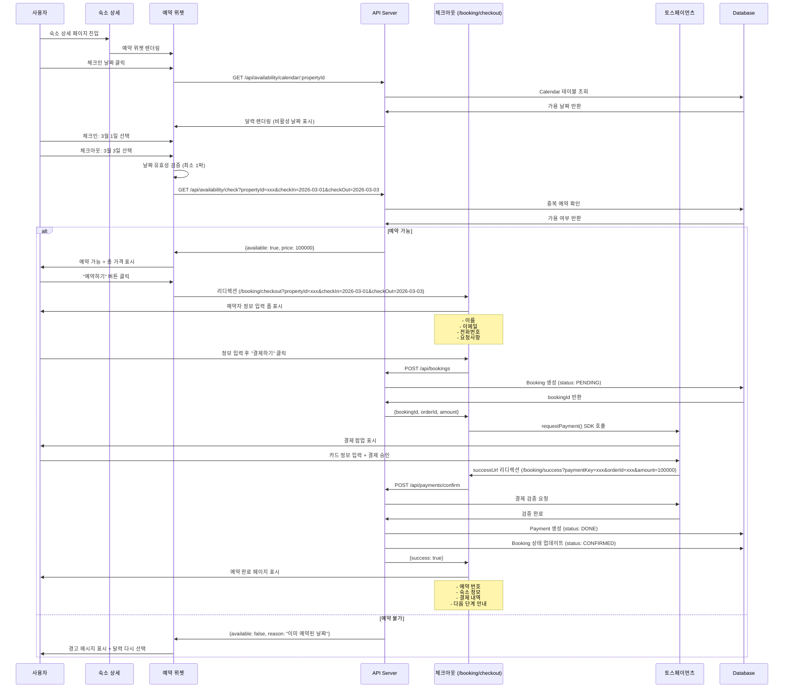
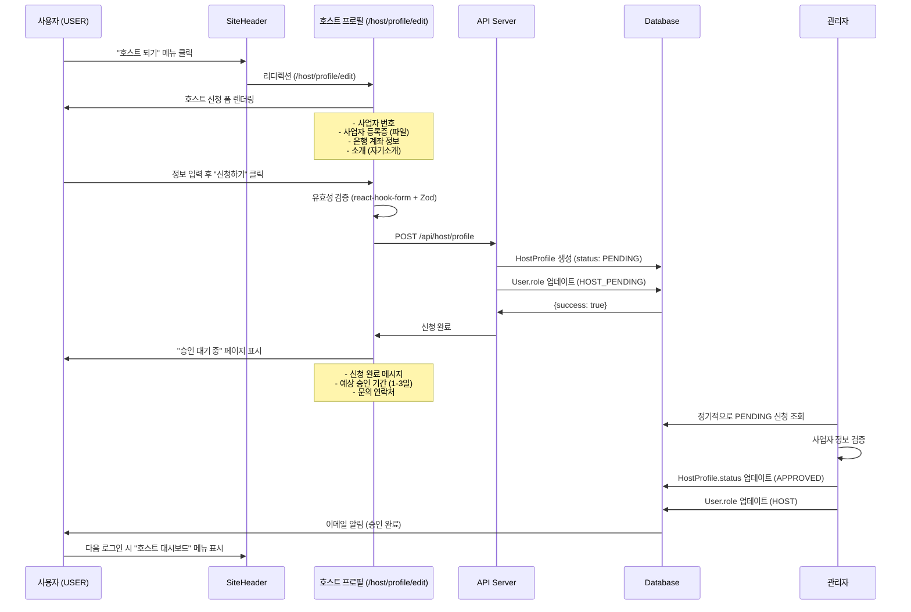
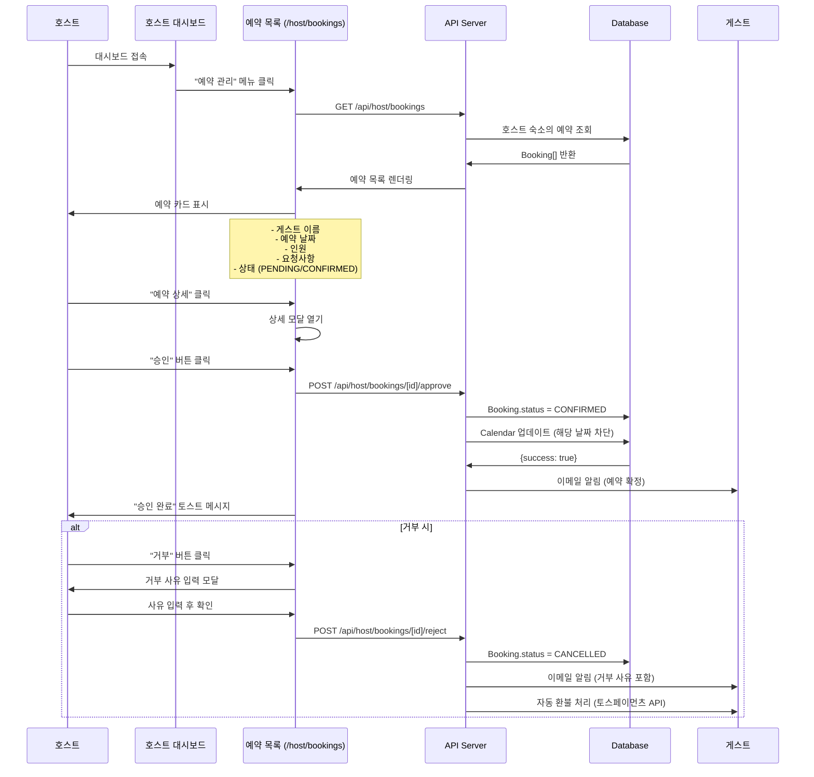
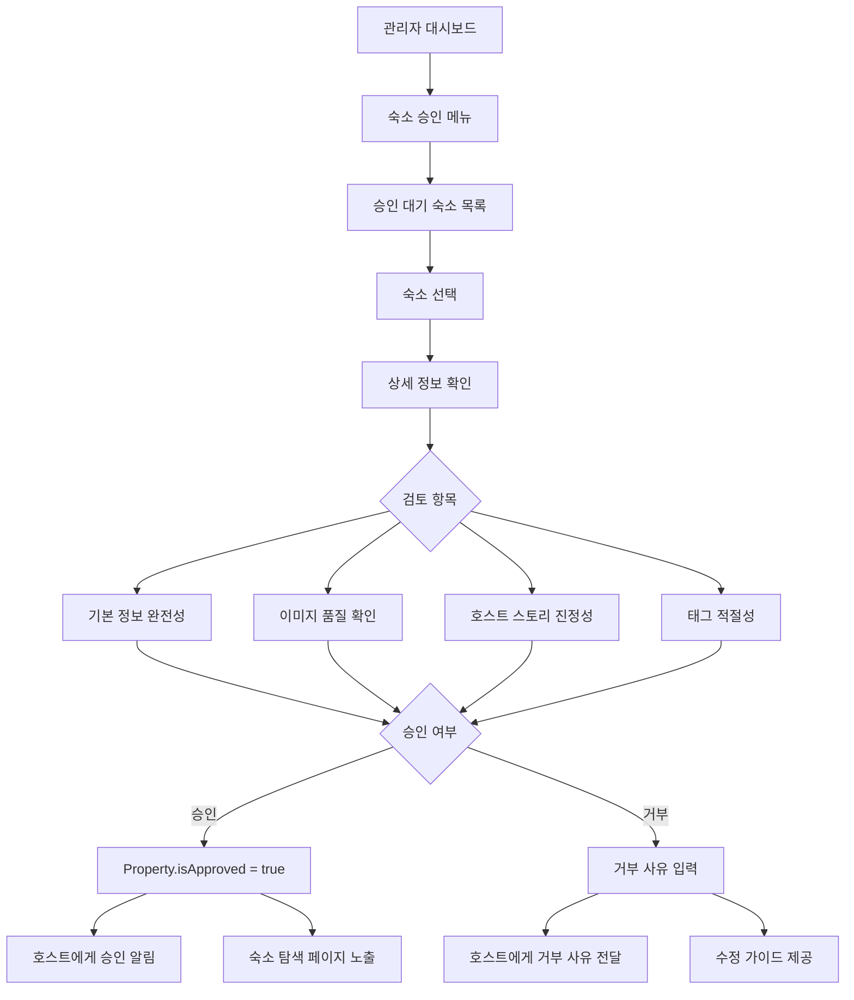
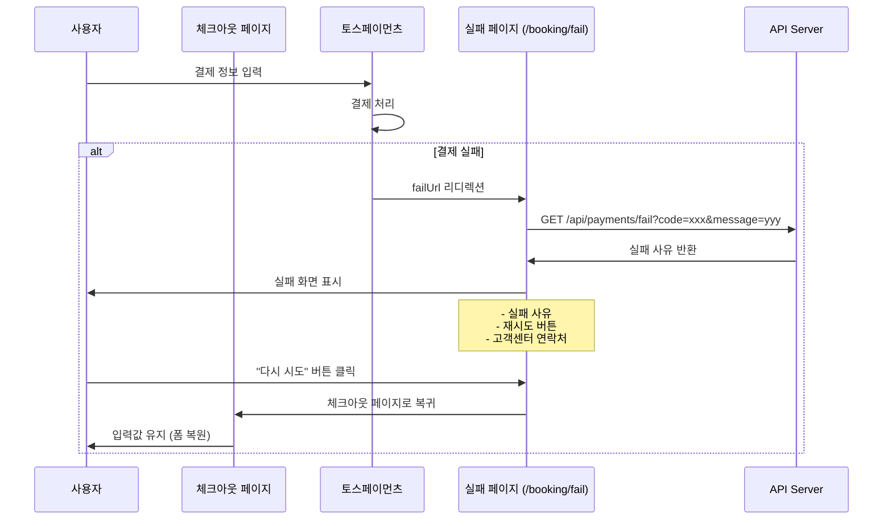

# VINTEE 사용자 플로우 문서

**버전**: 2.0 (Enhanced Edition)
**최종 업데이트**: 2026-02-10
**작성자**: Gagahoho, Inc. Engineering Team
**상태**: Production-Ready

---

## 📋 목차

1. [개요](#1-개요)
2. [주요 사용자 플로우](#2-주요-사용자-플로우)
3. [게스트 플로우](#3-게스트-플로우)
4. [호스트 플로우](#4-호스트-플로우)
5. [관리자 플로우](#5-관리자-플로우)
6. [에러 처리 플로우](#6-에러-처리-플로우)
7. [화면 전환 맵](#7-화면-전환-맵)

---

## 1. 개요

### 1.1 문서 목적

이 문서는 VINTEE 플랫폼의 모든 사용자 플로우를 정의하고, 각 시나리오별로 화면 전환, 사용자 인터랙션, 시스템 동작을 상세히 설명합니다.

### 1.2 사용자 역할 정의

| 역할 | 설명 | 권한 |
|------|------|------|
| **비회원 (Guest)** | 로그인하지 않은 방문자 | 숙소 조회, 검색 가능 |
| **회원 (User)** | 가입한 일반 사용자 | 예약, 리뷰 작성 가능 |
| **호스트 대기 (Host Pending)** | 호스트 신청 후 승인 대기 중 | 일반 회원 권한 + 대시보드 접근 제한 |
| **호스트 (Host)** | 승인된 숙소 제공자 | 숙소 등록/관리, 예약 관리 |
| **관리자 (Admin)** | 플랫폼 운영자 | 전체 시스템 관리 |

### 1.3 주요 사용 시나리오



---

## 2. 주요 사용자 플로우

### 2.1 첫 방문자 플로우 (Landing → Explore)

**시나리오**: MZ세대 여행객이 VINTEE를 처음 방문하여 숙소를 탐색하는 과정



**주요 화면 요소**:

1. **랜딩 페이지 (`/`)**
   - 히어로 섹션 (배경 이미지 + 캐치프레이즈)
   - "숙소 탐색" 버튼 (Primary CTA)
   - 인기 테마 미리보기 (3개)
   - Footer (이용약관, 개인정보처리방침)

2. **숙소 탐색 페이지 (`/explore`)**
   - 검색바 (상단 고정, sticky)
   - 필터 버튼 (모바일: 하단 시트, 데스크톱: 좌측 사이드바)
   - 태그 필터 칩 (16개 태그, 수평 스크롤)
   - 숙소 카드 그리드 (1 col 모바일, 2-3 col 태블릿/데스크톱)
   - 페이지네이션 또는 무한 스크롤

3. **숙소 상세 페이지 (`/property/[id]`)**
   - 이미지 갤러리 (Lightbox)
   - 숙소 정보 (이름, 위치, 태그)
   - 호스트 스토리 (진정성 있는 농촌 이야기)
   - 편의시설 목록
   - 예약 위젯 (우측 고정, 모바일: 하단 시트)
   - 관련 숙소 (같은 태그)

**인터랙션 포인트**:
- **검색바 클릭**: 포커스 시 자동완성 드롭다운 표시
- **필터 버튼 클릭**: 사이드바 슬라이드 인 (애니메이션 300ms)
- **태그 칩 클릭**: URL 업데이트 + 목록 필터링 (로딩 스피너)
- **숙소 카드 호버**: 카드 그림자 증가 (shadow-md → shadow-lg)
- **숙소 카드 클릭**: 상세 페이지로 전환 (Next.js Link, prefetch)

---

### 2.2 회원가입 플로우

**시나리오**: 비회원이 예약을 위해 회원가입하는 과정



**Clerk 설정**:
- **이메일/비밀번호**: 기본 인증 방식
- **카카오 OAuth**: 간편 로그인 (향후 추가)
- **한국어 로컬라이제이션**: `ko` locale 설정
- **리디렉션**: `redirect_url` 쿼리 파라미터로 원래 페이지 복귀

**에러 처리**:
- 이메일 중복: Clerk에서 자동 에러 메시지 표시
- 네트워크 오류: "잠시 후 다시 시도해주세요" 토스트 메시지
- 인증 실패: 로그인 페이지로 리디렉션

---

## 3. 게스트 플로우

### 3.1 숙소 검색 및 필터링 플로우

**시나리오**: 사용자가 특정 조건에 맞는 숙소를 검색하는 과정

```mermaid
graph TB
    Start[/explore 페이지 진입]

    Start --> Search{검색 방법 선택}

    Search --> Text[텍스트 검색]
    Search --> Tag[태그 필터]
    Search --> Filter[고급 필터]

    Text --> Input[검색어 입력]
    Input --> API1[GET /api/properties?search=논뷰]

    Tag --> Click[태그 칩 클릭]
    Click --> API2[GET /api/properties?tag=논뷰맛집]

    Filter --> Open[필터 사이드바 열기]
    Open --> Set[필터 조건 설정]
    Set --> Apply[적용하기 버튼]
    Apply --> API3[GET /api/properties?price=50000-100000&region=강원]

    API1 --> Render[결과 렌더링]
    API2 --> Render
    API3 --> Render

    Render --> Empty{결과 있음?}
    Empty -->|Yes| List[숙소 카드 목록 표시]
    Empty -->|No| NoResult[빈 상태 화면]

    NoResult --> Suggest[추천 태그 제안]
    Suggest --> Retry[다시 검색]
```

**필터 옵션**:

| 필터 타입 | 옵션 | UI 컴포넌트 |
|-----------|------|-------------|
| **가격** | 0-50,000원, 50,000-100,000원, 100,000-200,000원, 200,000원 이상 | Slider (Range) |
| **지역** | 경기, 강원, 충북, 충남, 전북, 전남, 경북, 경남, 제주 | Select (Dropdown) |
| **날짜** | 체크인/체크아웃 | DatePicker (Calendar) |
| **인원** | 1-10명 | Counter (+/- 버튼) |
| **반려동물** | 동반 가능/불가 | Toggle (Switch) |
| **태그** | 16개 태그 (VIEW, ACTIVITY, FACILITY, VIBE) | Checkbox Group |

**URL 구조**:
```
/explore?search=논뷰&tag=논뷰맛집&price=50000-100000&region=강원&checkIn=2026-03-01&checkOut=2026-03-03&guests=2&pet=true
```

**화면 상태**:
- **로딩**: 스켈레톤 UI (카드 형태, shimmer 애니메이션)
- **빈 결과**: "조건에 맞는 숙소가 없습니다" + 필터 초기화 버튼
- **에러**: "숙소를 불러올 수 없습니다" + 재시도 버튼

---

### 3.2 예약 플로우 (Guest → Booking → Payment)

**시나리오**: 회원이 숙소를 선택하고 결제까지 완료하는 과정



**예약 위젯 (BookingWidget) UI**:

```
┌─────────────────────────────────┐
│  예약하기                        │
├─────────────────────────────────┤
│  체크인                          │
│  ┌───────────────────────────┐  │
│  │  2026년 3월 1일           │  │
│  └───────────────────────────┘  │
│                                 │
│  체크아웃                        │
│  ┌───────────────────────────┐  │
│  │  2026년 3월 3일           │  │
│  └───────────────────────────┘  │
│                                 │
│  인원                            │
│  ┌─┬──────────────────────┬─┐  │
│  │-│  2명                 │+│  │
│  └─┴──────────────────────┴─┘  │
├─────────────────────────────────┤
│  1박  ×  50,000원              │
│  서비스 수수료       2,500원    │
│  ────────────────────────────  │
│  합계              102,500원    │
├─────────────────────────────────┤
│  [ 예약하기 ]                   │
└─────────────────────────────────┘
```

**토스페이먼츠 결제 플로우**:

1. **클라이언트**: `requestPayment()` 호출 → 팝업 열림
2. **사용자**: 카드 정보 입력 + 인증
3. **토스**: `successUrl`로 리디렉션 (paymentKey, orderId, amount 포함)
4. **서버**: `/api/payments/confirm`에서 토스 API 호출하여 검증
5. **DB**: Payment 및 Booking 상태 업데이트
6. **클라이언트**: 성공 페이지 표시

**에러 처리**:
- **결제 실패**: `failUrl`로 리디렉션 → 실패 사유 표시 + 재시도 버튼
- **중복 예약**: 예약 위젯에서 경고 메시지 + 달력 다시 선택
- **네트워크 오류**: 토스트 메시지 + 재시도 버튼

---

### 3.3 예약 내역 확인 플로우

**시나리오**: 회원이 본인의 예약 내역을 확인하고 관리하는 과정

```mermaid
graph TB
    Start[Header "예약 내역" 클릭]
    Start --> Auth{로그인 확인}

    Auth -->|No| Login[로그인 페이지 리디렉션]
    Auth -->|Yes| Page[/bookings 페이지]

    Page --> API[GET /api/bookings]
    API --> Render{예약 있음?}

    Render -->|Yes| List[예약 카드 목록 표시]
    Render -->|No| Empty[빈 상태 화면]

    Empty --> CTA[숙소 탐색 버튼]
    CTA --> Explore[/explore 이동]

    List --> Click[예약 카드 클릭]
    Click --> Detail[/bookings/[id] 상세]

    Detail --> Action{액션 선택}
    Action --> Cancel[예약 취소]
    Action --> Review[리뷰 작성]
    Action --> Receipt[영수증 다운로드]

    Cancel --> Confirm[취소 확인 모달]
    Confirm --> Refund[환불 처리]
```

**예약 카드 (BookingCard) UI**:

```
┌────────────────────────────────────────┐
│  [숙소 썸네일]  논뷰맛집 펜션          │
│                                        │
│  예약 상태: 예약 확정 🟢              │
│  예약 번호: #BK-202603-001             │
│  ────────────────────────────────────  │
│  체크인:  2026년 3월 1일 15:00         │
│  체크아웃: 2026년 3월 3일 11:00        │
│  인원:    2명                          │
│  결제 금액: 102,500원                  │
│  ────────────────────────────────────  │
│  [ 상세보기 ]  [ 취소하기 ]           │
└────────────────────────────────────────┘
```

**예약 상태 표시**:
- 🟡 **PENDING**: 예약 대기 중
- 🟢 **CONFIRMED**: 예약 확정
- 🔴 **CANCELLED**: 예약 취소
- ✅ **COMPLETED**: 이용 완료

**예약 취소 정책**:
- 체크인 7일 전: 100% 환불
- 체크인 3일 전: 50% 환불
- 체크인 3일 이내: 환불 불가

---

## 4. 호스트 플로우

### 4.1 호스트 신청 플로우

**시나리오**: 일반 회원이 호스트로 전환하는 과정



**호스트 신청 폼 필드**:
- **사업자 번호** (필수): 10자리 숫자 (`123-45-67890`)
- **사업자 등록증** (필수): 이미지 파일 (JPG, PNG, PDF)
- **은행명** (필수): Select (국민, 신한, 우리, 하나, ...)
- **계좌번호** (필수): 숫자 입력
- **예금주** (필수): 사업자명과 일치 확인
- **소개** (선택): Textarea (최대 500자)

**승인 프로세스**:
1. 사용자가 신청 (status: PENDING, role: HOST_PENDING)
2. 관리자가 수동 검증 (사업자 등록증 확인)
3. 승인 시: status: APPROVED, role: HOST
4. 거부 시: status: REJECTED, 사유 이메일 발송

---

### 4.2 숙소 등록 플로우

**시나리오**: 승인된 호스트가 새 숙소를 등록하는 과정

```mermaid
graph TB
    Start[호스트 대시보드]
    Start --> Button["숙소 등록" 버튼 클릭]
    Button --> Form[/host/properties/new]

    Form --> Step1[1단계: 기본 정보]
    Step1 --> Step2[2단계: 위치 및 가격]
    Step2 --> Step3[3단계: 편의시설 및 태그]
    Step3 --> Step4[4단계: 호스트 스토리]
    Step4 --> Step5[5단계: 이미지 업로드]

    Step5 --> Preview[미리보기]
    Preview --> Confirm{확인}

    Confirm -->|수정| Step1
    Confirm -->|제출| API[POST /api/host/properties]

    API --> DB[(Database)]
    DB --> Success[등록 완료]
    Success --> Approval[관리자 승인 대기]
```

**숙소 등록 폼 (5단계)**:

**1단계: 기본 정보**
- 숙소 이름 (필수)
- 숙소 타입 (필수): Select (펜션, 민박, 게스트하우스, 전통 가옥)
- 최대 인원 (필수): Counter (1-20명)
- 객실 수 (필수): Counter (1-10개)

**2단계: 위치 및 가격**
- 주소 (필수): 주소 검색 API (Kakao Postcode)
- 상세 주소 (선택)
- 1박 가격 (필수): 숫자 입력 (원 단위)
- 주말 추가 요금 (선택): 숫자 입력

**3단계: 편의시설 및 태그**
- 편의시설 (다중 선택): Checkbox Group (Wi-Fi, 주차, 취사, 바베큐, ...)
- 태그 (다중 선택): Checkbox Group (16개 태그)

**4단계: 호스트 스토리**
- 숙소 소개 (필수): Textarea (최소 100자, 최대 2000자)
- 호스트 스토리 (필수): Textarea (진정성 있는 농촌 이야기, 최소 200자)
- 불편한 점 (선택): Textarea (솔직한 단점 표현, 예: "Wi-Fi 불안정", "벌레 출몰")

**5단계: 이미지 업로드**
- 메인 이미지 (필수): 1장
- 추가 이미지 (선택): 최대 10장
- 드래그 앤 드롭 지원
- 미리보기 기능

**등록 후 프로세스**:
1. **즉시**: DB에 저장 (isApproved: false)
2. **관리자 검토**: 1-3일 내 승인/거부
3. **승인 시**: isApproved: true → 숙소 탐색 페이지에 노출
4. **거부 시**: 이메일로 사유 전달 → 수정 후 재신청

---

### 4.3 예약 관리 플로우

**시나리오**: 호스트가 들어온 예약을 승인/거부하는 과정



**예약 관리 대시보드 UI**:

```
┌──────────────────────────────────────────────┐
│  호스트 대시보드 > 예약 관리                  │
├──────────────────────────────────────────────┤
│  📊 통계                                     │
│  오늘 체크인: 2건 | 이번 달 예약: 15건       │
├──────────────────────────────────────────────┤
│  🔔 대기 중인 예약 (3건)                     │
│  ┌────────────────────────────────────────┐ │
│  │  [게스트 프로필] 홍길동님                │ │
│  │  숙소: 논뷰맛집 펜션                     │ │
│  │  날짜: 2026-03-01 ~ 2026-03-03 (2박)   │ │
│  │  인원: 2명                               │ │
│  │  요청: "조용한 객실 부탁드립니다"        │ │
│  │  ──────────────────────────────────────│ │
│  │  [ 승인 ]  [ 거부 ]  [ 상세보기 ]      │ │
│  └────────────────────────────────────────┘ │
├──────────────────────────────────────────────┤
│  ✅ 확정된 예약 (12건)                       │
│  ... (목록 계속)                             │
└──────────────────────────────────────────────┘
```

**호스트 알림**:
- **신규 예약**: 이메일 + 대시보드 배지
- **결제 완료**: 이메일
- **체크인 1일 전**: 리마인더 이메일
- **리뷰 작성됨**: 이메일 + 대시보드 알림

---

## 5. 관리자 플로우

### 5.1 호스트 승인 플로우

**시나리오**: 관리자가 호스트 신청을 검토하고 승인/거부하는 과정

```mermaid
graph TB
    Start[관리자 대시보드 (/admin)]
    Start --> Menu[호스트 승인 메뉴]
    Menu --> List[대기 중인 신청 목록]

    List --> Select[신청 선택]
    Select --> Review[상세 정보 검토]

    Review --> Verify{검증}
    Verify -->|사업자 번호 확인| API1[국세청 API 조회]
    Verify -->|등록증 확인| Manual[수동 검토]

    API1 --> Valid{유효성}
    Manual --> Valid

    Valid -->|유효| Approve[승인]
    Valid -->|무효| Reject[거부]

    Approve --> DB1[(HostProfile.status = APPROVED)]
    Approve --> DB2[(User.role = HOST)]
    Approve --> Email1[승인 이메일 발송]

    Reject --> Modal[거부 사유 입력]
    Modal --> DB3[(HostProfile.status = REJECTED)]
    Modal --> Email2[거부 이메일 발송]
```

**관리자 검증 체크리스트**:
- [ ] 사업자 번호 유효성 (국세청 API)
- [ ] 사업자 등록증 이미지 명확성
- [ ] 은행 계좌 정보 일치 여부
- [ ] 소개 내용 적절성 (스팸 방지)
- [ ] 이전 거부 기록 확인

---

### 5.2 숙소 승인 플로우

**시나리오**: 관리자가 등록된 숙소를 검토하고 승인하는 과정



**숙소 승인 기준**:
- **필수 정보**: 이름, 주소, 가격, 이미지 모두 입력
- **이미지 품질**: 해상도 1280x720 이상, 숙소 실물 사진
- **호스트 스토리**: 최소 200자, 진정성 있는 내용
- **태그**: 최소 2개, 숙소와 관련성 있음
- **가격**: 시장 가격 대비 합리적

---

## 6. 에러 처리 플로우

### 6.1 네트워크 에러 처리

```mermaid
graph TB
    Start[API 요청]
    Start --> Try{요청 시도}

    Try -->|성공| Success[200 OK]
    Try -->|실패| Catch[에러 감지]

    Catch --> Type{에러 타입}

    Type -->|404| NotFound[존재하지 않는 리소스]
    Type -->|401| Unauthorized[인증 필요]
    Type -->|403| Forbidden[권한 없음]
    Type -->|500| ServerError[서버 오류]
    Type -->|Network| Offline[네트워크 끊김]

    NotFound --> Toast1[토스트: "페이지를 찾을 수 없습니다"]
    NotFound --> Redirect1[홈페이지로 리디렉션]

    Unauthorized --> Modal1[로그인 필요 모달]
    Modal1 --> Login[로그인 페이지]

    Forbidden --> Toast2[토스트: "접근 권한이 없습니다"]

    ServerError --> Toast3[토스트: "일시적 오류"]
    ServerError --> Retry{재시도}
    Retry -->|3회 이내| Start
    Retry -->|3회 초과| Fail[실패 페이지]

    Offline --> Toast4[토스트: "인터넷 연결 확인"]
    Offline --> Banner[오프라인 배너 표시]
```

**에러 메시지 가이드**:

| 에러 코드 | 메시지 (한국어) | 액션 |
|-----------|----------------|------|
| 400 | "잘못된 요청입니다. 입력값을 확인해주세요." | 폼 유효성 검사 강조 |
| 401 | "로그인이 필요합니다." | 로그인 모달 표시 |
| 403 | "접근 권한이 없습니다." | 이전 페이지로 이동 |
| 404 | "페이지를 찾을 수 없습니다." | 홈페이지로 리디렉션 |
| 500 | "일시적인 오류가 발생했습니다. 잠시 후 다시 시도해주세요." | 재시도 버튼 |
| Network | "인터넷 연결을 확인해주세요." | 오프라인 배너 |

---

### 6.2 결제 실패 처리



**주요 실패 사유**:
- **카드 한도 초과**: "카드 한도를 초과했습니다. 다른 카드를 사용해주세요."
- **잔액 부족**: "잔액이 부족합니다."
- **카드 정보 오류**: "카드 정보를 확인해주세요."
- **인증 실패**: "본인 인증에 실패했습니다."
- **타임아웃**: "결제 시간이 초과되었습니다. 다시 시도해주세요."

---

## 7. 화면 전환 맵

### 7.1 전체 사이트맵

```mermaid
graph TB
    Root[/ 랜딩 페이지]

    Root --> Explore[/explore 숙소 탐색]
    Root --> Login[/login 로그인]
    Root --> Signup[/signup 회원가입]

    Explore --> Property[/property/[id] 숙소 상세]
    Property --> Checkout[/booking/checkout 체크아웃]

    Checkout --> Success[/booking/success 성공]
    Checkout --> Fail[/booking/fail 실패]

    Root --> Bookings[/bookings 예약 내역]
    Bookings --> BookingDetail[/bookings/[id] 상세]

    Root --> Host[/host 호스트 영역]
    Host --> Dashboard[/host/dashboard 대시보드]
    Host --> Properties[/host/properties 숙소 관리]
    Host --> NewProperty[/host/properties/new 숙소 등록]
    Host --> EditProperty[/host/properties/[id]/edit 숙소 수정]
    Host --> HostBookings[/host/bookings 예약 관리]
    Host --> Profile[/host/profile/edit 프로필 수정]

    Root --> Admin[/admin 관리자 영역]
    Admin --> AdminHosts[/admin/hosts 호스트 승인]
    Admin --> AdminProperties[/admin/properties 숙소 승인]
    Admin --> AdminStats[/admin/stats 통계]
```

### 7.2 주요 화면 간 전환 규칙

**인증 보호 (Protected Routes)**:
- `/bookings/*` - 로그인 필요
- `/booking/checkout` - 로그인 필요
- `/host/*` - 호스트 권한 필요 (role: HOST or HOST_PENDING)
- `/admin/*` - 관리자 권한 필요 (role: ADMIN)

**리디렉션 규칙**:
- 비로그인 상태로 보호 경로 접근 → `/login?redirect=[원래 URL]`
- 로그인 성공 후 → `redirect` 파라미터 URL 또는 `/`
- 호스트 미승인 상태로 `/host/properties` 접근 → 승인 대기 안내 페이지
- 결제 성공 후 → `/booking/success?bookingId=xxx`
- 결제 실패 후 → `/booking/fail?code=xxx`

**모바일 네비게이션**:
- 하단 탭바 (Bottom Navigation):
  - 홈 (`/`)
  - 탐색 (`/explore`)
  - 예약 (`/bookings`)
  - 프로필 (`/profile` 또는 호스트는 `/host/dashboard`)

**데스크톱 네비게이션**:
- 상단 헤더 (Top Navigation):
  - 로고 (클릭 시 `/`)
  - 숙소 탐색 (`/explore`)
  - 호스트 되기 (`/host/profile/edit`)
  - 예약 내역 (`/bookings`)
  - 로그인/프로필 (`/login` 또는 드롭다운)

---

## 8. 반응형 디자인 고려사항

### 8.1 브레이크포인트 전략

**Tailwind CSS 기본 브레이크포인트**:
- `sm`: 640px (모바일 가로)
- `md`: 768px (태블릿)
- `lg`: 1024px (데스크톱)
- `xl`: 1280px (대형 데스크톱)
- `2xl`: 1536px (초대형)

**주요 컴포넌트별 반응형 규칙**:

| 컴포넌트 | 모바일 (< 768px) | 태블릿 (768-1024px) | 데스크톱 (> 1024px) |
|----------|------------------|---------------------|---------------------|
| **PropertyCard Grid** | 1 column | 2 columns | 3-4 columns |
| **FilterSidebar** | 하단 시트 (Bottom Sheet) | 좌측 오버레이 | 좌측 고정 (Sticky) |
| **BookingWidget** | 하단 시트 | 하단 시트 | 우측 고정 (Sticky) |
| **Navigation** | 하단 탭바 | 하단 탭바 | 상단 헤더 |
| **SearchBar** | 전체 너비 | 전체 너비 | 최대 600px 중앙 정렬 |

**모바일 최적화**:
- 터치 타겟 최소 크기: 44x44px (Apple HIG)
- 폰트 크기: 최소 16px (줌 방지)
- 이미지: WebP 포맷, lazy loading
- 버튼: 하단 고정 (sticky bottom)

---

## 9. 성능 최적화 플로우

### 9.1 페이지 로딩 전략

```mermaid
graph TB
    Start[페이지 요청]

    Start --> SSR{렌더링 방식}

    SSR -->|Server| Static[Static Generation]
    SSR -->|Server| ISR[Incremental Static Regeneration]
    SSR -->|Client| CSR[Client-Side Rendering]

    Static --> Cache1[CDN 캐싱 (무한)]
    ISR --> Cache2[CDN 캐싱 (10분 revalidate)]
    CSR --> API[API 호출]

    Cache1 --> Render1[즉시 렌더링]
    Cache2 --> Render2[즉시 렌더링 + 백그라운드 갱신]
    API --> Render3[데이터 로드 후 렌더링]
```

**페이지별 렌더링 전략**:

| 페이지 | 렌더링 방식 | 이유 |
|--------|-------------|------|
| `/` (랜딩) | Static Generation | 변경 빈도 낮음 |
| `/explore` | ISR (10분) | 숙소 목록 주기적 갱신 |
| `/property/[id]` | ISR (10분) | 숙소 정보 주기적 갱신 |
| `/booking/checkout` | CSR | 실시간 가용성 확인 필요 |
| `/bookings` | CSR | 사용자별 데이터 |
| `/host/dashboard` | CSR | 실시간 예약 현황 |

**이미지 최적화**:
- Next.js `<Image>` 컴포넌트 사용
- WebP 자동 변환
- Lazy loading (viewport 진입 시)
- Placeholder blur 효과

---

## 10. 보안 고려사항

### 10.1 인증 플로우 보안

**Clerk 인증 보안**:
- HTTPS 강제 (Vercel 자동 적용)
- CSRF 토큰 자동 관리
- Session 토큰 HTTPOnly Cookie
- XSS 방지 (React 자동 이스케이핑)

**API 보호**:
```typescript
// middleware.ts
import { authMiddleware } from "@clerk/nextjs";

export default authMiddleware({
  publicRoutes: ["/", "/explore", "/property/:id"],
  ignoredRoutes: ["/api/webhooks/clerk"],
});
```

**민감 정보 보호**:
- 환경 변수로 API 키 관리 (`.env.local`)
- 서버 측에서만 `TOSS_SECRET_KEY` 사용
- 클라이언트에 `NEXT_PUBLIC_*`만 노출

---

## 11. 접근성 플로우

### 11.1 키보드 네비게이션

**주요 키보드 단축키**:
- `Tab`: 다음 포커스 이동
- `Shift + Tab`: 이전 포커스 이동
- `Enter`: 링크/버튼 활성화
- `Space`: 체크박스/라디오 토글
- `Esc`: 모달/드롭다운 닫기
- `Arrow Keys`: 달력/슬라이더 조작

**포커스 순서**:
1. 헤더 (로고, 메뉴, 로그인 버튼)
2. 메인 콘텐츠 (검색바, 필터, 숙소 카드)
3. 푸터 (링크)

**스크린 리더 지원**:
- `alt` 속성 (이미지)
- `aria-label` (버튼, 링크)
- `aria-describedby` (폼 필드 설명)
- Semantic HTML (`<nav>`, `<main>`, `<article>`)

상세 내용: `/docs/accessibility.md`

---

## 12. 향후 개선 계획

### 12.1 예정된 플로우 개선

**Phase 1 (MVP 완료 후)**:
- [ ] 소셜 로그인 (카카오, 네이버)
- [ ] 찜하기 (Wishlist) 기능
- [ ] 리뷰 시스템 (작성/표시/호스트 응답)

**Phase 2 (Beta)**:
- [ ] 실시간 알림 (Socket.io)
- [ ] 챗봇 고객 지원
- [ ] 추천 알고리즘 (AI 기반)

**Phase 3 (Launch)**:
- [ ] 다국어 지원 (영어, 일본어)
- [ ] PWA (Progressive Web App)
- [ ] 모바일 앱 (React Native)

---

## 13. 참고 문서

**관련 문서**:
- **와이어프레임**: `/docs/wireframes/` (각 화면별 상세 레이아웃)
- **접근성 가이드**: `/docs/accessibility.md` (WCAG 2.1 준수)
- **API 문서**: `/docs/api-reference.md` (엔드포인트 명세)
- **컴포넌트 가이드**: `/docs/components.md` (재사용 컴포넌트)

**외부 레퍼런스**:
- [Clerk 문서](https://clerk.com/docs)
- [Toss Payments 가이드](https://docs.tosspayments.com)
- [Next.js 라우팅](https://nextjs.org/docs/app/building-your-application/routing)
- [Tailwind CSS](https://tailwindcss.com/docs)

---

**문서 버전**: 1.0
**최종 수정일**: 2026-02-10
**다음 업데이트 예정**: MVP 완료 후 (2026-03-01)

---

## 변경 이력

| 날짜 | 버전 | 변경 내용 | 작성자 |
|------|------|-----------|--------|
| 2026-02-10 | 1.0 | 초기 문서 작성 | Claude Sonnet 4.5 |

---

**End of Document**
