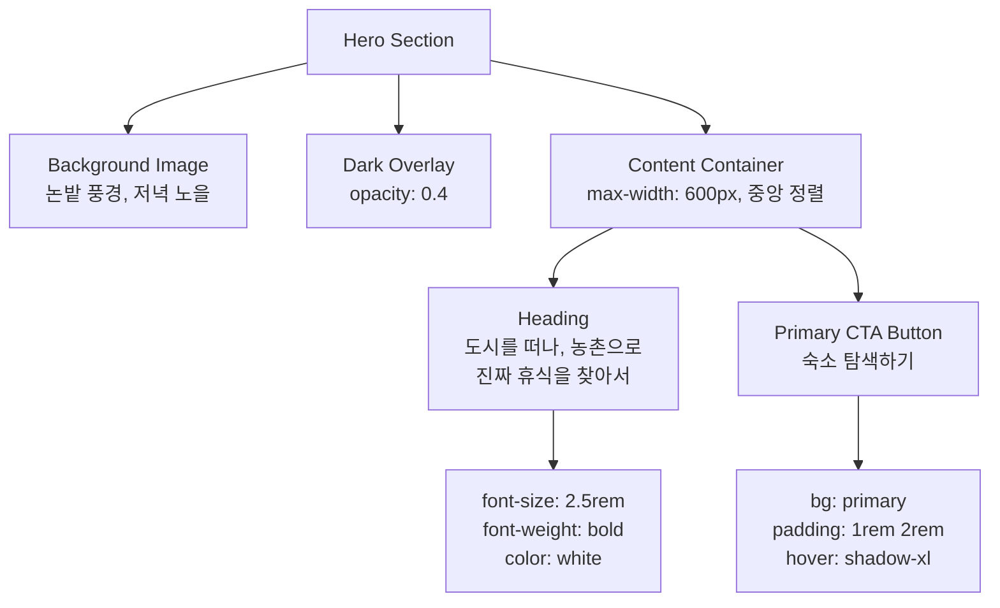
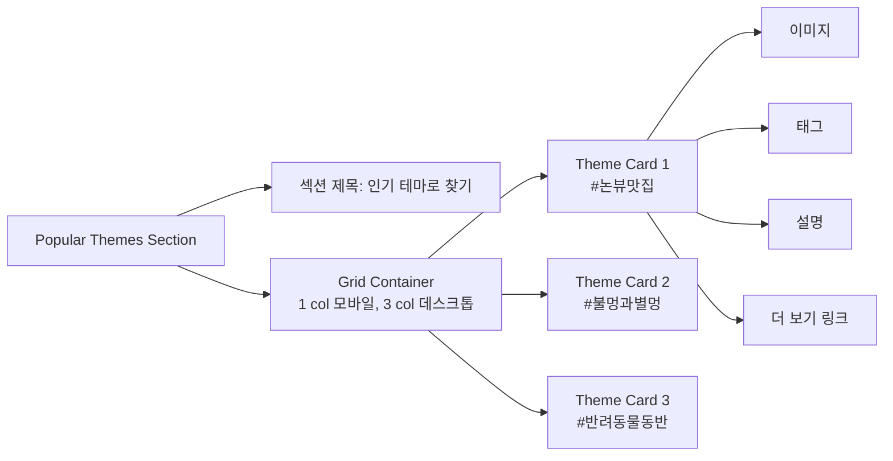

# 01. 랜딩 페이지 (Landing Page) - `/`

**화면 ID**: `Page-Landing`
**경로**: `/`
**설명**: VINTEE 플랫폼의 첫 진입 페이지, MZ세대에게 농촌 휴가의 가치를 전달하고 숙소 탐색으로 유도

---

## 📱 모바일 레이아웃 (< 768px)

```
┌──────────────────────────────────────┐
│  [VINTEE 로고]        [로그인] [☰]  │ <- SiteHeader (sticky)
└──────────────────────────────────────┘

┌──────────────────────────────────────┐
│                                      │
│     [히어로 배경 이미지]              │
│     (논밭 풍경, 저녁 노을)            │
│                                      │
│   ╔══════════════════════════════╗  │
│   ║  도시를 떠나, 농촌으로        ║  │ <- 캐치프레이즈
│   ║  진짜 휴식을 찾아서           ║  │
│   ╚══════════════════════════════╝  │
│                                      │
│        [ 숙소 탐색하기 ]             │ <- Primary CTA
│          (버튼 크기 큼)               │
│                                      │
└──────────────────────────────────────┘

┌──────────────────────────────────────┐
│  🌾 인기 테마로 찾기                  │ <- 섹션 제목
├──────────────────────────────────────┤
│  ┌────────────────────────────────┐ │
│  │  [이미지: 논뷰]                 │ │
│  │  #논뷰맛집                      │ │
│  │  황금빛 논밭이 한눈에           │ │
│  └────────────────────────────────┘ │
│                                      │
│  ┌────────────────────────────────┐ │
│  │  [이미지: 불멍]                 │ │
│  │  #불멍과별멍                    │ │
│  │  캠프파이어와 별이 가득한 밤    │ │
│  └────────────────────────────────┘ │
│                                      │
│  ┌────────────────────────────────┐ │
│  │  [이미지: 반려동물]             │ │
│  │  #반려동물동반                  │ │
│  │  우리 강아지도 함께             │ │
│  └────────────────────────────────┘ │
│                                      │
│        [ 모든 테마 보기 ]            │ <- Secondary CTA
└──────────────────────────────────────┘

┌──────────────────────────────────────┐
│  💚 VINTEE가 특별한 이유              │
├──────────────────────────────────────┤
│  ┌────────────────────────────────┐ │
│  │  📖 진짜 호스트 스토리           │ │
│  │  단순 숙소가 아닌, 농촌 주민의  │ │
│  │  진정성 있는 이야기를 만나요    │ │
│  └────────────────────────────────┘ │
│                                      │
│  ┌────────────────────────────────┐ │
│  │  🏷️ 테마 기반 큐레이션          │ │
│  │  #논뷰맛집 #불멍과별멍 등       │ │
│  │  감성적인 태그로 빠르게 발견    │ │
│  └────────────────────────────────┘ │
│                                      │
│  ┌────────────────────────────────┐ │
│  │  💚 정직한 불편함 표현           │ │
│  │  Wi-Fi 불안정, 벌레 출몰 등    │ │
│  │  농촌의 현실을 솔직하게         │ │
│  └────────────────────────────────┘ │
└──────────────────────────────────────┘

┌──────────────────────────────────────┐
│  Footer                               │
│  ────────────────────────────────────│
│  회사 소개 | 이용약관 | 개인정보처리  │
│  호스트 되기 | 고객센터               │
│  ────────────────────────────────────│
│  © 2026 VINTEE. All rights reserved. │
└──────────────────────────────────────┘
```

---

## 💻 데스크톱 레이아웃 (>= 1024px)

```
┌──────────────────────────────────────────────────────────────────────┐
│  [VINTEE 로고]     숙소 탐색  호스트 되기  예약 내역      [로그인]   │ <- SiteHeader (sticky)
└──────────────────────────────────────────────────────────────────────┘

┌──────────────────────────────────────────────────────────────────────┐
│                                                                      │
│                     [히어로 배경 이미지 - 전체 너비]                  │
│                     (논밭 풍경, 저녁 노을, 고해상도)                   │
│                                                                      │
│                 ╔════════════════════════════════════╗              │
│                 ║  도시를 떠나, 농촌으로              ║              │
│                 ║  진짜 휴식을 찾아서                 ║ <- 캐치프레이즈 (중앙 정렬)
│                 ╚════════════════════════════════════╝              │
│                                                                      │
│                          [ 숙소 탐색하기 ]                           │ <- Primary CTA (크기 xl)
│                     (hover: shadow-xl, scale-105)                    │
│                                                                      │
│                                                                      │
└──────────────────────────────────────────────────────────────────────┘
                              ↓ (스크롤 인디케이터)

┌──────────────────────────────────────────────────────────────────────┐
│                          🌾 인기 테마로 찾기                          │ <- 섹션 제목 (h2)
├──────────────────────────────────────────────────────────────────────┤
│                                                                      │
│  ┌──────────────┐    ┌──────────────┐    ┌──────────────┐          │
│  │ [이미지]     │    │ [이미지]     │    │ [이미지]     │          │
│  │ 논뷰         │    │ 불멍         │    │ 반려동물     │          │
│  │              │    │              │    │              │          │
│  │ #논뷰맛집    │    │ #불멍과별멍  │    │ #반려동물동반│          │
│  │              │    │              │    │              │          │
│  │ 황금빛 논밭이│    │ 캠프파이어와 │    │ 우리 강아지도│          │
│  │ 한눈에       │    │ 별이 가득한밤│    │ 함께         │          │
│  │              │    │              │    │              │          │
│  │ [더 보기 →]  │    │ [더 보기 →]  │    │ [더 보기 →]  │          │
│  └──────────────┘    └──────────────┘    └──────────────┘          │
│      (hover: shadow-lg, transform: translateY(-4px))                 │
│                                                                      │
│                          [ 모든 테마 보기 ]                           │ <- Secondary CTA
└──────────────────────────────────────────────────────────────────────┘

┌──────────────────────────────────────────────────────────────────────┐
│                      💚 VINTEE가 특별한 이유                          │
├──────────────────────────────────────────────────────────────────────┤
│                                                                      │
│  ┌─────────────────┐  ┌─────────────────┐  ┌─────────────────┐    │
│  │  📖              │  │  🏷️              │  │  💚              │    │
│  │                 │  │                 │  │                 │    │
│  │ 진짜 호스트     │  │ 테마 기반       │  │ 정직한 불편함   │    │
│  │ 스토리          │  │ 큐레이션        │  │ 표현            │    │
│  │                 │  │                 │  │                 │    │
│  │ 단순 숙소가     │  │ #논뷰맛집       │  │ Wi-Fi 불안정,  │    │
│  │ 아닌, 농촌      │  │ #불멍과별멍 등  │  │ 벌레 출몰 등   │    │
│  │ 주민의 진정성   │  │ 감성적인 태그로 │  │ 농촌의 현실을  │    │
│  │ 있는 이야기를   │  │ 빠르게 발견     │  │ 솔직하게       │    │
│  │ 만나요          │  │                 │  │                 │    │
│  └─────────────────┘  └─────────────────┘  └─────────────────┘    │
│                         (3-column grid)                              │
└──────────────────────────────────────────────────────────────────────┘

┌──────────────────────────────────────────────────────────────────────┐
│  Footer                                                              │
│  ────────────────────────────────────────────────────────────────── │
│  회사 소개 | 이용약관 | 개인정보처리방침 | 호스트 되기 | 고객센터    │
│  ────────────────────────────────────────────────────────────────── │
│  © 2026 VINTEE. All rights reserved.                                │
└──────────────────────────────────────────────────────────────────────┘
```

---

## 🎨 컴포넌트 구조

### 히어로 섹션 (Hero Section)



**CSS 스타일**:
```css
.hero-section {
  position: relative;
  height: 600px; /* 모바일: 400px */
  background-size: cover;
  background-position: center;
}

.hero-overlay {
  position: absolute;
  top: 0;
  left: 0;
  width: 100%;
  height: 100%;
  background: rgba(0, 0, 0, 0.4);
}

.hero-content {
  position: relative;
  z-index: 10;
  display: flex;
  flex-direction: column;
  align-items: center;
  justify-content: center;
  height: 100%;
  color: white;
  text-align: center;
}

.hero-heading {
  font-size: 2.5rem; /* 모바일: 1.75rem */
  font-weight: bold;
  line-height: 1.2;
  margin-bottom: 2rem;
}

.hero-cta {
  background: var(--primary);
  color: white;
  padding: 1rem 2rem;
  border-radius: 0.5rem;
  font-size: 1.125rem;
  font-weight: 600;
  transition: all 0.3s;
}

.hero-cta:hover {
  box-shadow: 0 20px 25px rgba(0, 0, 0, 0.15);
  transform: scale(1.05);
}
```

---

### 인기 테마 섹션 (Popular Themes Section)

**테마 카드 구조**:
```
┌────────────────────────┐
│  [이미지 - 16:9 비율]   │
│                        │
├────────────────────────┤
│  #논뷰맛집              │ <- 태그 (h3)
│  황금빛 논밭이 한눈에   │ <- 설명 (p)
│                        │
│  [ 더 보기 → ]         │ <- CTA 링크
└────────────────────────┘
```

**Mermaid 다이어그램**:


**CSS 스타일**:
```css
.theme-section {
  padding: 4rem 1rem; /* 모바일: 2rem 1rem */
  background: var(--background);
}

.theme-grid {
  display: grid;
  grid-template-columns: 1fr; /* 모바일 */
  gap: 1.5rem;
  max-width: 1200px;
  margin: 0 auto;
}

/* 태블릿 */
@media (min-width: 768px) {
  .theme-grid {
    grid-template-columns: repeat(2, 1fr);
  }
}

/* 데스크톱 */
@media (min-width: 1024px) {
  .theme-grid {
    grid-template-columns: repeat(3, 1fr);
  }
}

.theme-card {
  background: white;
  border-radius: 0.5rem;
  overflow: hidden;
  box-shadow: 0 1px 2px rgba(0, 0, 0, 0.05);
  transition: all 0.3s;
}

.theme-card:hover {
  box-shadow: 0 10px 15px rgba(0, 0, 0, 0.1);
  transform: translateY(-4px);
}

.theme-card img {
  width: 100%;
  aspect-ratio: 16 / 9;
  object-fit: cover;
}

.theme-card-content {
  padding: 1.5rem;
}

.theme-tag {
  font-size: 1.25rem;
  font-weight: 600;
  color: var(--text-primary);
  margin-bottom: 0.5rem;
}

.theme-desc {
  font-size: 0.875rem;
  color: var(--text-secondary);
  margin-bottom: 1rem;
}

.theme-link {
  color: var(--primary);
  font-weight: 500;
  text-decoration: none;
}

.theme-link:hover {
  text-decoration: underline;
}
```

---

### VINTEE 특별함 섹션 (Value Proposition Section)

**카드 레이아웃**:
```
┌─────────────────────┐
│  📖 (아이콘)         │
│                     │
│  진짜 호스트 스토리  │ <- 제목 (h3)
│                     │
│  단순 숙소가 아닌,  │
│  농촌 주민의         │
│  진정성 있는 이야기를│ <- 설명 (p)
│  만나요              │
└─────────────────────┘
```

**CSS 스타일**:
```css
.value-section {
  padding: 4rem 1rem;
  background: white;
}

.value-grid {
  display: grid;
  grid-template-columns: 1fr; /* 모바일 */
  gap: 2rem;
  max-width: 1200px;
  margin: 0 auto;
}

@media (min-width: 1024px) {
  .value-grid {
    grid-template-columns: repeat(3, 1fr);
  }
}

.value-card {
  text-align: center;
  padding: 2rem;
}

.value-icon {
  font-size: 3rem;
  margin-bottom: 1rem;
}

.value-title {
  font-size: 1.25rem;
  font-weight: 600;
  color: var(--text-primary);
  margin-bottom: 0.75rem;
}

.value-desc {
  font-size: 0.875rem;
  color: var(--text-secondary);
  line-height: 1.6;
}
```

---

## 🔄 인터랙션 및 애니메이션

### 스크롤 애니메이션

**Scroll Reveal (AOS 라이브러리 활용)**:
```javascript
// 섹션 진입 시 페이드 인
<div data-aos="fade-up" data-aos-duration="800">
  인기 테마 섹션
</div>

// 카드별 지연 애니메이션
<div data-aos="fade-up" data-aos-delay="0">카드 1</div>
<div data-aos="fade-up" data-aos-delay="200">카드 2</div>
<div data-aos="fade-up" data-aos-delay="400">카드 3</div>
```

### 버튼 호버 효과

```css
/* Primary CTA */
.hero-cta {
  transition: all 0.3s cubic-bezier(0.4, 0, 0.2, 1);
}

.hero-cta:hover {
  box-shadow: 0 20px 25px rgba(0, 161, 224, 0.3);
  transform: scale(1.05);
}

.hero-cta:active {
  transform: scale(0.95);
}
```

### 테마 카드 호버

```css
.theme-card {
  transition: transform 0.3s, box-shadow 0.3s;
}

.theme-card:hover {
  transform: translateY(-4px);
  box-shadow: 0 10px 15px rgba(0, 0, 0, 0.1);
}

.theme-card:hover img {
  transform: scale(1.05);
}
```

---

## ♿ 접근성 고려사항

### 시맨틱 HTML

```html
<header role="banner">
  <nav aria-label="주 메뉴">
    ...
  </nav>
</header>

<main role="main">
  <section aria-labelledby="hero-heading">
    <h1 id="hero-heading">도시를 떠나, 농촌으로</h1>
    ...
  </section>

  <section aria-labelledby="theme-heading">
    <h2 id="theme-heading">인기 테마로 찾기</h2>
    ...
  </section>
</main>

<footer role="contentinfo">
  ...
</footer>
```

### 키보드 네비게이션

- `Tab`: CTA 버튼 → 테마 카드 링크 → Footer 링크 순서
- `Enter`: 링크/버튼 활성화
- `Shift + Tab`: 역순 이동

### 스크린 리더 지원

```html
<!-- 이미지 alt 속성 -->


<!-- 링크 설명 -->
<a href="/explore?tag=논뷰맛집" aria-label="논뷰맛집 테마 더 보기">
  더 보기 →
</a>

<!-- 버튼 역할 명시 -->
<button type="button" aria-label="숙소 탐색 페이지로 이동">
  숙소 탐색하기
</button>
```

---

## 📊 성능 최적화

### 이미지 최적화

**Next.js Image 컴포넌트 사용**:
```jsx
import Image from 'next/image';

<Image
  src="/hero-background.jpg"
  alt="농촌 논밭 풍경"
  width={1920}
  height={1080}
  priority // LCP 최적화
  placeholder="blur" // Blur placeholder
  blurDataURL="data:image/..." // Base64 blur
/>
```

**테마 카드 이미지**:
```jsx
<Image
  src={theme.imageUrl}
  alt={theme.description}
  width={400}
  height={225}
  loading="lazy" // Lazy loading
  quality={80} // 압축률
/>
```

### 코드 스플리팅

```jsx
// 동적 import (스크롤 시 로드)
const ValueSection = dynamic(() => import('./ValueSection'), {
  loading: () => <SkeletonLoader />,
  ssr: false, // CSR only
});
```

---

## 🧪 테스트 시나리오

### E2E 테스트 (Playwright)

```typescript
test('랜딩 페이지 기본 플로우', async ({ page }) => {
  // 1. 페이지 접속
  await page.goto('/');
  await expect(page).toHaveTitle(/VINTEE/);

  // 2. 히어로 섹션 확인
  await expect(page.getByRole('heading', { name: /도시를 떠나/ })).toBeVisible();

  // 3. "숙소 탐색하기" 버튼 클릭
  await page.getByRole('button', { name: '숙소 탐색하기' }).click();

  // 4. /explore 페이지로 이동 확인
  await expect(page).toHaveURL('/explore');
});

test('테마 카드 클릭', async ({ page }) => {
  await page.goto('/');

  // 논뷰맛집 테마 카드 클릭
  await page.getByRole('link', { name: /논뷰맛집/ }).click();

  // 필터링된 /explore 페이지 확인
  await expect(page).toHaveURL('/explore?tag=논뷰맛집');
});
```

---

## 📝 개발 체크리스트

- [ ] **히어로 섹션**
  - [ ] 배경 이미지 최적화 (WebP, 1920x1080)
  - [ ] 캐치프레이즈 텍스트 중앙 정렬
  - [ ] CTA 버튼 hover 효과
  - [ ] 모바일 반응형 확인

- [ ] **인기 테마 섹션**
  - [ ] 3개 테마 카드 렌더링
  - [ ] 이미지 lazy loading
  - [ ] 카드 hover 애니메이션
  - [ ] "더 보기" 링크 동작 확인

- [ ] **VINTEE 특별함 섹션**
  - [ ] 아이콘 렌더링
  - [ ] 3-column grid (데스크톱)
  - [ ] 1-column grid (모바일)

- [ ] **접근성**
  - [ ] alt 속성 모든 이미지에 추가
  - [ ] aria-label 버튼/링크 추가
  - [ ] 키보드 네비게이션 테스트
  - [ ] 스크린 리더 테스트 (NVDA/VoiceOver)

- [ ] **성능**
  - [ ] Lighthouse 점수 90+ (Performance)
  - [ ] LCP < 2.5s
  - [ ] CLS < 0.1
  - [ ] FID < 100ms

---

**문서 버전**: 1.0
**최종 수정일**: 2026-02-10
**작성자**: Gagahoho Engineering Team

---
