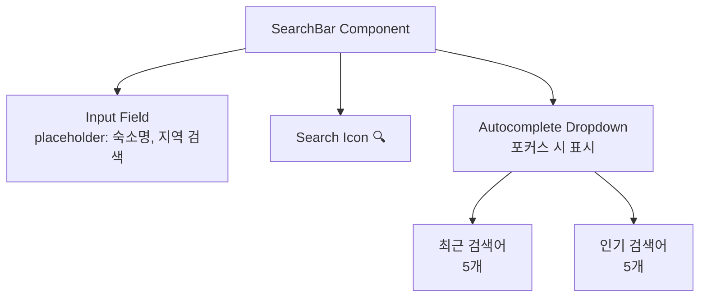
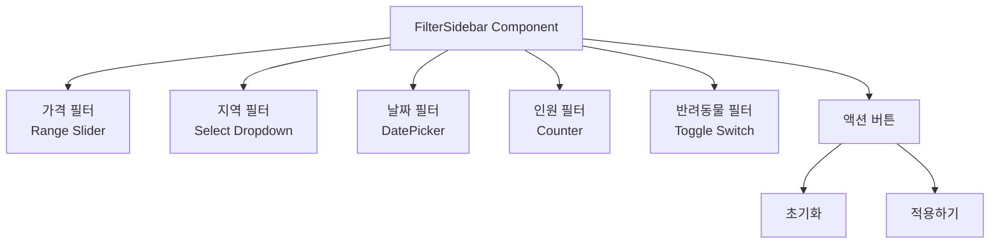
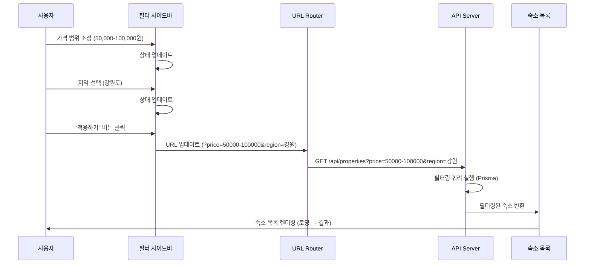
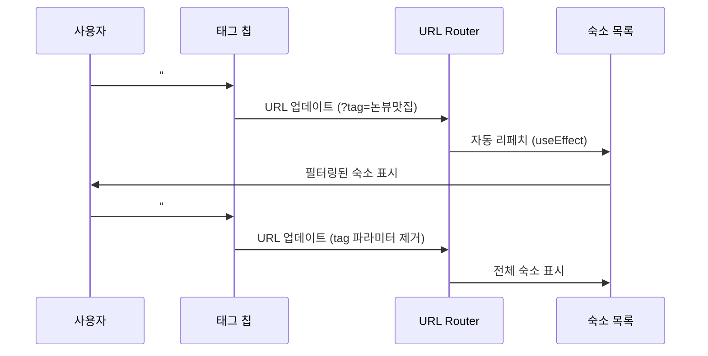

# 02. 숙소 탐색 페이지 (Explore Page) - `/explore`

**화면 ID**: `Page-Explore`
**경로**: `/explore`
**설명**: 테마 기반 필터링과 검색으로 사용자가 원하는 농촌 숙소를 발견하는 페이지

---

## 📱 모바일 레이아웃 (< 768px)

```
┌──────────────────────────────────────┐
│  [VINTEE 로고]        [로그인] [☰]  │ <- SiteHeader (sticky)
└──────────────────────────────────────┘

┌──────────────────────────────────────┐
│  🔍 [검색어 입력...]       [🔍]      │ <- 검색바 (sticky)
└──────────────────────────────────────┘

┌──────────────────────────────────────┐
│  [ 필터 ⚙️ ]  [ 지도 🗺️ ]           │ <- 필터/지도 버튼
└──────────────────────────────────────┘

┌──────────────────────────────────────┐
│  #논뷰맛집  #불멍과별멍  #반려동물동반│ <- 태그 칩 (수평 스크롤)
│  #SNS맛집  #전통가옥  #취사가능      │
└──────────────────────────────────────┘

┌──────────────────────────────────────┐
│  총 24개의 숙소                       │ <- 결과 카운트
├──────────────────────────────────────┤
│  ┌────────────────────────────────┐ │
│  │  [숙소 이미지]                  │ │
│  │                                │ │
│  │  논뷰맛집 펜션                  │ │
│  │  📍 강원도 홍천군               │ │
│  │  ⭐ 4.8 (32)                   │ │
│  │  ───────────────────────────  │ │
│  │  50,000원 / 박                 │ │
│  │  #논뷰맛집 #취사가능            │ │
│  └────────────────────────────────┘ │
│                                      │
│  ┌────────────────────────────────┐ │
│  │  [숙소 이미지]                  │ │
│  │  불멍별멍 게스트하우스          │ │
│  │  ...                           │ │
│  └────────────────────────────────┘ │
│                                      │
│  (무한 스크롤 또는 페이지네이션)      │
└──────────────────────────────────────┘

┌──────────────────────────────────────┐
│  [ ← 이전 ]  1 2 3 4 5  [ 다음 → ]  │ <- 페이지네이션
└──────────────────────────────────────┘
```

**필터 하단 시트 (Bottom Sheet)**:
```
┌──────────────────────────────────────┐
│  필터                        [ ✕ ]   │
├──────────────────────────────────────┤
│  가격                                │
│  ┌─────────●───────────●─────────┐  │
│  0원              100,000원  200,000원│
│                                      │
│  지역                                │
│  [ 전체 ▼ ]                          │
│                                      │
│  날짜                                │
│  체크인: [ 2026-03-01 ]              │
│  체크아웃: [ 2026-03-03 ]            │
│                                      │
│  인원                                │
│  [ - ]  2명  [ + ]                   │
│                                      │
│  반려동물                             │
│  [ ○ ] 동반 가능만 보기              │
│                                      │
├──────────────────────────────────────┤
│  [ 초기화 ]          [ 적용하기 ]    │
└──────────────────────────────────────┘
```

---

## 💻 데스크톱 레이아웃 (>= 1024px)

```
┌───────────────────────────────────────────────────────────────────────────┐
│  [VINTEE 로고]     숙소 탐색  호스트 되기  예약 내역        [로그인]       │
└───────────────────────────────────────────────────────────────────────────┘

┌───────────────────────────────────────────────────────────────────────────┐
│                  🔍 [검색어 입력...]                      [검색]            │ <- 검색바 (중앙, max-width 600px)
└───────────────────────────────────────────────────────────────────────────┘

┌─────────────┬─────────────────────────────────────────────────────────────┐
│             │  총 24개의 숙소                                             │
│  필터       │                                                             │
│  ───────    │  #논뷰맛집  #불멍과별멍  #반려동물동반  #SNS맛집  #전통가옥 │ <- 태그 칩
│             │                                                             │
│  가격       │  ┌───────────┐  ┌───────────┐  ┌───────────┐              │
│  ┌────────┐│  │ [이미지]  │  │ [이미지]  │  │ [이미지]  │              │
│  │●──────●││  │           │  │           │  │           │              │
│  0  100k 200k  │ 논뷰맛집  │  │ 불멍별멍  │  │ 산속힐링  │              │
│             │  │ 펜션      │  │ 게스트    │  │ 민박      │              │
│  지역       │  │           │  │           │  │           │              │
│  [전체 ▼] │  │ 📍 강원   │  │ 📍 충북   │  │ 📍 경북   │              │
│             │  │ ⭐ 4.8   │  │ ⭐ 4.9   │  │ ⭐ 4.7   │              │
│  날짜       │  │ 50,000원  │  │ 60,000원  │  │ 45,000원  │              │
│  체크인     │  │ #논뷰맛집 │  │ #불멍     │  │ #산속     │              │
│  [        ]│  └───────────┘  └───────────┘  └───────────┘              │
│  체크아웃   │                                                             │
│  [        ]│  ┌───────────┐  ┌───────────┐  ┌───────────┐              │
│             │  │ ...       │  │ ...       │  │ ...       │              │
│  인원       │  └───────────┘  └───────────┘  └───────────┘              │
│  [-] 2 [+] │                                                             │
│             │  (3-column grid)                                            │
│  반려동물   │                                                             │
│  [ ○ ] 동반 │  ┌─────────────────────────────────────────────┐          │
│    가능     │  │  [ ← 이전 ]  1 2 3 4 5  [ 다음 → ]         │          │
│             │  └─────────────────────────────────────────────┘          │
│  [ 초기화 ] │                                                             │
│  [ 적용 ]   │                                                             │
└─────────────┴─────────────────────────────────────────────────────────────┘
    (sticky)              (main content, 스크롤 가능)
```

---

## 🎨 컴포넌트 구조

### 검색바 (SearchBar)



**코드 예시**:
```jsx
<div className="search-bar">
  <input
    type="text"
    placeholder="숙소명, 지역 검색..."
    aria-label="숙소 검색"
    onFocus={() => setShowAutocomplete(true)}
  />
  <button aria-label="검색" type="submit">
    🔍
  </button>

  {showAutocomplete && (
    <div className="autocomplete-dropdown">
      <div>
        <h4>최근 검색어</h4>
        <ul>
          <li>논뷰맛집</li>
          <li>강원도 펜션</li>
        </ul>
      </div>
      <div>
        <h4>인기 검색어</h4>
        <ul>
          <li>불멍과별멍</li>
          <li>반려동물동반</li>
        </ul>
      </div>
    </div>
  )}
</div>
```

---

### 필터 사이드바 (FilterSidebar)



**가격 필터 (Range Slider)**:
```jsx
import { Slider } from "@/components/ui/slider";

<div className="filter-section">
  <h3>가격</h3>
  <Slider
    min={0}
    max={200000}
    step={10000}
    value={priceRange}
    onValueChange={setPriceRange}
    aria-label="가격 범위"
  />
  <div className="price-display">
    {priceRange[0].toLocaleString()}원 - {priceRange[1].toLocaleString()}원
  </div>
</div>
```

**날짜 필터 (DatePicker)**:
```jsx
import { Calendar } from "@/components/ui/calendar";

<div className="filter-section">
  <h3>날짜</h3>
  <div>
    <label>체크인</label>
    <Calendar
      mode="single"
      selected={checkIn}
      onSelect={setCheckIn}
      disabled={(date) => date < new Date()}
    />
  </div>
  <div>
    <label>체크아웃</label>
    <Calendar
      mode="single"
      selected={checkOut}
      onSelect={setCheckOut}
      disabled={(date) => date <= checkIn}
    />
  </div>
</div>
```

---

### 숙소 카드 (PropertyCard)

```
┌────────────────────────────┐
│  [이미지 - 16:9]            │
│  🤍 (찜하기 아이콘, 우측상단)│
├────────────────────────────┤
│  논뷰맛집 펜션              │ <- 제목 (h3)
│  📍 강원도 홍천군           │ <- 위치
│  ⭐ 4.8 (32)               │ <- 평점 (리뷰 수)
│  ────────────────────────  │
│  50,000원 / 박             │ <- 가격
│  #논뷰맛집 #취사가능        │ <- 태그 (최대 3개)
└────────────────────────────┘
```

**코드 예시**:
```jsx
<Link href={`/property/${property.id}`} className="property-card">
  <div className="property-image-wrapper">
    <Image
      src={property.images[0]}
      alt={property.name}
      width={400}
      height={225}
      className="property-image"
    />
    <button
      className="wishlist-button"
      aria-label="찜하기"
      onClick={(e) => {
        e.preventDefault();
        toggleWishlist(property.id);
      }}
    >
      {isWishlisted ? '❤️' : '🤍'}
    </button>
  </div>

  <div className="property-info">
    <h3 className="property-name">{property.name}</h3>
    <p className="property-location">
      📍 {property.location}
    </p>
    <p className="property-rating">
      ⭐ {property.rating} ({property.reviewCount})
    </p>
    <div className="property-divider"></div>
    <p className="property-price">
      {property.pricePerNight.toLocaleString()}원 / 박
    </p>
    <div className="property-tags">
      {property.tags.slice(0, 3).map(tag => (
        <span key={tag.id} className="tag-badge">
          #{tag.name}
        </span>
      ))}
    </div>
  </div>
</Link>
```

**CSS 스타일**:
```css
.property-card {
  background: white;
  border-radius: 0.5rem;
  overflow: hidden;
  box-shadow: 0 1px 2px rgba(0, 0, 0, 0.05);
  transition: all 0.3s;
  text-decoration: none;
  color: inherit;
}

.property-card:hover {
  box-shadow: 0 10px 15px rgba(0, 0, 0, 0.1);
  transform: translateY(-2px);
}

.property-image-wrapper {
  position: relative;
}

.property-image {
  width: 100%;
  aspect-ratio: 16 / 9;
  object-fit: cover;
  transition: transform 0.3s;
}

.property-card:hover .property-image {
  transform: scale(1.05);
}

.wishlist-button {
  position: absolute;
  top: 0.75rem;
  right: 0.75rem;
  background: rgba(255, 255, 255, 0.9);
  border: none;
  border-radius: 50%;
  width: 2.5rem;
  height: 2.5rem;
  font-size: 1.25rem;
  cursor: pointer;
  transition: transform 0.2s;
}

.wishlist-button:hover {
  transform: scale(1.1);
}

.property-info {
  padding: 1rem;
}

.property-name {
  font-size: 1.125rem;
  font-weight: 600;
  color: var(--text-primary);
  margin-bottom: 0.5rem;
}

.property-location,
.property-rating {
  font-size: 0.875rem;
  color: var(--text-secondary);
  margin-bottom: 0.25rem;
}

.property-divider {
  height: 1px;
  background: var(--border);
  margin: 0.75rem 0;
}

.property-price {
  font-size: 1.125rem;
  font-weight: 600;
  color: var(--text-primary);
  margin-bottom: 0.5rem;
}

.property-tags {
  display: flex;
  gap: 0.5rem;
  flex-wrap: wrap;
}

.tag-badge {
  background: var(--background);
  color: var(--text-secondary);
  padding: 0.25rem 0.5rem;
  border-radius: 0.25rem;
  font-size: 0.75rem;
}
```

---

## 🔄 상태 관리 및 URL 동기화

### URL 쿼리 파라미터

```typescript
// URL 구조
/explore?search=논뷰&tag=논뷰맛집&price=50000-100000&region=강원&checkIn=2026-03-01&checkOut=2026-03-03&guests=2&pet=true&page=2

// 파라미터 파싱
const searchParams = useSearchParams();
const filters = {
  search: searchParams.get('search') || '',
  tag: searchParams.get('tag') || '',
  priceMin: Number(searchParams.get('price')?.split('-')[0]) || 0,
  priceMax: Number(searchParams.get('price')?.split('-')[1]) || 200000,
  region: searchParams.get('region') || '',
  checkIn: searchParams.get('checkIn') || '',
  checkOut: searchParams.get('checkOut') || '',
  guests: Number(searchParams.get('guests')) || 2,
  pet: searchParams.get('pet') === 'true',
  page: Number(searchParams.get('page')) || 1,
};
```

### API 호출

```typescript
// API 엔드포인트: GET /api/properties
const fetchProperties = async (filters: FilterParams) => {
  const queryString = new URLSearchParams({
    search: filters.search,
    tag: filters.tag,
    priceMin: filters.priceMin.toString(),
    priceMax: filters.priceMax.toString(),
    region: filters.region,
    checkIn: filters.checkIn,
    checkOut: filters.checkOut,
    guests: filters.guests.toString(),
    pet: filters.pet.toString(),
    page: filters.page.toString(),
    limit: '12',
  }).toString();

  const response = await fetch(`/api/properties?${queryString}`);
  const data = await response.json();

  return {
    properties: data.properties,
    total: data.total,
    page: data.page,
    totalPages: data.totalPages,
  };
};
```

---

## 🔄 인터랙션

### 필터 적용 플로우



### 태그 칩 클릭 플로우



---

## ♿ 접근성

### 필터 사이드바 키보드 네비게이션

```typescript
// Escape 키로 필터 닫기
useEffect(() => {
  const handleEscape = (e: KeyboardEvent) => {
    if (e.key === 'Escape') {
      closeFilter();
    }
  };
  window.addEventListener('keydown', handleEscape);
  return () => window.removeEventListener('keydown', handleEscape);
}, []);
```

### 스크린 리더 지원

```html
<!-- 결과 카운트 -->
<p aria-live="polite" aria-atomic="true">
  총 {totalProperties}개의 숙소
</p>

<!-- 로딩 상태 -->
<div role="status" aria-live="polite">
  숙소를 불러오는 중...
</div>

<!-- 빈 결과 -->
<div role="status">
  조건에 맞는 숙소가 없습니다. 필터를 조정해보세요.
</div>
```

---

## 📊 성능 최적화

### 무한 스크롤 vs 페이지네이션

**무한 스크롤 (Infinite Scroll)**:
```jsx
import { useInfiniteScroll } from '@/hooks/useInfiniteScroll';

const { properties, hasMore, loadMore, isLoading } = useInfiniteScroll({
  apiUrl: '/api/properties',
  initialPage: 1,
  limit: 12,
});

<InfiniteScrollContainer onLoadMore={loadMore}>
  {properties.map(property => (
    <PropertyCard key={property.id} property={property} />
  ))}
  {isLoading && <SkeletonLoader count={3} />}
</InfiniteScrollContainer>
```

**페이지네이션 (Pagination)**:
```jsx
<Pagination
  currentPage={page}
  totalPages={totalPages}
  onPageChange={(newPage) => {
    router.push(`/explore?${new URLSearchParams({...filters, page: newPage})}`);
  }}
/>
```

### 스켈레톤 로딩

```jsx
const SkeletonCard = () => (
  <div className="skeleton-card">
    <div className="skeleton-image shimmer"></div>
    <div className="skeleton-text shimmer"></div>
    <div className="skeleton-text shimmer short"></div>
  </div>
);

// CSS
@keyframes shimmer {
  0% {
    background-position: -1000px 0;
  }
  100% {
    background-position: 1000px 0;
  }
}

.shimmer {
  background: linear-gradient(
    90deg,
    #f0f0f0 25%,
    #e0e0e0 50%,
    #f0f0f0 75%
  );
  background-size: 1000px 100%;
  animation: shimmer 2s infinite;
}
```

---

**문서 버전**: 1.0
**최종 수정일**: 2026-02-10
**작성자**: Gagahoho Engineering Team

---
