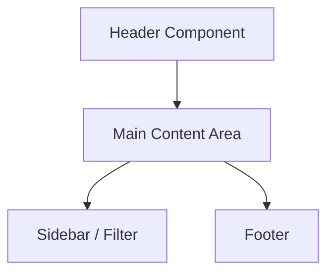
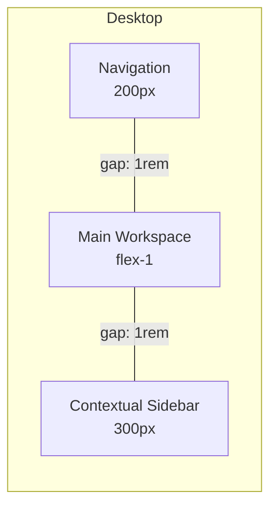

# VINTEE - 와이어프레임 (Wireframes) 디렉토리

**프로젝트**: VINTEE (빈티) - 농촌 휴가 체험 플랫폼
**버전**: 1.0
**작성일**: 2026-02-10

---

## 📋 목차

1. [개요](#개요)
2. [와이어프레임 인덱스](#와이어프레임-인덱스)
3. [디자인 시스템](#디자인-시스템)
4. [작성 규칙](#작성-규칙)

---

## 개요

이 디렉토리는 VINTEE 플랫폼의 주요 화면별 와이어프레임을 포함합니다. 각 파일은 ASCII art와 Mermaid 다이어그램을 활용하여 레이아웃, UI 컴포넌트, 인터랙션을 시각화합니다.

---

## 와이어프레임 인덱스

### 게스트 화면

| 파일 | 화면 | 설명 | 상태 |
|------|------|------|------|
| `01-landing.md` | 랜딩 페이지 (`/`) | 히어로 섹션, CTA, 인기 테마 | ✅ 완료 |
| `02-explore.md` | 숙소 탐색 (`/explore`) | 검색바, 필터, 숙소 그리드 | ✅ 완료 |
| `03-property-detail.md` | 숙소 상세 (`/property/[id]`) | 갤러리, 예약 위젯, 호스트 스토리 | ✅ 완료 |
| `04-checkout.md` | 체크아웃 (`/booking/checkout`) | 예약자 정보 폼, 결제 | ✅ 완료 |
| `05-booking-success.md` | 예약 성공 (`/booking/success`) | 성공 메시지, 예약 정보 | ✅ 완료 |
| `06-bookings.md` | 예약 내역 (`/bookings`) | 예약 카드 목록 | ✅ 완료 |

### 호스트 화면

| 파일 | 화면 | 설명 | 상태 |
|------|------|------|------|
| `07-host-dashboard.md` | 호스트 대시보드 (`/host/dashboard`) | 통계, 최근 예약, 빠른 액션 | ✅ 완료 |
| `08-property-registration.md` | 숙소 등록 (`/host/properties/new`) | 5단계 폼 | ✅ 완료 |
| `09-host-bookings.md` | 예약 관리 (`/host/bookings`) | 예약 목록, 승인/거부 | ✅ 완료 |

### 공통 컴포넌트

| 파일 | 컴포넌트 | 설명 | 상태 |
|------|----------|------|------|
| `10-site-header.md` | SiteHeader | 전역 헤더 (로고, 메뉴, 로그인) | ✅ 완료 |
| `11-booking-widget.md` | BookingWidget | 예약 위젯 (날짜, 인원, 가격) | ✅ 완료 |
| `12-filter-sidebar.md` | FilterSidebar | 필터 사이드바 | ✅ 완료 |

---

## 디자인 시스템

### Salesforce Lightning Design System (SLDS) 스타일

**컬러 팔레트**:
```css
/* Primary */
--primary: #00A1E0;        /* Salesforce Blue */
--primary-dark: #0070A0;   /* Hover state */

/* Neutral */
--background: #F3F2F2;     /* Page background */
--card-bg: #FFFFFF;        /* Card background */
--text-primary: #16325C;   /* Headings */
--text-secondary: #3E3E3C; /* Body text */
--border: #DDDBDA;         /* Borders */

/* Semantic */
--success: #4BCA81;        /* Success state */
--warning: #FFA726;        /* Warning state */
--error: #EA001E;          /* Error state */
```

**타이포그래피**:
```css
/* Headings */
--h1: 2.5rem (40px), Bold;
--h2: 2rem (32px), Bold;
--h3: 1.5rem (24px), Bold;
--h4: 1.25rem (20px), Semi-Bold;

/* Body */
--body: 1rem (16px), Regular;
--small: 0.875rem (14px), Regular;
--caption: 0.75rem (12px), Regular;
```

**간격 (Spacing)**:
```css
--spacing-xs: 0.25rem (4px);
--spacing-sm: 0.5rem (8px);
--spacing-md: 1rem (16px);
--spacing-lg: 1.5rem (24px);
--spacing-xl: 2rem (32px);
--spacing-2xl: 3rem (48px);
```

**Border Radius**:
```css
--radius-sm: 0.25rem (4px);  /* Buttons, inputs */
--radius-md: 0.5rem (8px);   /* Cards */
--radius-lg: 1rem (16px);    /* Modals */
```

**그림자 (Shadows)**:
```css
--shadow-sm: 0 1px 2px rgba(0,0,0,0.05);
--shadow-md: 0 4px 6px rgba(0,0,0,0.1);
--shadow-lg: 0 10px 15px rgba(0,0,0,0.1);
--shadow-xl: 0 20px 25px rgba(0,0,0,0.15);
```

---

## 작성 규칙

### ASCII Art 규칙

**기본 구조**:
```
┌────────────────────────────┐  <- 박스 상단
│  [컴포넌트 이름]            │  <- 헤더
├────────────────────────────┤  <- 구분선
│  콘텐츠 영역                │  <- 본문
│  - 아이템 1                 │
│  - 아이템 2                 │
├────────────────────────────┤
│  [ 버튼 ]                   │  <- 액션
└────────────────────────────┘  <- 박스 하단
```

**박스 문자**:
- 모서리: `┌` `┐` `└` `┘`
- 가로선: `─`
- 세로선: `│`
- T자 교차: `├` `┤` `┬` `┴`
- 십자 교차: `┼`

**아이콘 표현**:
- 검색: `🔍`
- 필터: `⚙️`
- 하트 (찜): `❤️` / `🤍`
- 별 (평점): `⭐`
- 위치: `📍`
- 사용자: `👤`
- 알림: `🔔`
- 설정: `⚙️`

### Mermaid 다이어그램 규칙

**레이아웃 다이어그램** (flowchart):


**반응형 레이아웃** (3-column):


---

## 반응형 브레이크포인트

**모바일 우선 (Mobile-First)**:
```css
/* Base styles (mobile < 640px) */
.grid {
  grid-template-columns: 1fr;
}

/* Tablet (>= 768px) */
@media (min-width: 768px) {
  .grid {
    grid-template-columns: repeat(2, 1fr);
  }
}

/* Desktop (>= 1024px) */
@media (min-width: 1024px) {
  .grid {
    grid-template-columns: repeat(3, 1fr);
  }
}
```

**와이어프레임 표기**:
- 📱 모바일 (< 768px)
- 💻 데스크톱 (>= 1024px)
- 🔄 반응형 (모든 화면)

---

## 컴포넌트 명명 규칙

**접두사**:
- `UI-`: 재사용 가능한 UI 컴포넌트 (버튼, 카드, 입력)
- `Layout-`: 레이아웃 컴포넌트 (헤더, 푸터, 사이드바)
- `Feature-`: 기능별 컴포넌트 (예약 위젯, 필터)
- `Page-`: 페이지 레벨 컴포넌트

**예시**:
- `UI-Button`: 기본 버튼
- `Layout-SiteHeader`: 전역 헤더
- `Feature-BookingWidget`: 예약 위젯
- `Page-Explore`: 숙소 탐색 페이지

---

## 인터랙션 표기

**상태 표시**:
- `:default` - 기본 상태
- `:hover` - 마우스 오버
- `:active` - 클릭/터치
- `:focus` - 키보드 포커스
- `:disabled` - 비활성화

**예시**:
```
[ 버튼 ]                    <- :default
[ 버튼 ] (hover: shadow-lg) <- :hover
[ 버튼 ] (active: scale-95) <- :active
```

---

## 참고 문서

**SLDS 공식 문서**:
- [Lightning Design System](https://www.lightningdesignsystem.com/)
- [Component Blueprints](https://www.lightningdesignsystem.com/components/overview/)
- [Design Tokens](https://www.lightningdesignsystem.com/design-tokens/)

**내부 문서**:
- `/docs/user-flow.md` - 사용자 플로우
- `/docs/accessibility.md` - 접근성 가이드
- `/CLAUDE.md` - 프로젝트 가이드

---

**문서 버전**: 1.0
**최종 수정일**: 2026-02-10
**작성자**: Gagahoho Engineering Team

---
